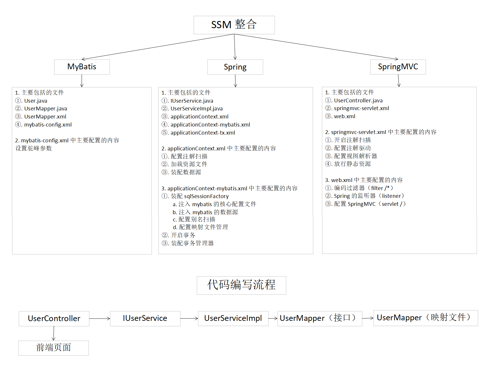

# 2 JavaWeb
## 2.1 Servlet
### 2.1.1 Response 常用 API


**1. 响应头**
**定时刷新页面**

```java
//    给浏览器响应头设置 Refresh参数，3秒后跳转到http://www.baidu.com
response.setHeader("Refresh","3;url=http://www.baidu.com");
```
**处理响应乱码**

```java
//    设置响应数据的编码格式
response.setContentType("text/html;charset=utf-8");
```
**重定向**

```java
response.sendRedirect("/otherServlet");
```
**2. 响应体**
**文件下载**

```java
//    文件下载流程 : 
//    输入流 : 将服务器中的文件读取到流中
//    输出流 : 将流中的文件写出到浏览器

//    获取 Servlet 上下文对象
ServletContext context = getServletContext();

//文件下载
//1.获取文件资源
//获取文件名
String fileName = request.getParameter("fileName");
//    获取当前项目中资源的物理路径；
File file = new File(context.getRealPath("/resource/"+fileName));


//2.设置两个响应头文件
//给浏览器设置响应头：Content-Disposition   告诉浏览器以附件的形式打开这个文件
response.setHeader("Content-Disposition","attachment;filename="+fileName);
//给浏览器设置响应头：文件类型    response.setContentType(mimetype);
//获取文件的mimeType
String mimeType = context.getMimeType(fileName);
response.setContentType(mimeType);


//3.设置两个流，进行流拷贝操作
//读取文件资源
FileInputStream fin = new FileInputStream(file);
//从response中获取输出流
ServletOutputStream outputStream = response.getOutputStream();
//流拷贝
int len = 0;
byte[] arr = new byte[1024];

while ((len=fin.read(arr))!= -1){
    outputStream.write(arr,0,len);
}
outputStream.close();
fin.close();
```
### 2.1.2 转发和重定向的区别

**转发的流程**

**重定向的流程**

**转发和重定向的区别**

1. 实现原理 : 转发是服务器内部执行，重定向是浏览器执行.
2. 请求次数 : 转发请求一次，重定向请求两次.
3. 浏览器地址栏地址 : 转发不变化，重定向变为第二次请求的地址.
4. 能否共享 request 域 : 转发能够共享，重定向不能共享.
5. 作用 : 转发共享 request 域，重定向完成跳转.

### 2.1.3 Cookie & Session


### 2.1.4 浏览器关闭后，Session 持久化方案

浏览器关闭后，Session 对象之所以会重新创建是因为 cookie 中的 JSESSIONID 会被删除，所以就不能够再标识这个 Session 了，如果能让 cookie 不消失（或者存活的时间长点），就能够在很长一段时间把这个标识发送给 Servlet 了，此时 Servlet 就能够找到之前创建的 Session 对象了.

代码 : 

```jquery
HttpSession session = request.getSession();
String JSESSIONID = session.getId();
Cookie cookie = new Cookie("JSESSIONID", JSESSIONID);
cookie.setMaxAge(60 * 60 * 60 * 24);
response.addCookie(cookie);
```
## 2.2 Ajax
### 2.2.1 Ajax 中 Get 请求、Post 请求和 Ajax 请求的语法格式

**Get 请求的语法格式 :** $.get(url, data, callback, type)，其中 data 为 json 类型

```jquery
$.get("/jqGetServlet", {"name" : "张三", "age" : 18}, function(result) {
    alert(result);
}, "text");
```
**Post 请求的语法格式 :** $.post(url, data, callback, type)，其中 data 为 json 类型

```jquery
$.post("jqServlet", {"name" : "张三", "age" : 18}, function(result) {
    alert(result);
}, "text");
```
**Ajax 请求的语法格式 :** $.ajax([settings])，其中 settings 的格式是 : {name : value, name : value ... ...}，常用的 name 属性包括 : url、async、data、type、dataType、success、error

```jquery
$.ajax({
    url : "jqAjaxServlet",
    type : "GET",
    data : {
        name : "张三",
        age : 18
    },
    dataType : "json",
    success : function(result) {
        alert(result)
    },
    error : function(result) {
        alert(result)
    }
})
```
## 2.3 Maven
### 2.3.1 Maven 的依赖范围 scope

**compile :** 默认范围，编译、测试、运行三个阶段都需要使用当前依赖包.

**test :** 只能用于测试，而在编译和运行项目时无需使用依赖，典型的是 JUnit，它在编译测试代码和运行测试代码的时候才需要.

**provided :** 编译和测试时使用依赖，在运行时不用，典型的就是 servlet-api，tomcat 中已提供，不需要再打包到 war 中，所以在引入 servlet-api 的依赖时，需要将其作用范围设置为 provided.

**runtime :** 在测试和运行时使用，但是在编译代码时无需使用，比如，JDBC 驱动.

**system :** 需要显式提供包含依赖的 jar，Maven 不会在 Repository 中查找该依赖.

### 2.3.2 Maven 常用命令
#### 2.3.2.1 将项目中所有第三方依赖导出

```shell
//    首先进入到项目的 pom.xml 文件所在的目录，然后将项目中所有第三方依赖导出到当前目录下的 lib 文件夹中
mvn dependency:copy-dependencies -DoutputDirectory=./lib
```

## 2.4 MyBatis
### 2.4.1 Mybatis 操作数据库的流程

1. 创建 Mapper 接口.
2. 创建 Mapper 映射文件

### 2.4.2 Mybatis 配置文件
#### 2.4.2.1 User.java

```java
package mapper;

import org.apache.ibatis.annotations.Param;
import pojo.User;

import javax.jws.soap.SOAPBinding;
import java.util.HashMap;
import java.util.List;

/**
 * @author Grayson
 * @date 2018/8/22 20:53
 */
public interface UserMapper {

    /**
     * 根据 id 查询用户信息
     * @param id
     * @return
     */

    User queryUserById(Long id);

    /**
     * 查询所有用户信息
     * @return
     */

    List<User> queryUserList();

    /**
     * 新增用户
     * @param user
     */

    void insertUser(User user);

    /**
     * 更新用户信息
     * @param user
     */

    void updateUser(User user);

    /**
     * 根据 id 删除用户信息
     * @param id
     */

    void deleteUserById(Long id);

    /**
     * 根据表名查询用户信息
     * @param tableName
     * @return
     */

    List<User> queryUserListByTableName(@Param("tableName") String tableName);

    /**
     * 用户登录（参数类型为 User）
     * @param user_name
     * @param password
     * @return
     */

    User login(@Param("user_name") String user_name, @Param("password") String password);

    /**
     * 用户登录（参数类型为 HashMap）
     * @param map
     * @return
     */

    User loginMap(HashMap<String, String> map);

    /**
     * 用户登录（参数类型为 User）
     * @param user
     * @return
     */

    User loginUser(User user);

}
```

#### 2.4.2.2 mybatis-config.xml

```xml
<?xml version="1.0" encoding="UTF-8" ?>
<!DOCTYPE configuration
        PUBLIC "-//mybatis.org//DTD Config 3.0//EN"
        "http://mybatis.org/dtd/mybatis-3-config.dtd">

<configuration>

    <!-- 加载外部配置文件 -->
    <properties resource="jdbc.properties"></properties>

    <settings>
        <!-- 设置驼峰匹配:从数据库列名映射java属性名称的经典方式，如数据库中的列名 user_name 可以映射 java 属性名称 userName -->
        <setting name="mapUnderscoreToCamelCase" value="true"/>
    </settings>

    <!-- 配置别名 -->
    <typeAliases>
        <!-- typeAlias:用来配置别名，方便映射文件使用，type:类的全限定类名,alias:别名 -->
        <!-- <typeAlias type="cn.itcast.pojo.User" alias="User"/> -->
        <!-- 配置包扫描：解决多个pojo别名问题，默认将类名作为别名 -->
        <package name="pojo"/>
    </typeAliases>

    <environments default="development">
        <environment id="development">
            <transactionManager type="JDBC"/>
            <dataSource type="POOLED">
                <property name="driver" value="${jdbc.driver}"/>
                <property name="url" value="${jdbc.url}"/>
                <property name="username" value="${jdbc.username}"/>
                <property name="password" value="${jdbc.password}"/>
            </dataSource>
        </environment>
    </environments>

    <mappers>
        <mapper resource="UserDaoMapper.xml"/>
        <mapper resource="UserMapper.xml"/>
    </mappers>

</configuration>
```
#### 2.4.2.3 UserMapper.xnl

```xml
<?xml version="1.0" encoding="UTF-8" ?>
<!DOCTYPE mapper
        PUBLIC "-//mybatis.org//DTD Mapper 3.0//EN"
        "http://mybatis.org/dtd/mybatis-3-mapper.dtd">

<mapper namespace="mapper.UserMapper">

    <select id="queryUserById" resultType="User">
        SELECT * FROM tb_user WHERE id = #{id}
    </select>

    <select id="queryUserList" resultType="User">
        SELECT * FROM tb_user
    </select>

    <select id="queryUserListByTableName" resultType="User">
        SELECT * FROM ${tableName}
    </select>

    <select id="login" resultType="User">
        SELECT * FROM tb_user WHERE user_name = #{user_name} AND password = #{password}
    </select>

    <select id="loginMap" resultType="User">
        SELECT * FROM tb_user WHERE user_name = #{user_name} AND password = #{password}
    </select>

    <select id="loginUser" resultType="User">
        SELECT * FROM tb_user WHERE user_name = #{user_name} AND password = #{password}
    </select>

    <insert id="insertUser">
        INSERT INTO tb_user (user_name, password, name, age, sex, birthday, created, updated)
        VALUES
            (#{user_name}, #{password}, #{name}, #{age}, #{sex}, #{birthday}, now(), now());
    </insert>

    <update id="updateUser">
        UPDATE tb_user
        SET user_name = #{user_name},
            password  = #{password},
            name      = #{name},
            age       = #{age},
            sex       = #{sex},
            birthday  = #{birthday},
            created   = #{created},
            updated   = now()
        WHERE
            id = #{id};
    </update>

    <delete id="deleteUserById">
        DELETE FROM tb_user WHERE id = #{id}
    </delete>

</mapper>
```
### 2.4.3 Mapper XML 文件的 CRUD
#### 2.4.3.1 Select

```xml
//    id : 语句的唯一标识
//    resultType : 配置返回的结果集类型
//    parameter : 插入语句的参数类型，可以省略
<select id = "queryUserById" resultType = "User">
    SELECT * FROM tb_user WHERE id = #{id}
</select>
```
#### 2.4.3.2 Insert

```xml
//    id : 插入语句的唯一标识
//    parameterType : 插入语句的参数类型，可以省略
//    useGeneratedKeys : 开启主键自增回显，将自增长的主键回显到形参中（即封装到 User 对象中）
<insert id="insertUser">
    INSERT INTO tb_user (user_name, password, name, age, sex, birthday, created, updated)
    VALUES
        (#{user_name}, #{password}, #{name}, #{age}, #{sex}, #{birthday}, now(), now());
</insert>
```
#### 2.4.3.3 Update

```xml
//    id : 插入语句的唯一标识
//    parameterType : 插入语句的参数类型，可以省略
//    useGeneratedKeys : 开启主键自增回显，将自增长的主键回显到形参中（即封装到 User 对象中）
<update id="updateUser">
    UPDATE tb_user
    SET user_name = #{user_name},
        password  = #{password},
        name      = #{name},
        age       = #{age},
        sex       = #{sex},
        birthday  = #{birthday},
        created   = #{created},
        updated   = now()
    WHERE
        id = #{id};
</update>
```
#### 2.4.3.4 Delete

```xml
//    id : 插入语句的唯一标识
//    parameterType : 插入语句的参数类型，可以省略
//    useGeneratedKeys : 开启主键自增回显，将自增长的主键回显到形参中（即封装到 User 对象中）
<delete id="deleteUserById">
    DELETE FROM tb_user WHERE id = #{id}
</delete>
```
### 2.4.4 动态 SQL
#### 2.4.4.1 if

```xml
<select id="queryUsersLikeUserName" resultType="User">
   select * from tb_user where sex = 1
   <if test="userName!=null and userName.trim()!=''">
      and user_name like '%' #{userName} '%'
   </if>
</select>
```
#### 2.4.4.2 choose when otherwise

```xml
<!-- 不管有多少个 when 条件，一旦其中一个条件成立，后面的 when 条件都不执行，当所有条件都不满足时，才会执行 otherwise 中的 SQL 语句-->
<select id="queryUserListByUserNameOrAge" resultType="User">
   select * from tb_user where sex = 1
   <choose>
      <when test="userName!=null and userName.trim()!=''">
         and user_name like '%' #{userName} '%'
      </when>
      <when test="age!=null">
         and age = #{age}
      </when>
      <otherwise>
         and user_name = "zhangsan"
      </otherwise>
   </choose>
</select>
```
#### 2.4.4.3 where

```xml
<!-- 可以自动将动态 SQL 中多出来的一个 and 或者 or 去除-->
<select id="queryUserListByUserNameAndAge" resultType="User">
   select * from tb_user
   <where>
      <if test="userName!=null and userName.trim()!=''">
         user_name like '%' #{userName} '%'
      </if>
      <if test="age!=null">
         and age = #{age}
      </if>
   </where>
</select>
```
#### 2.4.4.4 set

```xml
<!--可以自动添加一个 set 关键字，并将动态 SQL 中最后的逗号去除-->
<update id="updateUserSelective">
   update tb_user
   <set>
      <if test="userName!=null and userName.trim()!=''">
         user_name = #{userName},
      </if>
      <if test="password!=null and password.trim()!=''">
         password = #{password},
      </if>
      <if test="name!=null and name.trim()!=''">
         user_name = #{userName},
      </if>
      <if test="age!=null">
         age = age
      </if>
   </set>
   where id = #{id}
</update>
```
#### 2.4.4.5 foreach

```xml
<!-- 
collection : 接收到的集合或者数组参数
item : 集合或者数组中的每一个元素
separator : 标签分隔符
open : 以什么开始
close : 以什么结束
-->
<select id="queryUserListByIds" resultType="User">
   select * from tb_user where id in 
   <foreach collection="ids" item="id" separator="," open="(" close=")">
      #{id}
   </foreach>
</select>
```
### 2.4.5 高级查询
#### 2.4.5.1 一对一查询

1. 在 pojo 类型的 Order 中定义 pojo 类型的 User，并为其添加 setter & getter

```java
private User user;

public User getUser() {
    return user;
}

public void setUser(User user) {
    this.user = user;
}
```
2. 在 OrderMapper.xml 中相应的查询语句中自定义结果集，并在结果集中指定其映射关系

```xml
<!--配置自定义结果集id属性：-->
<!--自定义结果集的唯一标识type属性：结果集类型autoMapping属性：多表查询时，必须设置为true，Order对象和tb_order表的属性和字段才会进行自动映射-->
<resultMap id="orderAndUserResultMap" type="Order" autoMapping="true">
   <!--配置Order的主键映射-->
   <id column="id" property="id"></id>
   <!--association标签：用于对一的映射property属性：类中的关联属性的名称javaType属性：属性对应的类型autoMapping属性:autoMapping属性：多表查询时，必须设置为true，User对象和tb_user表的属性和字段才会进行自动映射-->

   <association property="user" javaType="User" autoMapping="true">
      <!--配置User的主键映射-->
      <id column="uid" property="id"></id>
   </association>
</resultMap>

<!--一对一查询-->
<select id="queryOrderAndUserByOrderNumber" resultMap="orderAndUserResultMap">
   SELECT
      *,u.id as uid
   FROM
      tb_order o
   INNER JOIN tb_user u ON o.user_id = u.id
   WHERE
      o.order_number = #{orderNumber}
</select>
```
#### 2.4.5.2 一对多查询
1. 在 pojo 类型的 Order 中定义 pojo 类型的 OrderDetail，并为其添加 setter & getter

```java
private List<Orderdetail> orderdetails;

public List<Orderdetail> getOrderdetails() {
    return orderdetails;
}

public void setOrderdetails(List<Orderdetail> orderdetails) {
    this.orderdetails = orderdetails;
}
```
2. 在 OrderMapper.xml 中自定义结果集，并在结果集中配置相应的映射关系

```xml
<resultMap id="orderAndUserAndOrderdetailsResultMap" type="Order" autoMapping="true">

   <id column="id" property="id"></id>
   
   <!--一对一-->
   <association property="user" javaType="User" autoMapping="true">
      <id column="uid" property="id"></id>
   </association>
   
   <!--一对多-->
   <collection property="orderdetails" javaType="List" ofType="Orderdetail" autoMapping="true">
      <id column="detail_id" property="id"></id>
   </collection>

</resultMap>

<!--一对多查询-->
<select id="queryOrderAndUserAndOrderdetailByOrderNumber" resultMap="orderAndUserAndOrderdetailsResultMap">
   SELECT
      *,u.id as uid,od.id as detail_id
   FROM
      tb_order o
   INNER JOIN tb_user u ON o.user_id = u.id
   INNER JOIN tb_orderdetail od on od.order_id = o.id
   WHERE
      o.order_number = #{orderNumber}
</select>
```
#### 2.4.5.3 多对多查询
1. 在 pojo 类型的 OrderDetail 中定义 pojo 类型的 Item，并为其添加 setter & getter

```java
private Item item;

public Item getItem() {
    return item;
}

public void setItem(Item item) {
    this.item = item;
}
```
2. 在 OrderMapper.xml 中自定义结果集，并在结果集中配置相应的映射关系

```xml
<resultMap id="orderAndUserAndOrderdetailsAndItemResultMap" type="Order" autoMapping="true">
   <id column="id" property="id"></id>
   <!--一对一-->
   <association property="user" javaType="User" autoMapping="true">
      <id column="uid" property="id"></id>
   </association>
   <!--一对多-->
   <collection property="orderdetails" javaType="List" ofType="Orderdetail" autoMapping="true">
      <id column="detail_id" property="id"></id>
      <!--订单详情和商品的一对一的关系-->
      <association property="item" javaType="Item" autoMapping="true">
         <id column="iid" property="id"></id>
      </association>
   </collection>

</resultMap>

<!--多对多查询-->
<select id="queryOrderAndUserAndOrderdetailAndItemByOrderNumber" resultMap="orderAndUserAndOrderdetailsAndItemResultMap">
   SELECT
      *,u.id as uid,od.id as detail_id,i.id as iid
   FROM
      tb_order o
   INNER JOIN tb_user u ON o.user_id = u.id
   INNER JOIN tb_orderdetail od on od.order_id = o.id
   INNER JOIN tb_item i on i.id = od.item_id
   WHERE
      o.order_number = #{orderNumber}
</select>
```
### 2.4.6 延迟加载
#### 2.4.6.1 定义

对于根据订单号查询订单信息和用户信息来说，延迟加载是指使 Order 的查询和 User 的查询分开，只有当我们访问 Order 对象的 User 属性时，才会执行 User 的查询.

#### 2.4.6.2 配置方法及测试结果

**配置方法 :**
1. 打开延迟加载的全局开关
在 mybatis-config.xml 中加入以下设置 : 

```xml
<setting name="lazyLoadingEnabled" value="true"></setting>
```
2. 在 OrderMapper.xml 中书写延迟加载的语句

```xml
<!--通过Order延迟加载User-->
<resultMap id="orderUserLazyResultMap" type="Order">
   <!--select属性：调用指定sql语句来执行延迟加载 column属性：延迟加载的sql语句中所需的参数 其中 id 需要与 下面 select 语句中的 #{id} 中的 id 相对应，user_id 是 tb_order 表中的字段-->
   <association property="user" javaType="User" select="queryUserByIdOfOrder" column="{id=user_id}"></association>
</resultMap>

<!--通过订单编号查询订单-->
<select id="queryOrderUserLazy" resultMap="orderUserLazyResultMap">
   select * from tb_order where order_number = #{orderNumber}
</select>

<select id="queryUserByIdOfOrder" resultType="User">
   select * from tb_user where id = #{id}
</select>
```
**测试结果 :**


## 2.5 Spring
### 2.5.1 Spring 的核心

**IoC (Inverse of Control , 控制反转) :** 将对象创建权力交给 Spring 工厂进行管理 , 主要运用了反射的技术 , 其实质就是解耦的过程 (工厂 + 反射 + 配置文件) .

**AOP (Aspect Oriented Programming , 面向切面编程) :** 基于动态代理的功能增强方式.

### 2.5.2 BeanFactory 和 ApplicationContext 的区别

**创建对象的时间点不一样 :** ApplicationContext 只要一读取配置文件，默认情况下就会创建对象，BeanFactory 什么时候使用，什么时候创建对象.

### 2.5.3 实例化 Bean 的三种方式


**默认无参构造创建对象 :**

```java
<!-- 将service实现类装配到容器中 -->
<bean id="accountService" class="cn.itcast.service.impl.AccountServiceImpl"></bean>
```
**静态工厂方法创建对象 :**

```java
//    创建静态工厂
public class StaticFactory {
    public static IAccountService createAccountService(){

        return new AccountServiceImpl();
    }

}

//    编写配置文件
<!-- 通过静态工厂方法创建对象并装配到容器中 -->
<bean id="accountService" class="cn.itcast.utils.StaticFactory" factory-method="createAccountService"></bean>
```
**实例工厂方法创建对象 :**

```java
//    创建实例工厂
public class InstanceFactory {
    
    public IAccountService createAccountService(){

        return new AccountServiceImpl();
    }

}

//    编写配置文件
<!-- 将实例工厂装配到容器中 -->
<bean id="instanceFactory" class="cn.itcast.utils.InstanceFactory"></bean>
<!-- 调用实例工厂中的非静态方法创建对象 -->
<bean id="accountService" factory-bean="instanceFactory" factory-method="createAccountService"></bean>
```
### 2.5.4 Spring 的依赖注入方式


#### 2.5.4.1 构造方法注入属性

```java
//    AccountServiceImpl.java
public class AccountServiceImpl2 implements IAccountService {
    private String name;
    private Integer age;
    private IAccountDao accountDao;

    //使用有参构造来注入属性
    public AccountServiceImpl2(String name, Integer age, IAccountDao accountDao) {
        this.name = name;
        this.age = age;
        this.accountDao = accountDao;
    }

    public void saveAccount() {
        System.out.println(name+"..."+age+"..."+accountDao);
    }

}
```
```java
//    配置文件
<!-- 使用构造函数注入属性值：涉及的标签：constructor-arg 属性：index:指定参数在构造函数参数列表的索引位置 name:指定参数在构造函数中的名称,指定给谁赋值 =======上面三个属性都是指给谁赋值，下面两个属性指的是赋什么值的============== value:它能赋的值是基本数据类型和 String 类型 ref:它能赋的值是其他 bean 类型，也就是说，必须得是在配置文件中配置过的 bean-->
<bean id="accountService2" class="cn.itcast.service.impl.AccountServiceImpl2">
     <constructor-arg name="name" value="张三"></constructor-arg>
     <constructor-arg name="age" value="18"></constructor-arg>
     <constructor-arg name="accountDao" ref="accountDao"></constructor-arg>
</bean>
```
#### 2.5.4.2 Set 方法注入属性

```java
//    AccountServiceImpl3.java
public class AccountServiceImpl3 implements IAccountService {
    private String name;
    private Integer age;
    private IAccountDao accountDao;

    public void setName(String name) {
        this.name = name;
    }

    public void setAge(Integer age) {
        this.age = age;
    }

    public void setAccountDao(IAccountDao accountDao) {
        this.accountDao = accountDao;
    }

    public void saveAccount() {
        System.out.println(name+"..."+age+"..."+accountDao);
    }

}
```
```java
//    配置文件
<!--通过配置文件给 bean 中的属性传值：使用 set 方法的方式涉及的标签：Property相关属性：name：找的是类中 set 方法后面的部分 ref：给属性赋值是其他 bean 类型的 value：给属性赋值是基本数据类型和 string 类型的 实际开发中，此种方式用的较多。-->
<bean id="accountService3" class="cn.itcast.service.impl.AccountServiceImpl3">
    <property name="name" value="李四"></property>
    <property name="age" value="20"></property>
    <property name="accountDao" ref="accountDao"></property>
</bean>
```
#### 2.5.4.3 P 名称空间注入属性

```java
//    AccountServiceImpl4.java
public class AccountServiceImpl4 implements IAccountService {
    private String name;
    private Integer age;
    private IAccountDao accountDao;

    public void setName(String name) {
        this.name = name;
    }

    public void setAge(Integer age) {
        this.age = age;
    }

    public void setAccountDao(IAccountDao accountDao) {
        this.accountDao = accountDao;
    }

    public void saveAccount() {
        System.out.println(name+"..."+age+"..."+accountDao);
    }

}
```
```java
//    编写配置文件，需要在头部加入 xmlns:p="http://www.springframework.org/schema/p"
<!-- 将dao实现类装配到容器中 -->
<bean id="accountDao" class="cn.itcast.dao.impl.AccountDaoImpl"></bean>
<bean id="accountService4" class="cn.itcast.service.impl.AccountServiceImpl4" p:name="zhangsan" p:age="18" p:accountDao-ref="accountDao"></bean>
```
#### 2.5.4.4 注入集合属性

```java
//    AccountServiceImpl5.java
public class AccountServiceImpl5 implements IAccountService {
    private String[] myStrs;
    private List<String> myList;
    private Set<String> mySet;
    private Map<String, String> myMap;
    private Properties myProps;


    public void setMyStrs(String[] myStrs) {
        this.myStrs = myStrs;
    }


    public void setMyList(List<String> myList) {
        this.myList = myList;
    }


    public void setMySet(Set<String> mySet) {
        this.mySet = mySet;
    }


    public void setMyMap(Map<String, String> myMap) {
        this.myMap = myMap;
    }


    public void setMyProps(Properties myProps) {
        this.myProps = myProps;
    }


    public void saveAccount() {
        System.out.println(myStrs);
        System.out.println(myList);
        System.out.println(mySet);
        System.out.println(myMap);
        System.out.println(myProps);
    }

}
```
```java
//    编写配置文件
<!--注入集合属性：使用set方法注入集合属性：array:一般用来设置数组 list:一般用来设置list集合 map:一般用来设置map集合 props:一般用来设置properties-->
<bean id="accountService5" class="cn.itcast.service.impl.AccountServiceImpl5">
    <property name="myStrs">
        <array>
            <value>AAA</value>
            <value>BBB</value>
            <value>CCC</value>
        </array>
    </property>
    <property name="myList">
        <list>
            <value>AAA</value>
            <value>BBB</value>
            <value>CCC</value>
        </list>
    </property>
    <property name="mySet">
        <set>
            <value>AAA</value>
            <value>BBB</value>
            <value>CCC</value>
        </set>
    </property>
    <property name="myMap">
        <map>
            <entry key="name1" value="AAA"></entry>
            <entry key="name2" value="BBB"></entry>
            <entry key="name3" value="CCC"></entry>
        </map>
    </property>
    <property name="myProps">
        <props>
            <prop key="name1">AAA</prop>
            <prop key="name2">BBB</prop>
            <prop key="name3">CCC</prop>
        </props>
    </property>
</bean>
```
### 2.5.5 Spring 中 IoC 注解


#### 2.5.5.1 装配 Bean
#### 2.5.5.1.1 @Component

```java
/**
 * @author Grayson
 * @date 2018/8/26 19:45
 */
@Component(value="accountService")
public class AccountServiceImpl implements IAccountService {

}
```
#### 2.5.5.1.2 @Controller

```java
/**
 * @author Grayson
 * @date 2018/8/26 19:46
 */
@Controller("accountController")
public class AccountController {

}
```
#### 2.5.5.1.3 @Service

```java
/**
 * @author Grayson
 * @date 2018/8/26 15:07
 */
@Service("accountService")
public class AccountServiceImpl implements IAccountService {

}
```
#### 2.5.5.1.4 @Repository

```java
/**
 * @author Grayson
 * @date 2018/8/26 15:12
 */
@Repository("accountDao")
public class AccountDaoImpl implements IAccountDao {

}
```
#### 2.5.5.2 注入数据

```java
/**
 * @author Grayson
 * @date 2018/8/26 19:46
 */
@Controller("accountController")
public class AccountController {

    @Value("zhangsan")
    private String name;
    @Value("11000F")
    private Float money;

    @Autowired
    private IAccountService accountService;

    /**
     * 保存账户
     */

    public void saveAccount() {
        Account account = new Account();
        account.setName(name);
        account.setMoney(money);
        accountService.saveAccount(account);
    }

}
```
#### 2.5.5.3 新注解
**SpringConfiguration.java**

```java
/**
 * @author Grayson
 * @date 2018/8/26 17:57
 */
@Configuration
@ComponentScan(value = {"com.grayson"})
@Import({JdbcConfig.class})
public class SpringConfiguration {
}
```
**JdbcConfig.java**

```java
/**
 * @author Grayson
 * @date 2018/8/26 18:19
 */
@PropertySource(value = {"classpath:jdbc.properties"})
public class JdbcConfig {

    @Value("${jdbc.driverClassName}")
    private String driverClassName;
    @Value("${jdbc.url}")
    private String url;
    @Value("${jdbc.username}")
    private String username;
    @Value("${jdbc.password}")
    private String password;

    /**
     * 获取 JdbcTemplate 对象
     * @return
     */

    @Bean("jdbcTemplate")
    public JdbcTemplate createJdbcTemplate() {
        return new JdbcTemplate(createDataSource());
    }

    /**
     * 获取 DataSource 对象
     * @return
     */

    @Bean("dataSource")
    public DataSource createDataSource() {
        DruidDataSource dataSource = new DruidDataSource();
        dataSource.setDriverClassName(driverClassName);
        dataSource.setUrl(url);
        dataSource.setUsername(username);
        dataSource.setPassword(password);
        return dataSource;
    }

}
```
#### 2.5.5.4 启动类
#### 2.5.5.4.1 基于 xml 方式

```java
/**
 * @author Grayson
 * @create 2018/10/18 15:33
 */
public class Test {
    public static void main(String[] args) {

        ApplicationContext applicationContext = new ClassPathXmlApplicationContext("applicationContext.xml");
        TaskService taskService = applicationContext.getBean(TaskService.class);
        Task task = taskService.queryTaskById(1);
        System.out.println(task);

    }
}
```
#### 2.5.5.4.2 基于注解方式

```java
/**
 * @author Grayson
 * @create 2018/10/18 15:33
 */
public class Test {
    public static void main(String[] args) {

        ApplicationContext applicationContext = new AnnotationConfigApplicationContext("com.grayson");
        TaskService taskService = applicationContext.getBean(TaskService.class);
        Task task = taskService.queryTaskById(1);
        System.out.println(task);

    }
}
```

### 2.5.6 Spring 中 AOP
#### 2.5.6.1 AOP 相关术语


#### 2.5.6.2 基于 XML 的 AOP 配置
#### 2.5.6.2.1 AOP 常用标签

**<aop:config> :**

```xml
<!-- 用于声明开始 AOP 的配置-->
<aop:config></app:config>
```
**<aop:aspect> :**

```xml
<!-- 用于配置切面-->
<aop:aspect id="logAdvice" ref="logger"></aop:aspect>
```
**<aop:pointcut> :**

```xml
<!-- 用于配置切入点表达式-->
<aop:pointcut expression="execution(* com.grayson.service.impl.*.*(..)) id="pt1""></aop:pointcut>
```
**<aop:before> :**

```xml
<!-- 用于配置前置通知-->
<!-- method : 指定通知中方法的名称 pointcut : 定义切入点表达式 pointcut-ref : 指定切入点表达式的引用-->
<aop:before method="beforePrintLog" pointcut-ref="pt1"></app:before>
```
**<aop:after-returning> :**

```xml
<!-- 用于配置后置通知-->
<!-- method : 指定通知中方法的名称 pointcut : 定义切入点表达式 pointcut-ref : 指定切入点表达式的引用-->
<aop:before method="afterReturningPrintLog" pointcut-ref="pt1"></app:before>
```
**<aop:after-throwing> :**

```xml
<!-- 用于配置异常通知-->
<!-- method : 指定通知中方法的名称 pointcut : 定义切入点表达式 pointcut-ref : 指定切入点表达式的引用-->
<aop:before method="afterThrowingPrintLog" pointcut-ref="pt1"></app:before>
```
**<aop:after> :**

```xml
<!-- 用于配置最终通知-->
<!-- method : 指定通知中方法的名称 pointcut : 定义切入点表达式 pointcut-ref : 指定切入点表达式的引用-->
<aop:before method="afterPrintLog" pointcut-ref="pt1"></app:before>
```
**<aop:around> :**

```xml
<!-- 用于配置环绕通知-->
<!-- method : 指定通知中方法的名称 pointcut : 定义切入点表达式 pointcut-ref : 指定切入点表达式的引用-->
<aop:before method="around" pointcut-ref="pt1"></app:before>
```
```java
//    around 方法
/**
 * 环绕通知
 *
 * spring框架为我们提供了一个接口，该接口可以作为环绕通知的方法参数来使用
 * ProceedingJoinPoint。当环绕通知执行时，spring框架会为我们注入该接口的实现类。
 * 它有一个方法proceed()，就相当于invoke，执行目标方法
 *
 * spring的环绕通知：它是spring为我们提供的一种可以在代码中手动控制增强方法何时执行的方式。
 */
public Object around(ProceedingJoinPoint pjp){
    Object obj = null;
    try {
        System.out.println("前置通知");
        obj = pjp.proceed();
        System.out.println("后置通知");

    } catch (Throwable e) {
        System.out.println("异常通知");
        e.printStackTrace();
    }finally{
        System.out.println("最终通知");
    }
    return obj;
}
```
#### 2.5.6.2.2 配置文件

```xml
<?xml version="1.0" encoding="UTF-8"?>
<beans xmlns="http://www.springframework.org/schema/beans"
       xmlns:xsi="http://www.w3.org/2001/XMLSchema-instance"
       xmlns:context="http://www.springframework.org/schema/context"
       xmlns:aop="http://www.springframework.org/schema/aop"
       xmlns:tx="http://www.springframework.org/schema/tx"
       xsi:schemaLocation="
        http://www.springframework.org/schema/beans
        http://www.springframework.org/schema/beans/spring-beans.xsd
        http://www.springframework.org/schema/context
        http://www.springframework.org/schema/context/spring-context.xsd
        http://www.springframework.org/schema/tx http://www.springframework.org/schema/tx/spring-tx.xsd
        http://www.springframework.org/schema/aop http://www.springframework.org/schema/aop/spring-aop.xsd">

    <!-- 加载 jdbc.properties-->
    <context:property-placeholder location="classpath:jdbc.properties"></context:property-placeholder>

    <!-- 装配 accountService-->
    <bean id="accountService" class="com.grayson.service.impl.AccountServiceImpl">
        <constructor-arg index="0" ref="accountDao"></constructor-arg>
    </bean>

    <!-- 装配 accountDao-->
    <bean id="accountDao" class="com.grayson.dao.impl.AccountDaoImpl">
        <property name="jdbcTemplate" ref="jdbcTemplate"></property>
    </bean>

    <!-- 装配 jdbcTemplate-->
    <bean id="jdbcTemplate" class="org.springframework.jdbc.core.JdbcTemplate">
        <property name="dataSource" ref="dataSource"></property>
    </bean>

    <!-- 装配 dataSource-->
    <bean id="dataSource" class="com.alibaba.druid.pool.DruidDataSource">
        <property name="driverClassName" value="${jdbc.driver}"></property>
        <property name="url" value="${jdbc.url}"></property>
        <property name="username" value="${jdbc.username}"></property>
        <property name="password" value="${jdbc.password}"></property>
    </bean>

    <!-- 装配 beanFactory-->
    <bean id="beanFactory" class="com.grayson.factory.BeanFactory">
        <property name="accountService" ref="accountService"></property>
        <property name="logger" ref="logger"></property>
    </bean>
    <!-- 装配 accountServiceProxy-->
    <bean id="accountServiceProxy" factory-bean="beanFactory" factory-method="createProxyAccountService"></bean>

    <!-- 装配 logger-->
    <bean id="logger" class="com.grayson.utils.Logger"/>

    <!-- 配置 AOP-->
    <aop:config>

        <!-- 配置切入点表达式-->
        <aop:pointcut id="pt1" expression="execution(* com.grayson.service.impl.*.*(..))"></aop:pointcut>

        <aop:aspect id="logAdvice" ref="logger">

            <!-- 前置通知-->
            <!--<aop:before method="beforePrintLog" pointcut-ref="pt1"></aop:before>-->
            <!-- 后置通知-->
            <!--<aop:after-returning method="afterReturningPrintLog" pointcut-ref="pt1"></aop:after-returning>-->
            <!-- 异常通知-->
            <!--<aop:after-throwing method="afterThrowingPrintLog" pointcut-ref="pt1"></aop:after-throwing>-->
            <!-- 最终通知-->
            <!--<aop:after method="afterPrintLog" pointcut-ref="pt1"></aop:after>-->
            <!-- 环绕通知-->
            <aop:around method="around" pointcut-ref="pt1"></aop:around>

        </aop:aspect>

    </aop:config>

</beans>
```
#### 2.5.6.3 基于注解的 AOP 配置
#### 2.5.6.3.1 配置文件

```xml
<?xml version="1.0" encoding="UTF-8"?>
<beans xmlns="http://www.springframework.org/schema/beans"
       xmlns:xsi="http://www.w3.org/2001/XMLSchema-instance"
       xmlns:context="http://www.springframework.org/schema/context"
       xmlns:aop="http://www.springframework.org/schema/aop"
       xsi:schemaLocation="
        http://www.springframework.org/schema/beans
        http://www.springframework.org/schema/beans/spring-beans.xsd
        http://www.springframework.org/schema/context
        http://www.springframework.org/schema/context/spring-context.xsd
        http://www.springframework.org/schema/aop
        http://www.springframework.org/schema/aop/spring-aop.xsd">

    <!--开启注解扫描-->
    <context:component-scan base-package="cn.itcast"></context:component-scan>

    <!--开启注解AOP-->
    <aop:aspectj-autoproxy></aop:aspectj-autoproxy>


</beans>
```
#### 2.5.6.3.2 在通知类上使用 @Aspect 注解声明为切面

```java
@Aspect//表示当前类是一个切面类（也可以称之为通知类）
public class Logger {}
```
#### 2.5.6.3.3 使用注解配置通知类型

```java
  /**
	 * 切入点表达式
	 */
	@Pointcut("execution(* com.grayson.service.impl.*.*(..))")
	private void pt1() {}

  /**
	 * 前置通知
	 */
	@Before("pt1()")
	public void beforePrintLog() {
		System.out.println("前置通知");
	}
	
  /**
	 * 后置通知
	 */
	@AfterReturning("pt1()")
	public void afterReturningPrintLog() {
		System.out.println("后置通知执行了");
	}

  /**
	 * 异常通知
	 */
	@AfterThrowing("pt1()")
	public void afterThrowingPrintLog() {
		System.out.println("异常通知执行了");
	}

  /**
	 * 最终通知
	 */
	@After("pt1()")
	public void afterPrintLog() {
		System.out.println("最终通知执行了");
	}
	
	/**
	 * 环绕通知
	 */
	@Around("pt1()")
	public void aroundPrintLog(ProceedingJoinPoint pjp) {
		
		try {
			System.out.println("前置通知");
			pjp.proceed();//明确的方法调用
			System.out.println("后置通知");
		} catch (Throwable e) {
			System.out.println("异常通知");
			e.printStackTrace();
		}finally {
			System.out.println("最终通知");
		}
	}
```
### 2.5.7 Spring 中的事务控制
#### 2.5.7.1 基于 XML 方式的配置
#### 2.5.7.1.1 配置文件

```xml
<?xml version="1.0" encoding="UTF-8"?>
<beans xmlns="http://www.springframework.org/schema/beans"
       xmlns:xsi="http://www.w3.org/2001/XMLSchema-instance"
       xmlns:aop="http://www.springframework.org/schema/aop"
       xmlns:tx="http://www.springframework.org/schema/tx"
       xmlns:context="http://www.springframework.org/schema/context"
       xsi:schemaLocation="http://www.springframework.org/schema/beans
             http://www.springframework.org/schema/beans/spring-beans.xsd
             http://www.springframework.org/schema/tx
             http://www.springframework.org/schema/tx/spring-tx.xsd
              http://www.springframework.org/schema/aop
              http://www.springframework.org/schema/aop/spring-aop.xsd
                http://www.springframework.org/schema/context
              http://www.springframework.org/schema/context/spring-context.xsd">

    <!--加载外部资源文件-->
    <context:property-placeholder location="classpath:jdbc.properties"></context:property-placeholder>

    <!--装配AccountServiceImpl-->
    <bean id="accountService" class="cn.itcast.service.impl.AccountServiceImpl">
        <!--注入AccountDaoImpl-->
        <property name="accountDao" ref="accountDao"></property>
    </bean>

    <!--装配AccountDaoImpl-->
    <bean id="accountDao" class="cn.itcast.dao.impl.AccountDaoImpl">
        <!--将DataSource注入到JdbcDaoSupport-->
        <property name="dataSource" ref="dataSource"></property>
    </bean>

    <!--装配数据源-->
    <bean id="dataSource" class="org.springframework.jdbc.datasource.DriverManagerDataSource">
        <property name="driverClassName" value="${jdbc.driverClass}"></property>
        <property name="url" value="${jdbc.url}"></property>
        <property name="username" value="${jdbc.username}"></property>
        <property name="password" value="${jdbc.password}"></property>
    </bean>

    <!--装配事务管理器-->
    <bean id="transactionManager" class="org.springframework.jdbc.datasource.DataSourceTransactionManager">
        <!--注入数据源-->
        <property name="dataSource" ref="dataSource"></property>
    </bean>

    <!--配置事务策略-->
    <tx:advice id="txAdvice">
        <!-- 配置事务的属性-->
        <tx:attributes>
            <!--
                指定对哪些方法使用事务
                name:方法名称，使用通配符* 代表对所有方法使用事务
                isolation：配置事务的隔离级别，默认使用当前数据库默认的隔离级别
                read-only：是否只读，一般对增删改方法使用false，表示读写，对查询方法使用true，表示只读即可，默认是读写。
                propagation：指定事务的传播行为，默认REQUIRED，增删改的时候使用，SUPPORTS：用于查询
                no-rollback-for：指定对哪种异常不回滚
                rollback-for：指定对哪种异常进行回滚
                timeout：设置事务的超时时间，单位是秒，默认是-1 ：永不超时。
             -->
            <tx:method name="*"/>

            <!-- 表示只对query开头的方法使用只读事务和SUPPORTS的传播行为
                相似度越高，匹配度越高。因此query*代表了所有以query开头的方法都会使用它的事务配置。
            -->
            <!--<tx:method name="query*" read-only="true" propagation="SUPPORTS"/>-->
        </tx:attributes>
    </tx:advice>

    <!--配置AOP-->
    <aop:config>
        <!--配置切入点表达式-->
        <aop:pointcut id="pt1" expression="execution(* cn.itcast.service.impl.*.*(..))"></aop:pointcut>
        <!--配置事务管理器应用到切入点-->
        <aop:advisor advice-ref="txAdvice" pointcut-ref="pt1"></aop:advisor>
    </aop:config>


</beans>
```
#### 2.5.7.2 基于注解方式的配置
#### 2.5.7.2.1 @Transactional

```java
//    @Transactional : 对指定的类或方法使用事务
@Service
@Transactional
public class AccountServiceImpl implements IAccountService {

    //注入AccountDaoImpl
    @Autowired
    private IAccountDao accountDao;


    @Override
    public void transfer(String sourceName, String targetName, Float money) {
        //通过账户名称查询账户
        Account source = accountDao.queryAccountByName(sourceName);
        Account target = accountDao.queryAccountByName(targetName);

        //修改金额
        source.setMoney(source.getMoney()-money);
        target.setMoney(target.getMoney()+money);

        //执行修改
        accountDao.updateAccount(source);

        int x = 1 / 0;

        accountDao.updateAccount(target);

    }
}
```
#### 2.5.7.2.2 @EnableTransactionManagement

```java
//    @EnableTransactionManagement : 声明使用注解方式的事务管理器
@Configuration
@ComponentScan("cn.itcast")
@EnableTransactionManagement//声明使用注解方式的事务管理器
@Import(value = {JdbcConfig.class,TxConfig.class})
public class SpringConfiguration {

}
```
```java
@PropertySource({"classpath:jdbc.properties"})
public class JdbcConfig {

    @Value("${jdbc.driverClassName}")
    private String driverClassName;
    @Value("${jdbc.url}")
    private String url;
    @Value("${jdbc.username}")
    private String username;
    @Value("${jdbc.password}")
    private String password;


    @Bean
    public JdbcTemplate getJdbcTemplate(DataSource dataSource){
        return new JdbcTemplate(dataSource);
    }

    @Bean
    public DataSource getDataSource(){

        DriverManagerDataSource dataSource = new DriverManagerDataSource();
        dataSource.setDriverClassName(driverClassName);
        dataSource.setUrl(url);
        dataSource.setUsername(username);
        dataSource.setPassword(password);

        return dataSource;
    }

}
```
```java
public class TxConfig {
    @Bean
    public DataSourceTransactionManager getDataSourceTransactionManager(DataSource dataSource){
        return new DataSourceTransactionManager(dataSource);
    }
}
```
### 2.5.8 Spring 中的监听器
#### 2.5.8.1 web.xml 配置

```xml
<!--指定applicationContext.xml的位置-->
<context-param>
    <param-name>contextConfigLocation</param-name>
    <param-value>classpath:applicationContext.xml</param-value>
</context-param>
<!--配置spring监听器-->
<listener>
    <listener-class>org.springframework.web.context.ContextLoaderListener</listener-class>
</listener>
```
#### 2.5.8.2 获取 Spring 容器

```java
//通过工具类获取spring容器
WebApplicationContext ac = WebApplicationContextUtils.getWebApplicationContext(this.getServletContext());
IHelloService helloService = (IHelloService) ac.getBean("helloService");
helloService.sayHello();
```
## 2.6 SpringMVC
### 2.6.1 SpringMVC 架构
#### 2.6.1.1 组件说明
**1. DispatcherServlet (前端控制器) :** DispatcherServlet 是整个流程的控制中心，当用户请求到达前端控制器时，由它调用其它组件处理用户的请求，降低了组件之间的耦合性.

**2. HandlerMapping (处理器映射器) :** 负责根据用户请求找到 Handler (处理器).

**3. HandlerAdapter (处理器适配器) :** 对处理器进行执行，这是适配器模式的应用，通过扩展适配器可以对更多类型的处理器进行执行.

**4. Handler (处理器) :** 具体业务处理器，由 DispatcherServlet 把用户请求转发到 Handler，由 Handler 对具体的用户请求进行处理.

**5. ViewResolver (视图解析器) :** 将处理结果生成 View 视图，ViewResolver 首先将逻辑视图名解析为物理视图名 (具体的页面地址)，再生成 View 视图对象，最后对页面进行渲染将结果页面展示给用户.
### 2.6.2 RequestMapping
#### 2.6.2.1 RequestMapping 的种类


#### 2.6.2.2 Rest 风格映射的使用方法

```java
/**
 * 使用占位符可以获取url中的数据
 * @param name
 * @param userId
 * @return
 */
@RequestMapping(value="show5/{name}/{userId}")
public ModelAndView test5(@PathVariable("name")String name, @PathVariable("userId")Long userId){
    ModelAndView mv = new ModelAndView();
    mv.setViewName("hello");
    mv.addObject("msg", "占位符的映射:"+name+"..."+userId);
    return mv;
}
```
#### 2.6.2.3 限定请求方法的映射

```java
//    限定单个请求方法
@RequestMapping(value=”xx”, method=RequestMethod.POST)

//    限定多个请求方法
@RequestMapping(value="show6",method={RequestMethod.POST,RequestMethod.GET})
```
#### 2.6.2.4 限定请求参数的映射

```java
//    请求参数中必须带有 userId
@RequestMapping(value="show8",params="userId")

//    请求参数必须不能是 userId
@RequestMapping(value="show9",params="!userId")

//    请求参数 userId 必须为 101
@RequestMapping(value="show10",params="userId=101")

//    请求参数中 userId 必须不为 101
@RequestMapping(value="show11",params="userId!=101")

//    请求参数中必须有 userId、name 参数
@RequestMapping(value="show12",params={"name","userId"})

//    请求参数中 name 必须是 zhangsan，并且 userId 必须不为 101
@RequestMapping(value="show12",params={"name=zhangsan","userId!=101"})
```
### 2.6.3 配置文件
#### 2.6.3.1 web.xml

```xml
<?xml version="1.0" encoding="UTF-8"?>
<web-app xmlns="http://xmlns.jcp.org/xml/ns/javaee"
         xmlns:xsi="http://www.w3.org/2001/XMLSchema-instance"
         xsi:schemaLocation="http://xmlns.jcp.org/xml/ns/javaee http://xmlns.jcp.org/xml/ns/javaee/web-app_3_1.xsd"
         version="3.1">
    
    <servlet>
        <servlet-name>springmvc</servlet-name>
        <servlet-class>org.springframework.web.servlet.DispatcherServlet</servlet-class>
        <init-param>
            <!-- 加载指定位置的 springmvc 配置文件-->
            <param-name>contextConfigLocation</param-name>
            <param-value>classpath:springmvc-servlet.xml</param-value>
        </init-param>
        <!-- 配置 tomcat 启动时初始化前端控制器-->
        <load-on-startup>1</load-on-startup>
    </servlet>
    <servlet-mapping>
        <servlet-name>springmvc</servlet-name>
        <!-- 控制器会拦截以 .do 为后缀的请求-->
        <url-pattern>*.do</url-pattern>
    </servlet-mapping>
    
</web-app>
```
#### 2.6.3.2 springmvc-servlet.xml

```xml
<?xml version="1.0" encoding="UTF-8"?>
<beans xmlns="http://www.springframework.org/schema/beans"
       xmlns:xsi="http://www.w3.org/2001/XMLSchema-instance" xmlns:p="http://www.springframework.org/schema/p"
       xmlns:context="http://www.springframework.org/schema/context"
       xmlns:mvc="http://www.springframework.org/schema/mvc"
       xsi:schemaLocation="http://www.springframework.org/schema/beans 
   http://www.springframework.org/schema/beans/spring-beans.xsd
        http://www.springframework.org/schema/mvc 
        http://www.springframework.org/schema/mvc/spring-mvc.xsd
        http://www.springframework.org/schema/context 
        http://www.springframework.org/schema/context/spring-context.xsd">

    <!-- 开启注解扫描-->
    <context:component-scan base-package="com.grayson"></context:component-scan>

    <!-- 配置视图解析器解析规则-->
    <bean class="org.springframework.web.servlet.view.InternalResourceViewResolver">
        <!-- 配置视图解析器的前缀，去哪个位置找视图-->
        <property name="prefix" value="/WEB-INF/views/"></property>
        <!-- 配置视图解析器的后缀，找以 .jsp 为后缀的视图-->
        <property name="suffix" value=".jsp"></property>
    </bean>

</beans>
```
### 2.6.4 接收数据及数据绑定
#### 2.6.4.1 接收 Servlet 常用的内置对象

```java
@RequestMapping(value="show19")
public String test19(Model model, HttpServletRequest request, HttpServletResponse response, HttpSession session){
    model.addAttribute("msg", request+"<br/>"+response+"<br/>"+session);
    return "hello";
}
```
#### 2.6.4.2 接收普通的请求参数

```java
/**
* @RequestParam(value=””, required=true/false, defaultValue=””)
* 1.value：参数名
* 2.required：是否必须，默认为true，标示请求参数中必须包含该参数，如果不包含则抛出异常
* 3.defaultValue：默认参数值，如果设置了该值，required=true将失效（即使手动设置了也会失效），自动为false，如果请求中不包含该参数则使用默认值。
*/

@RequestMapping(value="show20")
public String test20(Model model,@RequestParam(value="name")String name){
    model.addAttribute("msg", "使用@RequestParam接收到的参数为："+name);
    return "hello";
}
```
#### 2.6.4.3 获取 cookie

```java
@RequestMapping(value = "show22")
public String test22(Model model, @CookieValue("JSESSIONID")String jsessionid) {
    model.addAttribute("msg", "jsessionid：" + jsessionid);
    return "hello";
}
```
#### 2.6.4.4 基本数据类型的绑定

```html
<!DOCTYPE html>
<html lang="en">
<head>
    <meta charset="UTF-8">
    <title>Title</title>
</head>
<body>
    <form action="/hello/show23.do" method="post">
        name:<input type="text" name="name"/><br/>
        age:<input type="text" name="age"/><br/>
        isMarry:<input type="radio" name="isMarry" value="1"/>Y
        <input type="radio" name="isMarry" value="0"/>N<br>
        income:<input type="text" name="income"/><br/>
        interests:<input type="checkbox" name="interests" value="bb"/>basketball
        <input type="checkbox" name="interests" value="fb"/>football
        <input type="checkbox" name="interests" value="vb"/>vollyball<br/>
        <input type="submit" value="提交"/>
    </form>

</body>
</html>
```
```java
@RequestMapping("show23")
public String test23(Model model, @RequestParam("name") String name,
                     @RequestParam("age") Integer age,
                     @RequestParam("isMarry") Boolean isMarry,
                     @RequestParam("income") Float income,
                     @RequestParam("interests") String[] interests) {

    System.out.println(name);
    System.out.println(age);
    System.out.println(isMarry);
    System.out.println(income);
    System.out.println(Arrays.toString(interests));

    return "hello";
}
```
#### 2.6.4.5 pojo 对象的绑定

```java
public class User {
    private String name;
    private Integer age;
    private Boolean isMarry;
    private Float income;
    private String [] interests;
    public String getName() {
        return name;
    }
    public void setName(String name) {
        this.name = name;
    }
    public Integer getAge() {
        return age;
    }
    public void setAge(Integer age) {
        this.age = age;
    }
    public Boolean getIsMarry() {
        return isMarry;
    }
    public void setIsMarry(Boolean isMarry) {
        this.isMarry = isMarry;
    }
    public Float getIncome() {
        return income;
    }
    public void setIncome(Float income) {
        this.income = income;
    }
    public String[] getInterests() {
        return interests;
    }
    public void setInterests(String[] interests) {
        this.interests = interests;
    }
    @Override
    public String toString() {
        return "User [name=" + name + ", age=" + age + ", isMarry=" + isMarry + ", income=" + income + ", interests="
                + Arrays.toString(interests) + "]";
    }

}
```
```java
@RequestMapping(value="show24")
public String test24(Model model,User user) {
    model.addAttribute("msg",user);
    return "hello";
}
```
#### 2.6.4.6 集合的绑定
#### 2.6.4.6.1 集合中元素为基本类型

```java
@RequestMapping(value="show25")
public String test25(Model model,@RequestParam("ids")List<Long> ids) {
    model.addAttribute("msg","打印参数："+ids.toString());
    return "hello";
}
```
#### 2.6.4.6.2 集合中元素为 pojo 类型

```java
public class UserVO {
    private List<User> users;

    public List<User> getUsers() {
        return users;
    }

    public void setUsers(List<User> users) {
        this.users = users;
    }

    @Override
    public String toString() {
        return "UserVO [users=" + users + "]";
    }

}
```
```java
@RequestMapping(value="show26")
public String test26(Model model,UserVO userVO) {
    model.addAttribute("msg","打印参数："+userVO);
    return "hello";
}
```
```html
<form action="/hello/show26.do" method="post">
		name0:<input type="text" name="users[0].name" /><br />
		age0:<input type="text" name="users[0].age" /><br />
		isMarry0:<input type="radio" name="users[0].isMarry" value="1"/>Y
			<input type="radio" name="users[0].isMarry" value="0"/>N<br>
		income0:<input type="text" name="users[0].income" /><br />
		interests0:<input type="checkbox" name="users[0].interests" value="bb" />basketball
		<input type="checkbox" name="users[0].interests" value="fb" />football
		<input type="checkbox" name="users[0].interests" value="vb" />vollyball<br />
		
		name1:<input type="text" name="users[1].name" /><br />
		age1:<input type="text" name="users[1].age" /><br />
		isMarry1:<input type="radio" name="users[1].isMarry" value="1"/>Y
			<input type="radio" name="users[1].isMarry" value="0"/>N<br>
		income1:<input type="text" name="users[1].income" /><br />
		interests1:<input type="checkbox" name="users[1].interests" value="bb" />basketball
		<input type="checkbox" name="users[1].interests" value="fb" />football
		<input type="checkbox" name="users[1].interests" value="vb" />vollyball<br />
		<input type="submit" value="提交" />
	</form>
```
### 2.6.5 @ResponseBody 与 @RequestBody
#### 2.6.5.1 @ResponseBody 与 @RequestBody 的区别
**@ResponseBody :** 把 Controller 方法返回值转化为 JSON，称为序列化.
**@RequestBody :** 把收到的 JSON 数据转化为 pojo 对象，称为反序列化.
#### 2.6.5.2 配置方法
#### 2.6.5.2.1 引入依赖

```xml
<dependency>
    <groupId>com.fasterxml.jackson.core</groupId>
    <artifactId>jackson-databind</artifactId>
    <version>2.9.4</version>
</dependency>
```
#### 2.6.5.2.2 配置注解驱动

```xml
<!--配置注解驱动-->
<mvc:annotation-driven></mvc:annotation-driven>
```
#### 2.6.5.2.3 编写 Controller 方法

```java
/**
 * 将提交的json格式的数据封装到user对象中
 *
 * @RequestBody()：自动将json数据序列化成一个user对象
 * @param model
 * @param user
 * @return
 */
@RequestMapping(value="show29")
public String test29(Model model,@RequestBody User user) {
    model.addAttribute("msg", user);
    return "hello";
}
```
### 2.6.6 文件上传
#### 2.6.6.1 配置方法
#### 2.6.6.1.1 添加依赖
```xml
<dependency>
    <groupId>commons-fileupload</groupId>
    <artifactId>commons-fileupload</artifactId>
    <version>1.3.1</version>
</dependency>
```
#### 2.6.6.1.2 配置文件上传解析器

```xml
<!--配置文件上传解析器-->
<bean id="multipartResolver" class="org.springframework.web.multipart.commons.CommonsMultipartResolver">
    <!--设置上传文件大小-->
    <property name="maxUploadSize" value="5242880"></property>
    <!--设置上传文件编码集-->
    <property name="defaultEncoding" value="utf-8"></property>
</bean>
```
#### 2.6.6.1.3 自定义处理器异常解析器

```java
public class MyHandlerExceptionResolver  implements HandlerExceptionResolver {
    @Override
    public ModelAndView resolveException(HttpServletRequest request, HttpServletResponse response, Object handler, Exception ex) {
        ModelAndView mv = new ModelAndView();
        //判断是什么异常
        if (ex instanceof MaxUploadSizeExceededException) {
            //添加异常信息
            mv.addObject("msg","上传文件大小不得超过5个字节");
            mv.setViewName("hello");
        }
        return mv;
    }
}
```
#### 2.6.6.1.4 注册自定义处理器异常解析器

```xml
<!--装配自定义处理器错误解析器-->
<bean class="cn.itcast.exception.MyHandlerExceptionResolver"></bean>
```
#### 2.6.6.1.5 编写 Controller 方法

```java
@RequestMapping("show32")
public String test32(Model model,@RequestParam("files")MultipartFile[] files) throws Exception{
    for (MultipartFile file : files) {
        if (file!=null) {
            file.transferTo(new File("d://upload//"+file.getOriginalFilename()));
        }
    }
    model.addAttribute("msg", "上传成功");
    return "hello";
}
```
### 2.6.7 转发及重定向
#### 2.6.7.1 绝对路径与相对路径
**/ :** 表示绝对路径，指的是 http://localhost:8080/springmvc (项目名称可以省略)

**不带 / :** 表示相对路径，相当于当前请求的路径，如 http://localhost:8080/springmvc/hello/show32.do，则当前请求的路径为 http://localhost:8080/springmvc/hello/
#### 2.6.7.2 forward 和 redirect

```java
/**
 * 执行转发
 * @return
 */
@RequestMapping(value="show32")
public String test32() {
    return "forward:show34.do?id=101&type=forword";
}
```
```java
/**
 * 执行重定向
 * @return
 */
@RequestMapping(value="show33")
public String test33() {

    return "redirect:show34.do?id=101&type=redirect";
}
```
### 2.6.8 拦截器
#### 2.6.8.1 应用场景

**1. 权限检查 :** 如登录检测，进入处理器前检查用户是否登录，如果没有登录直接返回到登录页面.

**2. 性能监控 :** 有时候系统在某段时间莫名其妙的慢，可以通过拦截器在进入处理器之前记录开始时间，在处理完后记录结束时间，统计处理器执行用了多少时间.
#### 2.6.8.2 配置方法
#### 2.6.8.2.1 自定义拦截器

```java
public class MyInterceptor1 implements HandlerInterceptor {

    /**
     * 在Handler方法执行之前执行，顺序执行
     * 返回值，返回true拦截器放行 false拦截器不通过，后续业务逻辑不再执行
     */
    @Override
    public boolean preHandle(HttpServletRequest request, HttpServletResponse response, Object handler)
            throws Exception {
        System.out.println("MyInterceptor1，预处理正在执行...");
        return true;
    }

    /**
     *在执行完Handler方法之后执行，倒序执行
     */
    @Override
    public void postHandle(HttpServletRequest request, HttpServletResponse response, Object handler,
                           ModelAndView modelAndView) throws Exception {
        System.out.println("MyInterceptor1，后处理方法正在执行...");
    }

    /**
     * 在视图渲染完成之后执行，倒序执行
     */
    @Override
    public void afterCompletion(HttpServletRequest request, HttpServletResponse response, Object handler, Exception ex)
            throws Exception {
        System.out.println("MyInterceptor1，完成回调方法正在执行...");
    }

}
```
#### 2.6.8.2.2 配置自定义拦截器

```xml
@Configuration
@EnableConfigurationProperties(JwtProperties.class)
public class MvcConfig implements WebMvcConfigurer {

    @Override
    public void addInterceptors(InterceptorRegistry registry) {
        registry.addInterceptor(new MyInterceptor1()).addPathPatterns("/**");
    }
    
}
#### 2.6.8.2.3 编写自定义处理器

​```java
@RequestMapping(value="show35")
public String test35() {
    System.out.println("自定义处理器正在执行！！");
    return "hello";
}
```
### 2.6.9 解决 SpringMVC 中 POST 和 GET 请求乱码问题
#### 2.6.9.1 解决 POST 请求乱码问题

```xml
<!--post请求乱码过滤器-->
<filter>
    <filter-name>characterEncodingFilter</filter-name>
    <filter-class>org.springframework.web.filter.CharacterEncodingFilter</filter-class>
    <init-param>
        <param-name>encoding</param-name>
        <param-value>utf-8</param-value>
    </init-param>
</filter>
<filter-mapping>
    <filter-name>characterEncodingFilter</filter-name>
    <url-pattern>/*</url-pattern>
</filter-mapping>
```
#### 2.6.9.2 解决 GET 请求乱码问题

```xml
<plugins>
    <!-- 配置Tomcat插件 -->
    <plugin>
        <groupId>org.apache.tomcat.maven</groupId>
        <artifactId>tomcat7-maven-plugin</artifactId>
        <configuration>
            <port>8080</port>
            <path>/</path><!-- 相当于工程名称，一旦配置了/，那么在访问时可以省略工程名称 -->
            <!--设置get请求编码集-->
            <uriEncoding>utf-8</uriEncoding>
        </configuration>
    </plugin>
</plugins>
```
## 2.7 SSM 整合


### 2.7.1 配置文件
#### 2.7.1.1 MyBatis
#### 2.7.1.1.1 mybatis-config.xml

```xml
<?xml version="1.0" encoding="UTF-8" ?>
<!DOCTYPE configuration
        PUBLIC "-//mybatis.org//DTD Config 3.0//EN"
        "http://mybatis.org/dtd/mybatis-3-config.dtd">

<configuration>

    <settings>
        <!-- 设置驼峰参数-->
        <setting name="mapUnderscoreToCamelCase" value="true"/>
    </settings>

</configuration>
```
#### 2.7.1.2 Spring
#### 2.7.1.2.1 applicationContext.xml

```xml
<?xml version="1.0" encoding="UTF-8"?>
<beans xmlns="http://www.springframework.org/schema/beans"
       xmlns:xsi="http://www.w3.org/2001/XMLSchema-instance"
       xmlns:context="http://www.springframework.org/schema/context"
       xmlns:aop="http://www.springframework.org/schema/aop"
       xmlns:tx="http://www.springframework.org/schema/tx"
       xsi:schemaLocation="
        http://www.springframework.org/schema/beans
        http://www.springframework.org/schema/beans/spring-beans.xsd
        http://www.springframework.org/schema/context
        http://www.springframework.org/schema/context/spring-context.xsd
        http://www.springframework.org/schema/tx http://www.springframework.org/schema/tx/spring-tx.xsd
        http://www.springframework.org/schema/aop http://www.springframework.org/schema/aop/spring-aop.xsd">

    <!-- 配置注解扫描-->
    <context:component-scan base-package="com.grayson.service"></context:component-scan>

    <!-- 加载资源文件-->
    <context:property-placeholder location="classpath:jdbc.properties"></context:property-placeholder>

    <!-- 装配数据源-->
    <bean id="dataSource" class="com.alibaba.druid.pool.DruidDataSource">
        <property name="driverClassName" value="${jdbc.driver}"></property>
        <property name="url" value="${jdbc.url}"></property>
        <property name="username" value="${jdbc.username}"></property>
        <property name="password" value="${jdbc.password}"></property>
    </bean>

</beans>
```
#### 2.7.1.2.2 applicationContext-mybatis.xml

```xml
<?xml version="1.0" encoding="UTF-8"?>
<beans xmlns="http://www.springframework.org/schema/beans"
       xmlns:xsi="http://www.w3.org/2001/XMLSchema-instance"
       xmlns:context="http://www.springframework.org/schema/context"
       xmlns:aop="http://www.springframework.org/schema/aop"
       xmlns:tx="http://www.springframework.org/schema/tx"
       xsi:schemaLocation="
        http://www.springframework.org/schema/beans
        http://www.springframework.org/schema/beans/spring-beans.xsd
        http://www.springframework.org/schema/context
        http://www.springframework.org/schema/context/spring-context.xsd
        http://www.springframework.org/schema/tx http://www.springframework.org/schema/tx/spring-tx.xsd
        http://www.springframework.org/schema/aop http://www.springframework.org/schema/aop/spring-aop.xsd">

    <!-- 装配sqlSessionFactory-->
    <bean id="sqlSessionFactory" class="org.mybatis.spring.SqlSessionFactoryBean">
        <!-- 注入 mybatis 的核心配置文件-->
        <property name="configLocation" value="classpath:mybatis/mybatis-config.xml"></property>
        <!-- 注入 mybatis 的数据源-->
        <property name="dataSource" ref="dataSource"></property>
        <!-- 配置别名扫描-->
        <property name="typeAliasesPackage" value="com.grayson.pojo"></property>
        <!-- 配置映射文件管理-->
        <property name="mapperLocations" value="classpath:mybatis/mapper/**/*.xml"></property>
    </bean>

    <!-- 装配多个 Mapper-->
    <bean class="org.mybatis.spring.mapper.MapperScannerConfigurer">
        <property name="basePackage" value="com.grayson.mapper"></property>
    </bean>

</beans>
```
#### 2.7.1.2.3 applicationContext-tx.xml

```xml
<?xml version="1.0" encoding="UTF-8"?>
<beans xmlns="http://www.springframework.org/schema/beans"
       xmlns:xsi="http://www.w3.org/2001/XMLSchema-instance"
       xmlns:context="http://www.springframework.org/schema/context"
       xmlns:aop="http://www.springframework.org/schema/aop"
       xmlns:tx="http://www.springframework.org/schema/tx"
       xsi:schemaLocation="
        http://www.springframework.org/schema/beans
        http://www.springframework.org/schema/beans/spring-beans.xsd
        http://www.springframework.org/schema/context
        http://www.springframework.org/schema/context/spring-context.xsd
        http://www.springframework.org/schema/tx http://www.springframework.org/schema/tx/spring-tx.xsd
        http://www.springframework.org/schema/aop http://www.springframework.org/schema/aop/spring-aop.xsd">

    <!-- 开启事务-->
    <tx:annotation-driven></tx:annotation-driven>

    <!-- 装配事务管理器-->
    <bean id="transactionManager" class="org.springframework.jdbc.datasource.DataSourceTransactionManager">
        <property name="dataSource" ref="dataSource"></property>
    </bean>

</beans>
```
#### 2.7.1.3 SpringMVC
#### 2.7.1.3.1 springmvc-servlet.xml

```xml
<?xml version="1.0" encoding="UTF-8"?>
<beans xmlns="http://www.springframework.org/schema/beans"
       xmlns:xsi="http://www.w3.org/2001/XMLSchema-instance" xmlns:p="http://www.springframework.org/schema/p"
       xmlns:context="http://www.springframework.org/schema/context"
       xmlns:mvc="http://www.springframework.org/schema/mvc"
       xsi:schemaLocation="http://www.springframework.org/schema/beans 
   http://www.springframework.org/schema/beans/spring-beans.xsd
        http://www.springframework.org/schema/mvc 
        http://www.springframework.org/schema/mvc/spring-mvc.xsd
        http://www.springframework.org/schema/context 
        http://www.springframework.org/schema/context/spring-context.xsd">

    <!-- 开启注解扫描-->
    <context:component-scan base-package="com.grayson.controller"></context:component-scan>

    <!-- 配置注解驱动-->
    <mvc:annotation-driven></mvc:annotation-driven>

    <!-- 配置视图解析器-->
    <bean class="org.springframework.web.servlet.view.InternalResourceViewResolver">
        <property name="prefix" value="/WEB-INF/views/"></property>
        <property name="suffix" value=".jsp"></property>
    </bean>

    <!-- 放行静态资源-->
    <mvc:default-servlet-handler></mvc:default-servlet-handler>

</beans>
```
#### 2.7.1.3.2 web.xml

```xml
<?xml version="1.0" encoding="UTF-8"?>
<web-app xmlns="http://xmlns.jcp.org/xml/ns/javaee"
         xmlns:xsi="http://www.w3.org/2001/XMLSchema-instance"
         xsi:schemaLocation="http://xmlns.jcp.org/xml/ns/javaee http://xmlns.jcp.org/xml/ns/javaee/web-app_3_1.xsd"
         version="3.1">
    
    <!-- 编码过滤器-->
    <filter>
        <filter-name>encodingFilter</filter-name>
        <filter-class>org.springframework.web.filter.CharacterEncodingFilter</filter-class>
        <init-param>
            <param-name>encoding</param-name>
            <param-value>utf-8</param-value>
        </init-param>
    </filter>
    <filter-mapping>
        <filter-name>encodingFilter</filter-name>
        <url-pattern>/*</url-pattern>
    </filter-mapping>

    <!-- Spring 的监听器-->
    <listener>
        <listener-class>org.springframework.web.context.ContextLoaderListener</listener-class>
    </listener>
    <context-param>
        <param-name>contextConfigLocation</param-name>
        <param-value>classpath:spring/applicationContext*.xml</param-value>
    </context-param>
    
    <!-- 配置 SpringMVC-->
    <servlet>
        <servlet-name>springmvc</servlet-name>
        <servlet-class>org.springframework.web.servlet.DispatcherServlet</servlet-class>
        <init-param>
            <param-name>contextConfigLocation</param-name>
            <param-value>classpath:spring/springmvc-servlet.xml</param-value>
        </init-param>
        <load-on-startup>1</load-on-startup>
    </servlet>
    <servlet-mapping>
        <servlet-name>springmvc</servlet-name>
        <url-pattern>/</url-pattern>
    </servlet-mapping>
    
</web-app>
```
#### 2.7.1.4 pom.xml

```xml
<junit.version>4.12</junit.version>
        <spring.version>5.0.6.RELEASE</spring.version>
        <mybatis.version>3.4.6</mybatis.version>
        <mybatis.spring.version>1.3.0</mybatis.spring.version>
        <mysql.version>5.1.32</mysql.version>
        <slf4j.version>1.6.4</slf4j.version>
        <jackson.version>2.9.0</jackson.version>
        <druid.version>1.0.9</druid.version>
        <jstl.version>1.2</jstl.version>
        <javax.servlet.version>3.1.0</javax.servlet.version>
        <jsp.api.version>2.0</jsp.api.version>
        <maven.compiler.version>3.7.0</maven.compiler.version>
        <maven.compiler.source.version>1.8</maven.compiler.source.version>
        <maven.compiler.target.version>1.8</maven.compiler.target.version>

    </properties>

    <dependencies>
        <!-- 单元测试 -->
        <dependency>
            <groupId>junit</groupId>
            <artifactId>junit</artifactId>
            <version>${junit.version}</version>
            <scope>test</scope>
        </dependency>

        <!-- Spring -->
        <dependency>
            <groupId>org.springframework</groupId>
            <artifactId>spring-webmvc</artifactId>
            <version>${spring.version}</version>
        </dependency>
        <dependency>
            <groupId>org.springframework</groupId>
            <artifactId>spring-jdbc</artifactId>
            <version>${spring.version}</version>
        </dependency>
        <dependency>
            <groupId>org.springframework</groupId>
            <artifactId>spring-aspects</artifactId>
            <version>${spring.version}</version>
        </dependency>
        <dependency>
            <groupId>org.springframework</groupId>
            <artifactId>spring-test</artifactId>
            <version>${spring.version}</version>
        </dependency>
        <!-- Mybatis -->
        <dependency>
            <groupId>org.mybatis</groupId>
            <artifactId>mybatis</artifactId>
            <version>${mybatis.version}</version>
        </dependency>
        <dependency>
            <groupId>org.mybatis</groupId>
            <artifactId>mybatis-spring</artifactId>
            <version>${mybatis.spring.version}</version>
        </dependency>
        <!-- MySql -->
        <dependency>
            <groupId>mysql</groupId>
            <artifactId>mysql-connector-java</artifactId>
            <version>${mysql.version}</version>
        </dependency>

        <dependency>
            <groupId>org.slf4j</groupId>
            <artifactId>slf4j-log4j12</artifactId>
            <version>${slf4j.version}</version>
        </dependency>

        <!-- Jackson Json处理工具包 -->
        <dependency>
            <groupId>com.fasterxml.jackson.core</groupId>
            <artifactId>jackson-databind</artifactId>
            <version>${jackson.version}</version>
        </dependency>

        <!-- 连接池 -->
        <dependency>
            <groupId>com.alibaba</groupId>
            <artifactId>druid</artifactId>
            <version>${druid.version}</version>
        </dependency>
        <!-- JSP相关 -->
        <dependency>
            <groupId>jstl</groupId>
            <artifactId>jstl</artifactId>
            <version>${jstl.version}</version>
        </dependency>
        <dependency>
            <groupId>javax.servlet</groupId>
            <artifactId>javax.servlet-api</artifactId>
            <version>${javax.servlet.version}</version>
            <scope>provided</scope>
        </dependency>
        <dependency>
            <groupId>javax.servlet</groupId>
            <artifactId>jsp-api</artifactId>
            <version>${jsp.api.version}</version>
            <scope>provided</scope>
        </dependency>

    </dependencies>

    <build>

        <plugins>
            <!--jdk编译版本插件-->
            <plugin>
                <groupId>org.apache.maven.plugins</groupId>
                <artifactId>maven-compiler-plugin</artifactId>
                <version>${maven.compiler.version}</version>
                <configuration>
                    <source>${maven.compiler.source.version}</source>
                    <target>${maven.compiler.target.version}</target>
                </configuration>
            </plugin>
            <!-- 配置Tomcat插件 -->
            <plugin>
                <groupId>org.apache.tomcat.maven</groupId>
                <artifactId>tomcat7-maven-plugin</artifactId>
                <configuration>
                    <port>8080</port>
                    <path>/</path>
                    <uriEncoding>utf-8</uriEncoding>
                </configuration>
            </plugin>
        </plugins>
    </build>
```
## 2.8 Luence


## 2.9 SpringBoot
### 2.9.1 配置文件


#### 2.9.1.1 User.java

**1. @Data :** 为 pojo 类生成 toString、getter & setter、hashCode & equals 方法.
**2. @Table :** 指定 pojo 类所对应数据库中的表名. 
**3. @Id :** 指定当前字段为主键.
**4. @KeySql(useGeneratedKeys = true) :** 标识当前字段为自增 id，并获取向数据库中添加一条数据时该条数据的 id.

```java
/**
 * @author Grayson
 * @date 2018/9/8 21:35
 */
@Data
@Table(name = "tb_user")
public class User {

    // id
    @Id
    @KeySql(useGeneratedKeys = true)
    private Long id;
    // 用户名
    private String userName;
    // 密码
    private String password;
    // 姓名
    private String name;
    // 年龄
    private Integer age;
    // 性别，1男性，2女性
    private Integer sex;
    // 出生日期
    private Date birthday;
    // 创建时间
    private Date created;
    // 更新时间
    private Date updated;
    // 备注
    private String note;

}
```
#### 2.9.1.2 UserMapper.java

```java
/**
 * @author Grayson
 * @date 2018/9/8 22:19
 */
public interface UserMapper extends Mapper<User> {
}
```
#### 2.9.1.3 UserService.java

```java
/**
 * @author Grayson
 * @date 2018/9/8 22:10
 */
@Service
public class UserService {

    @Autowired
    private UserMapper userMapper;

    /**
     * 根据 id 查询用户信息
     * @param id
     * @return
     */

    public User queryUserById(Long id) {
        return userMapper.selectByPrimaryKey(id);
    }

    /**
     * 添加用户信息
     * @param user
     */

    public void addUser(User user) {
        userMapper.insert(user);
    }

}
```
#### 2.9.1.4 UserController.java

```java
/**
 * @author Grayson
 * @date 2018/9/8 20:51
 */
@RestController
@RequestMapping("user")
public class UserController {

    @Autowired
    private UserService userService;

    @GetMapping("id={id}")
    public User hello(@PathVariable("id") Long id) {
        return userService.queryUserById(id);
    }

}
```
#### 2.9.1.5 application.yml

```xml
#Jdbc 连接属性
jdbc:
  driverClassName: com.mysql.jdbc.Driver
  url: jdbc:mysql://localhost:3306/day54
  username: root
  password: weipeng185261

#日志级别
logging:
  level:
    com.grayson: debug

#MyBatis 别名配置
mybatis:
  type-aliases-package: com.grayson.pojo
  configuration:
    log-impl: org.apache.ibatis.logging.stdout.StdOutImpl
```
#### 2.9.1.6 pom.xml

```xml
<!-- 父工程坐标-->
    <parent>
        <groupId>org.springframework.boot</groupId>
        <artifactId>spring-boot-starter-parent</artifactId>
        <version>2.0.4.RELEASE</version>
    </parent>

    <dependencies>

        <!-- Web 启动器-->
        <dependency>
            <groupId>org.springframework.boot</groupId>
            <artifactId>spring-boot-starter-web</artifactId>
        </dependency>

        <!-- Jdbc 启动器-->
        <dependency>
            <groupId>org.springframework.boot</groupId>
            <artifactId>spring-boot-starter-jdbc</artifactId>
        </dependency>

        <!-- MyBatis 启动器-->
        <dependency>
            <groupId>org.mybatis.spring.boot</groupId>
            <artifactId>mybatis-spring-boot-starter</artifactId>
            <version>1.3.2</version>
        </dependency>

        <!-- 数据库连接池相关-->
        <dependency>
            <groupId>com.alibaba</groupId>
            <artifactId>druid</artifactId>
            <version>1.1.6</version>
        </dependency>

        <!-- Lombok 相关-->
        <dependency>
            <groupId>org.projectlombok</groupId>
            <artifactId>lombok</artifactId>
        </dependency>

        <!-- MySql 相关-->
        <dependency>
            <groupId>mysql</groupId>
            <artifactId>mysql-connector-java</artifactId>
        </dependency>

        <!-- 通用 Mapper 相关-->
        <dependency>
            <groupId>tk.mybatis</groupId>
            <artifactId>mapper-spring-boot-starter</artifactId>
            <version>2.0.3</version>
        </dependency>

    </dependencies>
```
#### 2.9.1.7 Jdbc 配置
#### 2.9.1.7.1 Jdbc.java

**1. @ConfigurationProperties(prefix = "jdbc") :** 声明在需要使用 @Bean 的方法上，然后 SpringBoot 就会自动调用这个 Bean 的 set 方法，然后完成注入，使用的前提是该类必须要有对应属性的 set 方法.

```java
/**
 * @author Grayson
 * @date 2018/9/8 21:06
 */
@Configuration
public class JdbcConfig {

    @Bean
    @ConfigurationProperties(prefix = "jdbc")
    public DataSource getDataSource() {
        return new DruidDataSource();
    }

}
```
#### 2.9.1.8 拦截器配置
#### 2.9.1.8.1 LoginInterceptor.java

```java
/**
 * @author Grayson
 * @date 2018/9/8 21:53
 */
public class LoginInterceptor implements HandlerInterceptor {

    private Logger logger = LoggerFactory.getLogger(LoginInterceptor.class);

    @Override
    public boolean preHandle(HttpServletRequest request, HttpServletResponse response, Object handler) {
        logger.debug("preHandle method is now running!");
        return true;
    }

    @Override
    public void postHandle(HttpServletRequest request, HttpServletResponse response, Object handler, ModelAndView modelAndView) {
        logger.debug("postHandle method is now running!");
    }

    @Override
    public void afterCompletion(HttpServletRequest request, HttpServletResponse response, Object handler, Exception ex) {
        logger.debug("afterCompletion method is now running!");
    }

}
```
#### 2.9.1.8.2 MvcConfig.java

```java
/**
 * @author Grayson
 * @date 2018/9/8 21:58
 */
@Configuration
public class MvcConfig implements WebMvcConfigurer {

    /**
     * 将 LoginInterceptor注册到 Spring 容器
     * @return
     */

    @Bean
    public LoginInterceptor getLoginInterceptor() {
        return new LoginInterceptor();
    }

    /**
     * 添加 LoginInterceptor
     * @param registry
     */

    @Override
    public void addInterceptors(InterceptorRegistry registry) {
        //  注册拦截器，并添加拦截路径
        registry.addInterceptor(getLoginInterceptor()).addPathPatterns("/**");
    }
}
```
#### 2.9.1.9 Application.java

**1. @SpringBootApplication :** 表明当前类是 SpringBoot 启动类.
**2. @MapperScan :** 配置 Mapper 的包扫描

```java
/**
 * @author Grayson
 * @date 2018/9/8 20:49
 */
@SpringBootApplication
@MapperScan("com.grayson.mapper")
public class Application {
    public static void main(String[] args) {

        SpringApplication.run(Application.class, args);

    }
}
```
## 2.10 SpringCloud
### 2.10.1 配置文件
#### 2.10.1.1 pom.xml

```xml
<parent>
        <groupId>org.springframework.boot</groupId>
        <artifactId>spring-boot-starter-parent</artifactId>
        <version>2.0.4.RELEASE</version>
        <relativePath/>
    </parent>

    <properties>
        <project.build.sourceEncoding>UTF-8</project.build.sourceEncoding>
        <project.reporting.outputEncoding>UTF-8</project.reporting.outputEncoding>
        <java.version>1.8</java.version>
        <spring-cloud.version>Finchley.SR1</spring-cloud.version>
        <mapper.starter.version>2.0.3</mapper.starter.version>
        <mysql.version>5.1.32</mysql.version>
        <pageHelper.starter.version>1.2.5</pageHelper.starter.version>
    </properties>

    <dependencyManagement>
        <dependencies>
            <!-- springCloud -->
            <dependency>
                <groupId>org.springframework.cloud</groupId>
                <artifactId>spring-cloud-dependencies</artifactId>
                <version>${spring-cloud.version}</version>
                <type>pom</type>
                <scope>import</scope>
            </dependency>
            <!-- 通用Mapper启动器 -->
            <dependency>
                <groupId>tk.mybatis</groupId>
                <artifactId>mapper-spring-boot-starter</artifactId>
                <version>${mapper.starter.version}</version>
            </dependency>
            <!-- mysql驱动 -->
            <dependency>
                <groupId>mysql</groupId>
                <artifactId>mysql-connector-java</artifactId>
                <version>${mysql.version}</version>
            </dependency>
        </dependencies>
    </dependencyManagement>
    <dependencies>
        <dependency>
            <groupId>org.projectlombok</groupId>
            <artifactId>lombok</artifactId>
        </dependency>
    </dependencies>

    <build>
        <plugins>
            <plugin>
                <groupId>org.springframework.boot</groupId>
                <artifactId>spring-boot-maven-plugin</artifactId>
            </plugin>
        </plugins>
    </build>
```
### 2.10.2 常用方法
#### 2.10.2.1 分页

```java
@Table(name = "tb_spu")
@Data
public class Spu {

    @Id
    @KeySql(useGeneratedKeys = true)
    private Long id;    //  id
    private String title;   //  标题
    private String subTitle;    //  子标题
    private Long cid1;  //  1 级类目 id
    private Long cid2;  //  2 级类目 id
    private Long cid3;  //  3 级类目 id
    private Long brandId;   //  商品所属品牌 id
    private Boolean saleable;   //  是否上架
    private Boolean valid;  //  是否有效
    private Date createTime;    //  添加时间
    private Date lastUpdateTime;    //  最后修改时间

    @Transient
    private String cname;    //  商品分类
    @Transient
    private String bname;   //  商品所属品牌名称

}
```

```java
@Table(name = "tb_brand")
@Data
public class Brand {

    @Id
    @KeySql(useGeneratedKeys = true)
    private Long id;    //  品牌 id
    private String name;    //  品牌名称
    private String image;   //  品牌图片地址
    private String letter;  //  品牌首字母

}
```

```java
public interface BrandMapper extends Mapper<Brand> {

    /**
     * 新增分类品牌信息
     * @param cid
     * @param bid
     * @return
     */

    @Transactional
    @Insert("insert into tb_category_brand values(#{cid}, #{bid})")
    int addCategoryBrand(@Param("cid") Long cid, @Param("bid") Long bid);

}
```

```java
public PageResult<Brand> queryBrandListByPage(PageCondition pageCondition) {

        //  开启分页
        PageHelper.startPage(pageCondition.getPage(), pageCondition.getRows());

        //  创建 Example 对象
        Example example = new Example(Brand.class);

        if (StringUtils.isNotBlank(pageCondition.getKey())) {
            //  根据品牌名称或首字母进行模糊查询
            example.createCriteria().orLike("name", "%"+pageCondition.getKey()+"%").orEqualTo("letter", pageCondition.getKey().toUpperCase());
        }

        if (StringUtils.isNotBlank(pageCondition.getSortBy())) {
            //  根据排序关键词进行排序
            String orderByClause = pageCondition.getSortBy() + (pageCondition.getDesc() ? " desc" : " asc");
            example.setOrderByClause(orderByClause);
        }

        //  执行查询
        List<Brand> brands = brandMapper.selectByExample(example);
        if (CollectionUtils.isEmpty(brands)) {
            throw new LyException(ExceptionEnum.BRAND_NOT_FOUND);
        }

        //  解析分页信息
        PageInfo<Brand> info = new PageInfo<>(brands);
        return new PageResult<Brand>(info.getTotal(), brands);
    }
```
### 2.10.3 @PathVariable、@RequestParam、@RequestBody 以及不加注节将 JSON 格式的参数转换为 pojo 对象的区别

```java
// http://api.leyou.com/api/item/category/bid/1115
@GetMapping("bid/{bid}")
public ResponseEntity<Brand> queryCategoryByBid(@PathVariable("bid") Long bid) {
    return ResponseEntity.ok(brandService.queryBrandById(bid));
}

//    http://api.leyou.com/api/item/category/list?pid=0
@RequestMapping("list")
public ResponseEntity<List<Category>> queryCategoryListByPid(@RequestParam("pid") Long pid) {
    return ResponseEntity.ok(categoryService.queryCategoryListByPid(pid));
}

// http://api.leyou.com/api/item/spec/group
// {"cid":76,"name":"黑马"}
@PostMapping("group")
public ResponseEntity<Void> addSpecGroup(@RequestBody SpecGroup specGroup) {
    specService.addSpecGroup(specGroup);
    return new ResponseEntity<>(HttpStatus.OK);
}

// http://api.leyou.com/api/item/brand
// name: 黑马
// image: http://image.leyou.com/group1/M00/00/00/wKiJC1uhwA2AeQjvAABZfIzTz4g537.jpg
// cids: 3
// letter: H
@PostMapping
public ResponseEntity<Void> addBrand(Brand brand, @RequestParam("cids") List<Long> cids) {
    brandService.addBrand(brand, cids);
    return new ResponseEntity<>(HttpStatus.CREATED);
}
```

## 2.11 Eureka
### 2.11.1 原理


### 2.11.2 架构


### 2.11.3 配置文件
#### 2.11.3.1 服务端配置文件

```yml
# 端口号
server:
  port: 10086

# 应用名称
spring:
  application:
    name: eureka-server

# EurekaServer 的地址，如果是集群，需要写其它 Server 的地址
eureka:
  client:
    service-url:
      defaultZone: http://127.0.0.1:10086/eureka,http://127.0.0.1:10087/eureka
```
#### 2.11.3.2 客户端配置文件
#### 2.11.3.2.1 服务提供者配置文件

```yml
# Jdbc 连接属性
jdbc:
  driverClassName: com.mysql.jdbc.Driver
  url: jdbc:mysql://localhost:3306/day54
  username: root
  password: weipeng185261

# 端口号
server:
  port: 8080

# MyBatis 相关配置
mybatis:
  # 别名
  type-aliases-package: com.grayson.pojo

# 应用名称
spring:
  application:
    name: user-service

# EurekaServer 配置
eureka:
  client:
    service-url:
      defaultZone: http://localhost:10086/eureka,http://localhost:10087/eureka
```
#### 2.11.3.2.2 服务调用者配置文件

```yml
# 端口号
server:
  port: 8081

# 应用名称
spring:
  application:
    name: user-consumer

# EurekaServer 配置
eureka:
  client:
    service-url:
      defaultZone: http://localhost:10086/eureka,http://localhost:10087/eureka
```
#### 2.11.3.3 其它配置文件
#### 2.11.3.3.1 修改服务续约时间

```yml
eureka:
  instance:
    # 服务失效时间，默认值90秒
    lease-expiration-duration-in-seconds: 90
    # 服务续约(renew)的间隔，默认为30秒
    lease-renewal-interval-in-seconds: 30
```
#### 2.11.3.3.2 修改获取服务列表间隔时间

```yml
eureka:
  client:
    registry-fetch-interval-seconds: 30
```
#### 2.11.3.3.3 修改失效剔除间隔时间

```yml
eureka.server.eviction-interval-timer-in-ms: 60 * 1000
```
#### 2.11.3.3.4 关闭自我保护

```yml
eureka:
  server:
    # 关闭自我保护模式（缺省为打开）
    enable-self-preservation: false
```
### 2.11.4 Eureka 配置过程
#### 2.11.4.1 服务端配置
#### 2.11.4.1.1 pom.xml

```xml
<dependencies>
        <dependency>
            <groupId>org.springframework.cloud</groupId>
            <artifactId>spring-cloud-starter-netflix-eureka-server</artifactId>
        </dependency>
    </dependencies>
```
#### 2.11.4.1.2 EurekaServer.java

```java
@SpringBootApplication
@EnableEurekaServer // 声明这个应用是一个EurekaServer
public class EurekaServer {

    public static void main(String[] args) {
        SpringApplication.run(EurekaServer.class, args);
    }
}
```
#### 2.11.4.1.3 application.yml

```yml
server:
  port: 10086
spring:
  application:
    name: eureka-server # 应用名称，会在Eureka中作为服务的id标识（serviceId）
eureka:
  client:
    service-url: # EurekaServer的地址，现在是自己的地址，如果是集群，需要写其它Server的地址。
      defaultZone: http://127.0.0.1:10086/eureka
```
#### 2.11.4.2 客户端配置
#### 2.11.4.2.1 pom.xml (服务提供方)

```xml
<!-- Eureka客户端 -->
<dependency>
    <groupId>org.springframework.cloud</groupId>
    <artifactId>spring-cloud-starter-netflix-eureka-client</artifactId>
</dependency>
```
#### 2.11.4.2.2 ServerApplication.java

```java
@SpringBootApplication
@MapperScan("cn.itcast.user.mapper")
@EnableDiscoveryClient // 开启Eureka客户端发现功能
public class ServiceApplication {
    public static void main(String[] args) {
        SpringApplication.run(UserServiceDemoApplication.class, args);
    }
}
```
#### 2.11.4.2.3 application.yml

```yml
# Jdbc 连接属性
jdbc:
  driverClassName: com.mysql.jdbc.Driver
  url: jdbc:mysql://localhost:3306/day54
  username: root
  password: weipeng185261

# 端口号
server:
  port: 8080

# MyBatis 相关配置
mybatis:
  # 别名
  type-aliases-package: com.grayson.pojo

# 应用名称
spring:
  application:
    name: user-service

# EurekaServer 配置
eureka:
  client:
    service-url:
      defaultZone: http://localhost:10086/eureka,http://localhost:10087/eureka
```
#### 2.11.4.2.4 pom.xml (服务调用方)

```xml
<!-- Eureka客户端 -->
<dependency>
    <groupId>org.springframework.cloud</groupId>
    <artifactId>spring-cloud-starter-netflix-eureka-client</artifactId>
</dependency>
```
#### 2.11.4.2.5 ConsumerApplication.java

```java
@SpringBootApplication
@EnableDiscoveryClient // 开启Eureka客户端
public class ConsumerApplication {
    @Bean
    public RestTemplate restTemplate() {
        return new RestTemplate();
    }
    public static void main(String[] args) {
        SpringApplication.run(ConsumerApplication.class, args);
    }
}
```
#### 2.11.4.2.6 application.yml

```yml
server:
  port: 8080
spring:
  application:
    name: consumer # 应用名称
eureka:
  client:
    service-url: # EurekaServer地址
      defaultZone: http://127.0.0.1:10086/eureka
```
## 2.12 Ribbon (负载均衡)
### 2.12.1 开启负载均衡的方法
1. 在 RestTemplate 的配置方法上加上 @LoadBalanced 注解.
2. 通过服务名称调用接口

### 2.12.2 具体实现

```java
@Bean
@LoadBalanced
public RestTemplate restTemplate() {
    return new RestTemplate();
}
```
```java
@GetMapping("{id}")
public User queryById(@PathVariable("id") Long id){
    String url = "http://user-service/user/" + id;
    User user = restTemplate.getForObject(url, User.class);
    return user;
}
```
## 2.13 Hystix (线程熔断)
### 2.13.1 雪崩问题

微服务中，服务间调用关系错综复杂，一个请求，可能需要调用多个微服务接口才能实现，会形成非常复杂的调用链路，如果此时，某个服务出现异常，请求阻塞，用户不会得到响应，则tomcat的这个线程不会释放，于是越来越多的用户请求到来，越来越多的线程会阻塞，服务器支持的线程和并发数有限，请求一直阻塞，会导致服务器资源耗尽，从而导致所有其它服务都不可用，形成雪崩效应。

Hystix解决雪崩问题的手段有两个 : 线程隔离、服务熔断

### 2.13.1.2 线程隔离与服务熔断
#### 2.13.1.2.1 线程隔离

Hystrix为每个依赖服务调用分配一个小的线程池，用户的请求将不再直接访问服务，而是通过线程池中的空闲线程来访问服务，如果线程池已满，或者请求超时，则会进行降级处理，用户的请求故障时，不会被阻塞，更不会无休止的等待或者看到系统崩溃，至少可以看到一个执行结果（例如返回友好的提示信息）。

服务降级是指优先保证核心服务，而非核心服务不可用或弱可用。

#### 2.13.1.2.2 服务熔断


Closed：关闭状态（断路器关闭），所有请求都正常访问。

Open：打开状态（断路器打开），所有请求都会被降级。Hystix会对请求情况计数，当一定时间内失败请求百分比达到阈值，则触发熔断，断路器会完全关闭。默认失败比例的阈值是50%，请求次数最少不低于20次。

Half Open：半开状态，Closed状态不是永久的，关闭后会进入休眠时间（默认是5S）。随后断路器会自动进入半开状态。此时会释放部分请求通过，若这些请求都是健康的，则会完全打开断路器，否则继续保持关闭，再次进行休眠计时

#### 2.13.1.3 配置方法
#### 2.13.1.3.1 引入依赖

```xml
<dependency>
    <groupId>org.springframework.cloud</groupId>
    <artifactId>spring-cloud-starter-netflix-hystrix</artifactId>
</dependency>
```
#### 2.13.1.3.2 开启熔断

```xml
@SpringCloudApplication
public class ConsumerApplication {

}
```
#### 2.13.1.3.3 编写降级逻辑

```java
@RestController
@RequestMapping("consumer")
@DefaultProperties(defaultFallback = "defaultFallBack")
public class ConsumerController {

    @Autowired
    private RestTemplate restTemplate;

    @GetMapping("{id}")
    @HystrixCommand
    public String queryById(@PathVariable("id") Long id){
        String url = "http://user-service/user/" + id;
        String user = restTemplate.getForObject(url, String.class);
        return user;
    }

    public String defaultFallBack(){
        return "默认提示：对不起，网络太拥挤了！";
    }
}
```
#### 2.13.1.3.4 超时设置

```yml
hystrix:
  command:
    default:
      execution:
        isolation:
          thread:
            timeoutInMilliseconds: 2000
```
## 2.14 Feign (远程调用)
### 2.14.1 配置方法
#### 2.14.1.1 导入依赖

```xml
<dependency>
    <groupId>org.springframework.cloud</groupId>
    <artifactId>spring-cloud-starter-openfeign</artifactId>
</dependency>
```
#### 2.14.1.2 Feign 的客户端

```java
@FeignClient("user-service")
public interface UserClient {

    @GetMapping("/user/{id}")
    User queryById(@PathVariable("id") Long id);
}
```
#### 2.14.1.3 ConsumerController.java

```java
@RestController
@RequestMapping("consumer")
public class ConsumerController {

    @Autowired
    private UserClient userClient;

    @GetMapping("{id}")
    public User queryById(@PathVariable("id") Long id){
        return userClient.queryById(id);
    }
}
```
#### 2.14.1.4 开启 Feign 功能

```java
@SpringCloudApplication
@EnableFeignClients // 开启Feign功能
public class ConsumerDemoApplication {
    public static void main(String[] args) {
        SpringApplication.run(UserConsumerDemoApplication.class, args);
    }
}
```
#### 2.14.1.5 开启 Hystix 支持

```yml
feign:
  hystrix:
    enabled: true # 开启Feign的熔断功能
```
#### 2.14.1.6 编写 fallback 处理类

```java
@Component
public class UserClientFallback implements UserClient {
    @Override
    public User queryById(Long id) {
        User user = new User();
        user.setId(id);
        user.setName("用户查询出现异常！");
        return user;
    }
}
```
#### 2.14.1.7 在 UserClient.java 中引用自定义 fallback 处理类

```java
@FeignClient(value = "user-service", fallback = UserFeignClientFallback.class)
public interface UserClient {

    @GetMapping("/user/{id}")
    User queryById(@PathVariable("id") Long id);
}
```
## 2.15 Zuul (网关)
### 2.15.1 配置方法
#### 2.15.1.1 导入依赖

```xml
<dependencies>
        <dependency>
            <groupId>org.springframework.cloud</groupId>
            <artifactId>spring-cloud-starter-netflix-zuul</artifactId>
        </dependency>
</dependencies>

<dependency>
    <groupId>org.springframework.cloud</groupId>
    <artifactId>spring-cloud-starter-netflix-eureka-client</artifactId>
</dependency>
```
#### 2.15.1.2 编写启动类

```java
@SpringBootApplication
@EnableZuulProxy // 开启Zuul的网关功能
@EnableDiscoveryClient
public class ZuulApplication {

    public static void main(String[] args) {
        SpringApplication.run(ZuulApplication.class, args);
    }
}
```
#### 2.15.1.3 编写配置

```yml
# 端口
server:
  port: 10010

# 应用名称
spring:
  application:
    name: zuul-gateway

# EurekaServer 配置
eureka:
  client:
    service-url:
      defaultZone: http://localhost:10086/eureka
```
#### 2.15.1.4 编写路由规则

```yml
# 映射配置
zuul:
  routes:
    user-service:
      path: /user/**
      serviceId: user-service
      strip-prefix: false
```
### 2.15.1.2 过滤器
#### 2.15.1.2.1 使用场景

请求鉴权：一般放在pre类型，如果发现没有访问权限，直接就拦截了

异常处理：一般会在error类型和post类型过滤器中结合来处理。

服务调用时长统计：pre和post结合使用

#### 2.15.1.2.2 自定义过滤器
#### 2.15.1.2.2.1 定义过滤器类

```java
@Component
public class LoginFilter extends ZuulFilter {
    @Override
    public String filterType() {
        return FilterConstants.PRE_TYPE;
    }

    @Override
    public int filterOrder() {
        return FilterConstants.PRE_DECORATION_FILTER_ORDER - 1;
    }

    @Override
    public boolean shouldFilter() {
        return true;
    }

    @Override
    public Object run() throws ZuulException {
        // 获取请求上下文
        RequestContext ctx = RequestContext.getCurrentContext();
        // 获取request对象
        HttpServletRequest request = ctx.getRequest();
        // 获取请求参数
        String token = request.getParameter("access-token");
        // 判断是否存在
        if(StringUtils.isBlank(token)){
            // 不存在，未登录，拦截
            ctx.setSendZuulResponse(false);
            // 设置返回状态码
            ctx.setResponseStatusCode(HttpStatus.UNAUTHORIZED.value());
        }
        return null;
    }
}
```
## 2.16 微服务架构 (Ureka、Ribbon、Zuul)


## 2.17 ElasticSearch
### 2.17.1 基本概念

```txt
索引集（indices）---------------------------------Databases 数据库

    类型（type）--------------------------------Table 数据表

        文档（Document）------------------------Row 行

                字段（Field）-------------------Columns 列
```

### 2.17.2 基本操作
#### 2.17.2.1 索引
#### 2.17.2.1.1 查看索引设置

```java
// 查询单个索引库配置
GET /索引库名

// 查询所有索引库配置
GET /*
```
#### 2.17.2.1.2 删除索引

```java
DELETE /索引库名
```
#### 2.17.2.2 映射
#### 2.17.2.3 创建映射字段

```java
// type：类型，可以是text、long、short、date、integer、object等
// index：是否索引，默认为true
// store：是否存储，默认为false
// analyzer：分词器，这里的ik_max_word即使用ik分词器
PUT /索引库名/_mapping/类型名称
{
  "properties": {
    "字段名": {
      "type": "类型",
      "index": true，
      "store": true，
      "analyzer": "分词器"
    }
  }
}
```
#### 2.17.2.4 查看映射关系

```java
GET /索引库名/_mapping
```
### 2.17.3 数据操作
#### 2.17.3.1 新增数据
#### 2.17.3.1.1 随机生成 id

```java
POST /索引库名/类型名
{
    "key":"value"
}
```
#### 2.17.3.1.2 自定义 id

```java
POST /索引库名/类型/id值
{
    ...
}
```
#### 2.17.3.1.3 智能判断

Elasticsearch非常智能，你不需要给索引库设置任何mapping映射，它也可以根据你输入的数据来判断类型，动态添加数据映射.

```java
POST /heima/goods/3
{
    "title":"超米手机",
    "images":"http://image.leyou.com/12479122.jpg",
    "price":2899.00,
    "stock": 200,
    "saleable":true
}
```
#### 2.17.3.2 修改数据

```java
PUT /heima/goods/3
{
    "title":"超大米手机",
    "images":"http://image.leyou.com/12479122.jpg",
    "price":3899.00,
    "stock": 100,
    "saleable":true
}
```
#### 2.17.3.3 删除数据

```java
DELETE /索引库名/类型名/id值
```
#### 2.17.3.4 查询数据
#### 2.17.3.4.1 基本查询

```java
// 查询类型：match_all、match、term、range 等等
GET /索引库名/_search
{
    "query":{
        "查询类型":{
            "查询条件":"查询条件值"
        }
    }
}
```
**1、查询所有(match_all) :**

```java
GET /heima/_search
{
    "query":{
        "match_all": {}
    }
}
```
**2、匹配查询(match) :**

```java
// match类型查询，会把查询条件进行分词，然后进行查询,多个词条之间是or的关系
GET /heima/_search
{
    "query":{
        "match":{
            "title":"小米电视"
        }
    }
}
```
```java
// 某些情况下，我们需要更精确查找，可以使用 operator 将这个关系变成and
GET /goods/_search
{
    "query":{
        "match":{
            "title":{"query":"小米电视","operator":"and"}
        }
    }
}
```
**3、多字段查询(multi_match) :**

```java
// multi_match与match类似，不同的是它可以在多个字段中查询，本例中，我们会在title字段和subtitle字段中查询小米这个词
GET /heima/_search
{
    "query":{
        "multi_match": {
            "query":    "小米",
            "fields":   [ "title", "subTitle" ]
        }
    }
}
```
**4、词条匹配(term) :**

```java
// term 查询被用于精确值匹配，这些精确值可能是数字、时间、布尔或者那些未分词的字符串
GET /heima/_search
{
    "query":{
        "term":{
            "price":2699.00
        }
    }
}
```
**5、多词条精确匹配(terms) :**

```java
// terms 查询和 term 查询一样，但它允许你指定多值进行匹配。如果这个字段包含了指定值中的任何一个值，那么这个文档满足条件
GET /heima/_search
{
    "query":{
        "terms":{
            "price":[2699.00,2899.00,3899.00]
        }
    }
}
```
#### 2.17.3.5 结果过滤
#### 2.17.3.5.1 直接指定字段

```java
GET /heima/_search
{
  "_source": ["title","price"],
  "query": {
    "term": {
      "price": 2699
    }
  }
}
```
#### 2.17.3.5.2 指定 includes 和 excludes

```java
//    includes：来指定想要显示的字段，excludes：来指定不想要显示的字段，二者都是可选的
GET /heima/_search
{
  "_source": {
    "includes":["title","price"]
  },
  "query": {
    "term": {
      "price": 2699
    }
  }
}
```
### 2.17.4 高级查询
#### 2.17.4.1 布尔组合(bool)

```java
// bool把各种其它查询通过must（与）、must_not（非）、should（或）的方式进行组合
GET /heima/_search
{
    "query":{
        "bool":{
            "must":     { "match": { "title": "大米" }},
            "must_not": { "match": { "title":  "电视" }},
            "should":   { "match": { "title": "手机" }}
        }
    }
}
```
#### 2.17.4.2 范围查询(range)

`range`查询允许以下字符：

| 操作符 |   说明   |
| :----: | :------: |
|   gt   |   大于   |
|  gte   | 大于等于 |
|   lt   |   小于   |
|  lte   | 小于等于 |

```java
GET /heima/_search
{
    "query":{
        "range": {
            "price": {
                "gte":  1000.0,
                "lt":   2800.00
            }
        }
    }
}
```
#### 2.17.4.3 模糊查询(fuzzy)

```java
// fuzzy 查询是 term 查询的模糊等价。它允许用户搜索词条与实际词条的拼写出现偏差，但是偏差的编辑距离不得超过2
GET /heima/_search
{
  "query": {
    "fuzzy": {
      "title": "appla"
    }
  }
}
```
### 2.17.5 过滤(filter)
#### 2.17.5.1 条件查询中进行过滤

```java
// 所有的查询都会影响到文档的评分及排名。如果我们需要在查询结果中进行过滤，并且不希望过滤条件影响评分，那么就不要把过滤条件作为查询条件来用。而是使用filter方式，filter 中还可以再次进行 bool 组合条件过滤。
GET /heima/_search
{
    "query":{
        "bool":{
            "must":{ "match": { "title": "小米手机" }},
            "filter":{
                "range":{"price":{"gt":2000.00,"lt":3800.00}}
            }
        }
    }
}
```
#### 2.17.5.2 无查询条件，直接过滤

```java
// 如果一次查询只有过滤，没有查询条件，不希望进行评分，我们可以使用 constant_score 取代只有 filter 语句的 bool 查询。在性能上是完全相同的，但对于提高查询简洁性和清晰度有很大帮助。
GET /heima/_search
{
    "query":{
        "constant_score":   {
            "filter": {
                 "range":{"price":{"gt":2000.00,"lt":3000.00}}
            }
        }
}
```
### 2.17.6 排序
#### 2.17.6.1 单字段排序

```java
GET /heima/_search
{
  "query": {
    "match": {
      "title": "小米手机"
    }
  },
  "sort": [
    {
      "price": {
        "order": "desc"
      }
    }
  ]
}
```
#### 2.17.6.2 多字段排序

```java
GET /goods/_search
{
    "query":{
        "bool":{
            "must":{ "match": { "title": "小米手机" }},
            "filter":{
                "range":{"price":{"gt":200000,"lt":300000}}
            }
        }
    },
    "sort": [
      { "price": { "order": "desc" }},
      { "_score": { "order": "desc" }}
    ]
}
```
### 2.17.7 聚合(aggregations)
#### 2.17.7.1 基本概念

Elasticsearch中的聚合，包含多种类型，最常用的两种，一个叫桶，一个叫度量 。

桶的作用，是按照某种方式对数据进行分组，每一组数据在ES中称为一个桶，例如我们根据国籍对人划分，可以得到中国桶、英国桶，日本桶……或者我们按照年龄段对人进行划分：0~10,10~20,20~30,30~40等。

分组完成以后，我们一般会对组中的数据进行聚合运算，例如求平均值、最大、最小、求和等，这些在ES中称为度量。

#### 2.17.7.2 聚合为桶

```java
// size： 查询条数，这里设置为0，因为我们不关心搜索到的数据，只关心聚合结果，提高效率
// aggs：声明这是一个聚合查询，是aggregations的缩写
// popular_colors：给这次聚合起一个名字，任意。
// terms：划分桶的方式，这里是根据词条划分
// field：划分桶的字段
GET /cars/_search
{
    "size" : 0,
    "aggs" : { 
        "popular_colors" : { 
            "terms" : { 
              "field" : "color"
            }
        }
    }
}
```
#### 2.17.7.3 桶内度量

```java
// aggs：我们在上一个aggs(popular_colors)中添加新的aggs。可见度量也是一个聚合
// avg_price：聚合的名称
// avg：度量的类型，这里是求平均值
// field：度量运算的字段
GET /cars/_search
{
    "size" : 0,
    "aggs" : { 
        "popular_colors" : { 
            "terms" : { 
              "field" : "color"
            },
            "aggs":{
                "avg_price": { 
                   "avg": {
                      "field": "price" 
                   }
                }
            }
        }
    }
}
```
#### 2.17.7.4 桶内嵌套桶

```java
// 桶不仅可以嵌套运算， 还可以再嵌套其它桶。也就是说在每个分组中，再分更多组。比如：我们想统计每种颜色的汽车中，分别属于哪个制造商，按照make字段再进行分桶
// maker：在嵌套的aggs下新添一个桶，叫做maker
// terms：桶的划分类型依然是词条
// filed：这里根据make字段进行划分
GET /cars/_search
{
    "size" : 0,
    "aggs" : { 
        "popular_colors" : { 
            "terms" : { 
              "field" : "color"
            },
            "aggs":{
                "avg_price": { 
                   "avg": {
                      "field": "price" 
                   }
                },
                "maker":{
                    "terms":{
                        "field":"make"
                    }
                }
            }
        }
    }
}
```
### 2.17.8 Spring Data ElasticSearch
#### 2.17.8.1 依赖文件
#### 2.17.8.1.1 pom.xml

```xml
<?xml version="1.0" encoding="UTF-8"?>
<project xmlns="http://maven.apache.org/POM/4.0.0" xmlns:xsi="http://www.w3.org/2001/XMLSchema-instance"
    xsi:schemaLocation="http://maven.apache.org/POM/4.0.0 http://maven.apache.org/xsd/maven-4.0.0.xsd">
    <modelVersion>4.0.0</modelVersion>

    <groupId>com.leyou.demo</groupId>
    <artifactId>elasticsearch</artifactId>
    <version>0.0.1-SNAPSHOT</version>
    <packaging>jar</packaging>

    <name>elasticsearch</name>
    <description>Demo project for Spring Boot</description>

    <parent>
        <groupId>org.springframework.boot</groupId>
        <artifactId>spring-boot-starter-parent</artifactId>
        <version>2.0.4.RELEASE</version>
        <relativePath/> <!-- lookup parent from repository -->
    </parent>

    <properties>
        <project.build.sourceEncoding>UTF-8</project.build.sourceEncoding>
        <project.reporting.outputEncoding>UTF-8</project.reporting.outputEncoding>
        <java.version>1.8</java.version>
    </properties>

    <dependencies>
        <dependency>
            <groupId>org.springframework.boot</groupId>
            <artifactId>spring-boot-starter-data-elasticsearch</artifactId>
        </dependency>
        <dependency>
            <groupId>org.springframework.boot</groupId>
            <artifactId>spring-boot-starter-test</artifactId>
            <scope>test</scope>
        </dependency>
    </dependencies>

    <build>
        <plugins>
            <plugin>
                <groupId>org.springframework.boot</groupId>
                <artifactId>spring-boot-maven-plugin</artifactId>
            </plugin>
        </plugins>
    </build>
</project>
```
#### 2.17.8.1.2 application.yml

```java
spring:
  data:
    elasticsearch:
      cluster-name: elasticsearch
      cluster-nodes: 192.168.56.101:9300
```
#### 2.18.8.2 索引操作
#### 2.18.8.2.1 创建索引和映射

```java
@Document(indexName = "item",type = "docs", shards = 1, replicas = 0)
public class Item {
    @Id
    private Long id;
    
    @Field(type = FieldType.Text, analyzer = "ik_max_word")
    private String title; //标题
    
    @Field(type = FieldType.Keyword)
    private String category;// 分类
    
    @Field(type = FieldType.Keyword)
    private String brand; // 品牌
    
    @Field(type = FieldType.Double)
    private Double price; // 价格
    
    @Field(index = false, type = FieldType.Keyword)
    private String images; // 图片地址
}
```
```java
@Test
public void createIndex() {
    // 创建索引，会根据Item类的@Document注解信息来创建
    esTemplate.createIndex(Item.class);
    // 配置映射，会根据Item类中的id、Field等字段来自动完成映射
    esTemplate.putMapping(Item.class);
}
```
#### 2.18.8.3 删除索引

```java
@Test
public void deleteIndex() {
    esTemplate.deleteIndex("heima");
}
```
#### 2.18.8.3 数据操作
#### 2.18.8.3.1 新增数据

```java
public interface ItemRepository extends ElasticsearchRepository<Item,Long> {
}
```
**1、新增一个对象 :**

```java
@Autowired
private ItemRepository itemRepository;

@Test
public void index() {
    Item item = new Item(1L, "小米手机7", " 手机",
                         "小米", 3499.00, "http://image.leyou.com/13123.jpg");
    itemRepository.save(item);
}
```
**2、批量新增 :**

```java
@Test
public void indexList() {
    List<Item> list = new ArrayList<>();
    list.add(new Item(2L, "坚果手机R1", " 手机", "锤子", 3699.00, "http://image.leyou.com/123.jpg"));
    list.add(new Item(3L, "华为META10", " 手机", "华为", 4499.00, "http://image.leyou.com/3.jpg"));
    // 接收对象集合，实现批量新增
    itemRepository.saveAll(list);
}
```
#### 2.18.8.3.2 修改数据

修改和新增是同一个接口，区分的依据就是id，这一点跟我们在页面发起PUT请求是类似的。

#### 2.18.8.3.3 查询数据

**1、基本查询 :**

```java
@Test
public void query(){
    // 查询全部，并安装价格降序排序
    Iterable<Item> items = this.itemRepository.findAll(Sort.by("price").descending());
    for (Item item : items) {
        System.out.println("item = " + item);
    }
}
```
**2、自定义方法 :**

| Keyword               | Sample                                     | Elasticsearch Query String                                   |
| --------------------- | ------------------------------------------ | ------------------------------------------------------------ |
| `And`                 | `findByNameAndPrice`                       | `{"bool" : {"must" : [ {"field" : {"name" : "?"}}, {"field" : {"price" : "?"}} ]}}` |
| `Or`                  | `findByNameOrPrice`                        | `{"bool" : {"should" : [ {"field" : {"name" : "?"}}, {"field" : {"price" : "?"}} ]}}` |
| `Is`                  | `findByName`                               | `{"bool" : {"must" : {"field" : {"name" : "?"}}}}`           |
| `Not`                 | `findByNameNot`                            | `{"bool" : {"must_not" : {"field" : {"name" : "?"}}}}`       |
| `Between`             | `findByPriceBetween`                       | `{"bool" : {"must" : {"range" : {"price" : {"from" : ?,"to" : ?,"include_lower" : true,"include_upper" : true}}}}}` |
| `LessThanEqual`       | `findByPriceLessThan`                      | `{"bool" : {"must" : {"range" : {"price" : {"from" : null,"to" : ?,"include_lower" : true,"include_upper" : true}}}}}` |
| `GreaterThanEqual`    | `findByPriceGreaterThan`                   | `{"bool" : {"must" : {"range" : {"price" : {"from" : ?,"to" : null,"include_lower" : true,"include_upper" : true}}}}}` |
| `Before`              | `findByPriceBefore`                        | `{"bool" : {"must" : {"range" : {"price" : {"from" : null,"to" : ?,"include_lower" : true,"include_upper" : true}}}}}` |
| `After`               | `findByPriceAfter`                         | `{"bool" : {"must" : {"range" : {"price" : {"from" : ?,"to" : null,"include_lower" : true,"include_upper" : true}}}}}` |
| `Like`                | `findByNameLike`                           | `{"bool" : {"must" : {"field" : {"name" : {"query" : "?*","analyze_wildcard" : true}}}}}` |
| `StartingWith`        | `findByNameStartingWith`                   | `{"bool" : {"must" : {"field" : {"name" : {"query" : "?*","analyze_wildcard" : true}}}}}` |
| `EndingWith`          | `findByNameEndingWith`                     | `{"bool" : {"must" : {"field" : {"name" : {"query" : "*?","analyze_wildcard" : true}}}}}` |
| `Contains/Containing` | `findByNameContaining`                     | `{"bool" : {"must" : {"field" : {"name" : {"query" : "**?**","analyze_wildcard" : true}}}}}` |
| `In`                  | `findByNameIn(Collection<String>names)`    | `{"bool" : {"must" : {"bool" : {"should" : [ {"field" : {"name" : "?"}}, {"field" : {"name" : "?"}} ]}}}}` |
| `NotIn`               | `findByNameNotIn(Collection<String>names)` | `{"bool" : {"must_not" : {"bool" : {"should" : {"field" : {"name" : "?"}}}}}}` |
| `Near`                | `findByStoreNear`                          | `Not Supported Yet !`                                        |
| `True`                | `findByAvailableTrue`                      | `{"bool" : {"must" : {"field" : {"available" : true}}}}`     |
| `False`               | `findByAvailableFalse`                     | `{"bool" : {"must" : {"field" : {"available" : false}}}}`    |
| `OrderBy`             | `findByAvailableTrueOrderByNameDesc`       | `{"sort" : [{ "name" : {"order" : "desc"} }],"bool" : {"must" : {"field" : {"available" : true}}}}` |

```java
public interface ItemRepository extends ElasticsearchRepository<Item,Long> {

    /**
     * 根据价格区间查询
     * @param price1
     * @param price2
     * @return
     */
    List<Item> findByPriceBetween(double price1, double price2);
}
```
```java
@Test
public void queryByPriceBetween(){
    List<Item> list = this.itemRepository.findByPriceBetween(2000.00, 3500.00);
    for (Item item : list) {
        System.out.println("item = " + item);
    }
}
```
**3、自定义查询 :**

```java
// 构建查询条件
    NativeSearchQueryBuilder queryBuilder = new NativeSearchQueryBuilder();
    // 添加基本分词查询
    queryBuilder.withQuery(QueryBuilders.matchQuery("title", "小米手机"));
    // 搜索，获取结果
    Page<Item> items = this.itemRepository.search(queryBuilder.build());
    // 总条数
    long total = items.getTotalElements();
    System.out.println("total = " + total);
    for (Item item : items) {
        System.out.println(item);
    }
```
**4、分页查询 :**

```java
// Elasticsearch中的分页是从第0页开始
@Test
public void searchByPage(){
    // 构建查询条件
    NativeSearchQueryBuilder queryBuilder = new NativeSearchQueryBuilder();
    // 添加基本分词查询
    queryBuilder.withQuery(QueryBuilders.termQuery("category", "手机"));
    // 分页：
    int page = 0;
    int size = 2;
    queryBuilder.withPageable(PageRequest.of(page,size));

    // 搜索，获取结果
    Page<Item> items = this.itemRepository.search(queryBuilder.build());
    // 总条数
    long total = items.getTotalElements();
    System.out.println("总条数 = " + total);
    // 总页数
    System.out.println("总页数 = " + items.getTotalPages());
    // 当前页
    System.out.println("当前页：" + items.getNumber());
    // 每页大小
    System.out.println("每页大小：" + items.getSize());

    for (Item item : items) {
        System.out.println(item);
    }
}
```
**5、排序 :**

```java
@Test
public void searchAndSort(){
    // 构建查询条件
    NativeSearchQueryBuilder queryBuilder = new NativeSearchQueryBuilder();
    // 添加基本分词查询
    queryBuilder.withQuery(QueryBuilders.termQuery("category", "手机"));

    // 排序
    queryBuilder.withSort(SortBuilders.fieldSort("price").order(SortOrder.ASC));

    // 搜索，获取结果
    Page<Item> items = this.itemRepository.search(queryBuilder.build());
    // 总条数
    long total = items.getTotalElements();
    System.out.println("总条数 = " + total);

    for (Item item : items) {
        System.out.println(item);
    }
}
```
**6、聚合**

**6.1、聚合为桶 :**

```java
// AggregationBuilders：聚合的构建工厂类。所有聚合都由这个类来构建
// AggregatedPage：聚合查询的结果类。它是Page<T>的子接口
// AggregatedPage在Page功能的基础上，拓展了与聚合相关的功能，它其实就是对聚合结果的一种封装，而返回的结果都是Aggregation类型对象，不过根据字段类型不同，又有不同的子类表示
@Test
public void testAggs() {
    NativeSearchQueryBuilder queryBuilder = new NativeSearchQueryBuilder();
    // 不查询任何结果
    queryBuilder.withSourceFilter(new FetchSourceFilter(new String[]{""}, null));
    // 给聚合起个名字
    String aggName = "brand_agg";
    // 添加一个term类型聚合
    queryBuilder.addAggregation(AggregationBuilders.terms(aggName).field("brand"));
    // 使用template查询聚合，返回聚合结果
    AggregatedPage<Item> aggPages = template.queryForPage(queryBuilder.build(), Item.class);
    // 从结果中，根据聚合名称获取聚合的内容
    StringTerms terms = aggPages.getAggregations().get(aggName);
    // 从结果中获取聚合的桶信息
    List<StringTerms.Bucket> buckets = terms.getBuckets();
    // 遍历桶
    for (StringTerms.Bucket bucket : buckets) {
        // 获取桶的key
        String key = bucket.getKeyAsString();
        // 获取桶的数量统计
        long count = bucket.getDocCount();
        System.out.println("key = " + key);
        System.out.println("count = " + count);
    }
}
```
#### 2.18.8.4 常用方法
#### 2.18.8.4.1 查询分页

**SearchRequest.java**

```java
/**
 * @author Grayson
 * @date 2018/9/23 10:25
 */
public class SearchRequest {

    private String key;
    private Integer page;
    private Integer size;
    private Map<String, String> filter;

    private static final Integer DEFAULT_PAGE = 1;  //  默认页
    private static final Integer DEFAULT_SIZE = 20; //  每页大小，不从页面接收，而是固定大小

    public String getKey() {
        return key;
    }

    public void setKey(String key) {
        this.key = key;
    }

    public Integer getPage() {
        if (page == null) {
            return DEFAULT_PAGE;
        }
        //  获取页码时做一些校验，不能小于 1
        return Math.max(DEFAULT_PAGE, page);
    }

    public void setPage(Integer page) {
        this.page = page;
    }

    public Integer getSize() {
        return DEFAULT_SIZE;
    }

    public Map<String, String> getFilter() {
        return filter;
    }

    public void setFilter(Map<String, String> filter) {
        this.filter = filter;
    }
}
```
**SearchResult.java**

```java
/**
 * @author Grayson
 * @date 2018/9/25 20:01
 */
public class SearchResult extends PageResult<Goods> {

    //  商品分类
    private List<Category> categories;

    //  商品品牌
    private List<Brand> brands;

    //  商品规格参数过滤条件
    private List<Map<String, Object>> specs;

    public SearchResult() {
    }

    public SearchResult(Long total, List<Goods> items) {
        super(total, items);
    }

    public SearchResult(Integer totalPage, Long total, List<Goods> items, List<Category> categories, List<Brand> brands, List<Map<String, Object>> specs) {
        super(totalPage, total, items);
        this.categories = categories;
        this.brands = brands;
        this.specs = specs;
    }

    public List<Category> getCategories() {
        return categories;
    }

    public void setCategories(List<Category> categories) {
        this.categories = categories;
    }

    public List<Brand> getBrands() {
        return brands;
    }

    public void setBrands(List<Brand> brands) {
        this.brands = brands;
    }

    public List<Map<String, Object>> getSpecs() {
        return specs;
    }

    public void setSpecs(List<Map<String, Object>> specs) {
        this.specs = specs;
    }
}
```
**SearchService.java**

```java
/**
     * 搜索
     *
     * @param searchRequest 搜索参数
     * @return
     */

    public PageResult<Goods> search(SearchRequest searchRequest) {

        //  创建查询构造器
        NativeSearchQueryBuilder queryBuilder = new NativeSearchQueryBuilder();

        //  过滤返回字段
        queryBuilder.withSourceFilter(new FetchSourceFilter(new String[]{"id", "skus", "subTitle"}, null));

        //  查询条件
        BoolQueryBuilder boolQueryBuilder = new BoolQueryBuilder();
        //  判断搜索关键词是否为空
        if (null == searchRequest.getKey() || searchRequest.getKey().isEmpty()) {
            //  搜索关键词为空，查询所有商品信息
            boolQueryBuilder.must(QueryBuilders.matchAllQuery());
        } else {
            //  搜索关键词不为空，查询指定条件的商品信息
            boolQueryBuilder.must(QueryBuilders.matchQuery("all", searchRequest.getKey()));
        }
        //  过滤条件
        Map<String, String> filterMap = searchRequest.getFilter();
        for (Map.Entry<String, String> entry : filterMap.entrySet()) {
            String key = entry.getKey();
            if (!"cid3".equals(key) && !"brandId".equals(key)) {
                key = "specs." + key + ".keyword";
            }
            boolQueryBuilder.filter(QueryBuilders.termQuery(key, entry.getValue()));
        }
        QueryBuilder basicQueryBuilder = boolQueryBuilder;
        queryBuilder.withQuery(basicQueryBuilder);

        //  分页
        queryBuilder.withPageable(PageRequest.of(searchRequest.getPage(), searchRequest.getSize()));

        //  对分类和品牌聚合
        String categoryAggName = "categoryAgg";
        queryBuilder.addAggregation(AggregationBuilders.terms(categoryAggName).field("cid3"));
        String brandAggName = "brandAgg";
        queryBuilder.addAggregation(AggregationBuilders.terms(brandAggName).field("brandId"));

        //  执行查询，返回结果
        AggregatedPage<Goods> result = template.queryForPage(queryBuilder.build(), Goods.class);

        //  解析分类和品牌的聚合结果
        Aggregations aggregations = result.getAggregations();
        LongTerms categoryTerms = aggregations.get(categoryAggName);
        List<Long> categoryIds = categoryTerms.getBuckets().stream().map(term -> term.getKeyAsNumber().longValue()).collect(Collectors.toList());
        List<Category> categories = null;
        if (null != categoryIds && !categoryIds.isEmpty()) {
            categories = categoryClient.queryCategoryByIds(categoryIds).stream().map(category -> {
                category.setParentId(null);
                category.setIsParent(null);
                category.setSort(null);
                return category;
            }).collect(Collectors.toList());
        }
        LongTerms brandTerms = aggregations.get(brandAggName);
        List<Long> brandIds = brandTerms.getBuckets().stream().map(term -> term.getKeyAsNumber().longValue()).collect(Collectors.toList());
        List<Brand> brands = null;
        if (null != brandIds && !brandIds.isEmpty()) {
            brands = brandClient.queryBrandByIds(brandIds);
        }

        //  对规格参数聚合
        List<SpecParam> specParams = null;
        if (categories != null && categories.size() == 1) {
            //  商品分类存在，并且数量为 1，可以聚合规格参数
            specParams = specClient.querySpecParamListByGid(null, categories.get(0).getId(), true);
            NativeSearchQueryBuilder queryBuilder2 = new NativeSearchQueryBuilder();
            //  带上查询条件
            queryBuilder2.withQuery(basicQueryBuilder);
            //  聚合
            for (SpecParam specParam : specParams) {
                queryBuilder.addAggregation(AggregationBuilders.terms(specParam.getName()).field("specs." + specParam.getName() + ".keyword"));
            }
        }

        //  解析规格参数聚合结果
        List<Map<String, Object>> specs = null;
        if (null != specParams && !specParams.isEmpty()) {
            specs = new ArrayList<>();
            AggregatedPage<Goods> result2 = template.queryForPage(queryBuilder.build(), Goods.class);
            Aggregations aggregations2 = result2.getAggregations();
            for (SpecParam specParam : specParams) {
                StringTerms specTerms = aggregations2.get(specParam.getName());
                Map<String, Object> specMap = new HashMap<>();
                specMap.put("k", specParam.getName());
                specMap.put("options", specTerms.getBuckets().stream().map(term -> term.getKeyAsString()).collect(Collectors.toList()));
                specs.add(specMap);
            }
        }

        return new SearchResult(result.getTotalPages(), result.getTotalElements(), result.getContent(), categories, brands, specs);

    }
}
```
## 2.18 Nginx
### 2.18.1 配置文件

```conf

worker_processes  1;

events {
    worker_connections  1024;
}


http {
    include       mime.types;
    default_type  application/octet-stream;

    sendfile        on;

    keepalive_timeout  65;

    server {
        listen       80;
        server_name  api.leyou.com;

        proxy_set_header X-Forwarded-Host $host;
        proxy_set_header X-Forwarded-Server $host;
        proxy_set_header X-Forwarded-For $proxy_add_x_forwarded_for;

	location /api/upload {      
        rewrite "^/(.*)$" /zuul/$1; 
	}

        location / {
            proxy_pass http://192.168.43.74:10010;
            proxy_connect_timeout 600;
            proxy_read_timeout 600;
        }
    }

    server {
        listen       80;
        server_name  manage.leyou.com;

        proxy_set_header X-Forwarded-Host $host;
        proxy_set_header X-Forwarded-Server $host;
        proxy_set_header X-Forwarded-For $proxy_add_x_forwarded_for;

        location / {
            proxy_pass http://192.168.43.74:9001;
            proxy_connect_timeout 600;
            proxy_read_timeout 600;
        }
    }

    server {
        listen       80;
        server_name  image.leyou.com;

      location ~/group([0-9])/ {
          ngx_fastdfs_module;
      }

      # 其它图片都走本地目录
      location /images/ {
	 root  /usr/local/file/leyou/static;
      }

        proxy_set_header X-Forwarded-Host $host;
        proxy_set_header X-Forwarded-Server $host;
        proxy_set_header X-Forwarded-For $proxy_add_x_forwarded_for;
    }

    server {
        listen       80;
        server_name  www.leyou.com;

        proxy_set_header X-Forwarded-Host $host;
        proxy_set_header X-Forwarded-Server $host;
        proxy_set_header X-Forwarded-For $proxy_add_x_forwarded_for;

     location /item {
            # 先找本地
        root html;
        if (!-f $request_filename) { #请求的文件不存在，就反向代理
            proxy_pass http://192.168.43.74:8084;
            break;
        }
      }

        location / {
            proxy_pass http://192.168.43.74:9999;
            proxy_connect_timeout 600;
            proxy_read_timeout 600;
        }
    }

}
```
## 2.19 RabbitMQ
### 2.19.1 消息模型


#### 2.19.1.1 基本消息模型


P：生产者，也就是要发送消息的程序。

C：消费者：消息的接受者，会一直等待消息到来。

queue：消息队列，图中红色部分。类似一个邮箱，可以缓存消息；生产者向其中投递消息，消费者从其中取出消息。

#### 2.19.1.2 work 消息模型


P：生产者：任务的发布者。

C1：消费者，领取任务并且完成任务，假设完成速度较慢。

C2：消费者2：领取任务并完成任务，假设完成速度快。

当消息处理比较耗时的时候，可能生产消息的速度会远远大于消息的消费速度。长此以往，消息就会堆积越来越多，无法及时处理。此时就可以使用work 模型：让多个消费者绑定到一个队列，共同消费队列中的消息。队列中的消息一旦消费，就会消失，因此任务是不会被重复执行的。

#### 2.19.1.3 订阅模型


P：生产者，也就是要发送消息的程序，但是不再发送到队列中，而是发给X（交换机）

C：消费者，消息的接受者，会一直等待消息到来。

Queue：消息队列，接收消息、缓存消息。

Exchange：交换机，图中的X。一方面，接收生产者发送的消息。另一方面，知道如何处理消息，例如递交给某个特别队列、递交给所有队列、或是将消息丢弃。到底如何操作，取决于Exchange的类型。Exchange有以下3种类型：

Fanout：广播，将消息交给所有绑定到交换机的队列

Direct：定向，把消息交给符合指定routing key 的队列

Topic：通配符，把消息交给符合routing pattern（路由模式） 的队列

**Exchange（交换机）**只负责转发消息，不具备存储消息的能力，因此如果没有任何队列与Exchange绑定，或者没有符合路由规则的队列，那么消息会丢失

#### 2.19.1.3.1 Fanout


在广播模式下，消息发送流程是这样的：

1） 可以有多个消费者

2） 每个消费者有自己的queue（队列）

3） 每个队列都要绑定到Exchange（交换机）

4） 生产者发送的消息，只能发送到交换机，交换机来决定要发给哪个队列，生产者无法决定

5） 交换机把消息发送给绑定过的所有队列

6） 队列的消费者都能拿到消息。实现一条消息被多个消费者消费

#### 2.19.1.3.2 Direct


P：生产者，向Exchange发送消息，发送消息时，会指定一个routing key

X：Exchange（交换机），接收生产者的消息，然后把消息递交给 与routing key完全匹配的队列

C1：消费者，其所在队列指定了需要routing key 为 error 的消息

C2：消费者，其所在队列指定了需要routing key 为 info、error、warning 的消息

在Fanout模式中，一条消息，会被所有订阅的队列都消费。但是，在某些场景下，我们希望不同的消息被不同的队列消费。这时就要用到Direct类型的Exchange。

在Direct模型下：

1）队列与交换机的绑定，不能是任意绑定了，而是要指定一个RoutingKey（路由key）

2）消息的发送方在 向 Exchange发送消息时，也必须指定消息的 RoutingKey

3）Exchange不再把消息交给每一个绑定的队列，而是根据消息的Routing Key进行判断，只有队列的Routingkey与消息的 Routing key完全一致，才会接收到消息

#### 2.19.1.3.3 Topic


红色Queue：绑定的是usa.# ，因此凡是以 usa.开头的routing key 都会被匹配到

黄色Queue：绑定的是#.news ，因此凡是以 .news结尾的 routing key 都会被匹配

Topic类型的Exchange与Direct相比，都是可以根据RoutingKey把消息路由到不同的队列。只不过Topic类型Exchange可以让队列在绑定Routing key 的时候使用通配符！

Routingkey 一般都是有一个或多个单词组成，多个单词之间以”.”分割，例如： item.insert

通配符规则：

**#：**匹配一个或多个词

**`*`：**匹配不多不少恰好1个词

举例：

**audit.#：**能够匹配audit.irs.corporate 或者 audit.irs

**audit.`*`：**只能匹配audit.irs

### 2.19.2 解决消息丢失的方法

1）ack（消费者确认）

2）持久化，包括交换机持久化、对列持久化

3）发送消息前，将消息持久化到数据库，并记录消息状态（可靠消息服务）

4）生产者确认（publisher confirm）

## 2.20 Spring MQP
### 2.20.1 配置文件
#### 2.20.1.1 pom.xml

```xml
<dependency>
    <groupId>org.springframework.boot</groupId>
    <artifactId>spring-boot-starter-amqp</artifactId>
</dependency>
```
#### 2.20.1.2 application.yml

```yml
spring:
  rabbitmq:
    host: hadoop11
    username: grayson
    password: weipeng185261
    virtual-host: /leyou
```
### 2.20.2 代码实现
#### 2.20.2.1 Listener.java

```java
@Component
public class Listener {

    @RabbitListener(bindings = @QueueBinding(
            value = @Queue(value = "spring.test.queue", durable = "true"),
            exchange = @Exchange(
                    value = "spring.test.exchange",
                    ignoreDeclarationExceptions = "true",
                    type = ExchangeTypes.TOPIC
            ),
            key = {"#.#"}))
    public void listen(String msg){
        System.out.println("接收到消息：" + msg);
    }
}
```
#### 2.20.2.2 MqDemo.java

```java
@RunWith(SpringRunner.class)
@SpringBootTest(classes = Application.class)
public class MqDemo {

    @Autowired
    private AmqpTemplate amqpTemplate;

    @Test
    public void testSend() throws InterruptedException {
        String msg = "hello, Spring boot amqp";
        this.amqpTemplate.convertAndSend("spring.test.exchange","a.b", msg);
        // 等待10秒后再结束
        Thread.sleep(10000);
    }
}
```
