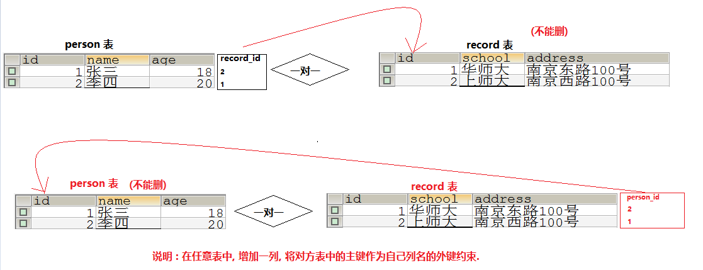
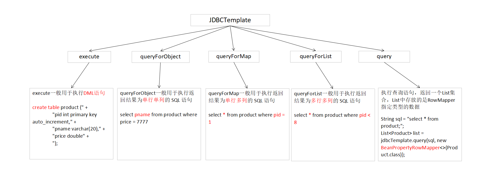

# 3 数据库
## 3.1 数据库概念
### 3.1.1 SQL 分类

**DDL (数据定义语言) :** `create`、`alter`、`drop`、`truncate`

~~~sql
-- 创建用户 : CREATE USER '用户名'@'主机名' IDENTIFIED BY '密码';如果想让该用户可以从任意远程主机登陆，可以使用通配符%

-- Jack 用户只能在localhost这个IP登录mysql服务器
CREATE USER 'Jack'@'localhost' IDENTIFIED BY '123';
-- Rose 用户可以在任何电脑上登录mysql服务器
CREATE USER 'Rose'@'%' IDENTIFIED BY '123';

-- 删除用户 : DROP USER '用户名'@'主机名';

-- 删除 Jack
DROP USER 'Jack'@'localhost';

-- alter table 表名 add/delete/modify 列名 类型(长度) 约束；

-- 在emp2表上增加salary列
alter table emp2 add salary double;
-- 修改name列的长度为30
alter table emp modify name varchar(30);

-- 修改现有列名称 语法：alter table 表名 change 旧列名 新列名 类型(长度) 约束;

-- 修改列名name为username
alter table emp change name username;

-- 删除现有列 语法：alter table 表名 drop 列名 ;

-- 删除age列
alter table emp drop age;

-- 修改表名 : rename table 旧表名 to 新表名; 

-- 将emp2表名修改为employee表
rename table emp2 to employee;
~~~

**DML (数据操纵语言) :** `update`、`insert`、`delete`

**DCL (数据控制语言) :** `grant`、`revoke`、`if ... else`、`while`、`begin transaction`

~~~sql
-- 授权用户 : GRANT 权限1，权限2 ... ON 数据库名.表名 TO '用户名'@'主机名';如果要授予所的权限则使用ALL

-- 给 Jack 用户分配对 test 这个数据库操作的权限
grant create,alter,drop,insert,update,delete,select on test.* to 'Jack'@'localhost';
-- 给 Rose 用户分配对所有数据库操作的权限
grant all on *.* to 'Rose'@'%';

-- 撤销授权 : REVOKE  权限1, 权限2... ON 数据库.表名 FROM '用户名'@'主机名';

-- 撤销 Jack 用户对 test 操作的权限
revoke all on test.* from 'Jack'@'localhost';

-- 修改管理员密码 : mysqladmin -u root -p 新密码（不需要加上引号）
msqladmin -u root -p weipeng185261
-- 修改普通用户密码 : set password for '用户名'@'主机名' password('新密码')
set password for 'Rose'@'localhost' password('666666');
~~~

**DQL (数据查询语言) :** `select`

## 3.2 数据库增删改查

### 3.2.1 delete 删除表中的数据时没有加 where 条件，它与 truncate 有什么区别

1. **删除过程不同 :** truncate 删除数据，先将整个表删除，再重新创建，delete 删除数据，逐行删除记录，truncate 效率要好于 delete.
2. **语言定义不同 :** truncate 属于 DDL，无法回退，不可以将数据找回来，delete 属于 DML，可以回退，可以将数据找回来.

### 3.2.2 SQL 查询语句

1. null 与其它值进行运算的时候，结果还是 null，因此在对一些可能会出现 null 值的变量进行运算的时候，需要使用 `ifnull` 指定其为 null 时的一个默认值，以保证运算结果正确.

~~~sql
-- 对姓刘的学生的成绩总分进行降序排序
select ifnull(chinese, 0) + ifnull(math, 0) + ifnull(english, 0) as 总分 
from exam
where name like '刘%'
order by 总分 desc;
~~~

2. SQL 的聚合函数包括 `avg` 、`count` 、`max` 、`min` 、`sum` ，这些聚合函数在对列进行运算的时候，如果变量的值为 null，则不会对相应的元素进行计算，因此在使用 `avg` 、`sum` 对表的列进行运算的时候，需要使用 `ifnull` 进行相应的处理.

~~~sql
-- 统计一个班级语文、数学、英语的成绩总和
select sum(chinese + math + english) from exam;	-- 错误，因为 chinese、math、english这三科的成绩可能为 null，此时运算结果可能会出现错误，因此需对其使用 ifnull 进行相应的处理
select sum(ifnull(chinese) + ifnull(math) + ifnull(english)) from exam;	-- 正确
select sum(chinese) + sum(math) + sum(english) from exam;	-- 正确
~~~

3. where 和 having 的区别 : where 在分组之前实现过滤，而且 where 语句中不可以使用别名和聚合函数，having 在分组之后实现过滤，在 having 语句中可以使用聚合函数和别名，having 和 group by 一般组合使用.
4. as 不仅可以用作列的别名，还可以将查询结果通过 as 作为一张表来使用，这种情况一般出现在最后的查询需要使用到中间的查询结果.

~~~sql
-- 查询不及格的学生信息和课程信息
SELECT student.*, temp2.name
FROM student,
(SELECT student_id, course_id FROM student_course WHERE score < 60) AS temp1,
(SELECT * FROM course) AS temp2
WHERE student.id = temp1.student_id AND temp1.course_id = temp2.id;
~~~

5. 在使用 `delete`、`update`对表进行修改，且在修改的中间过程需要使用到查询语句，此时需要将查询语句修改为一个临时表来使用，这样才能修改成功.

~~~sql
-- 删除10号部门薪水最高的员工
DELETE FROM emp WHERE sal = (SELECT * FROM (SELECT MAX(sal) FROM emp WHERE deptno = 10) AS temp) AND deptno = 10;

-- 将薪水最高的员工的薪水降30%
UPDATE emp SET sal = 0.7 * sal WHERE sal = (SELECT * FROM (SELECT MAX(sal) FROM emp) AS temp);
~~~

### 3.2.3 select 语句的查询顺序

select 语句的查询顺序为 : `from` 、`where`、`group by`、`select`、`having`、`order by`.

面试的时候回答 : `from`、`where`、`group by`、`having`、`select`、`order by`.

## 3.3 数据库设计
### 3.3.1 多表设计的方法

1. 一对多 : 在多方表中增加一列，将一方表中的主键作为自己的外键约束.

2. 多对多 : 额外设计一张中间表，中间表中的列名需要引用两张表的主键作为自己的外键约束.

3. 一对一 : 在任意表中，增加一列，将对方表中的主键作为自己列名的外键约束.

### 3.3.2 SQL 语句书写的方法

在根据需求书写 SQL 语句时，需要分析需求的中间过程，并书写出其 SQL 语句，然后一步一步的来书写出需求的完整 SQL 语句.

~~~sql
-- 查询没学过关羽老师课的同学的学号、姓名
-- 1.查询关羽老师的 id
SELECT id FROM teacher WHERE NAME = '关羽';
-- 2.查询关羽老师课的 id
SELECT id FROM course WHERE teacher_id = (SELECT id FROM teacher WHERE NAME = '关羽');
-- 3.查询学过关羽老师课的同学
SELECT DISTINCT student_id FROM student_course WHERE course_id IN (SELECT id FROM course WHERE teacher_id = (SELECT id FROM teacher WHERE NAME = '关羽'));
-- 4.查询没有学过关羽老师课的同学的学号、姓名
SELECT id, NAME
FROM student
WHERE student.id NOT IN (SELECT DISTINCT student_id FROM student_course WHERE course_id IN (SELECT id FROM course WHERE teacher_id = (SELECT id FROM teacher WHERE NAME = '关羽')));
~~~

## 3.4 SQL 注入
### 3.4.1 SQL 注入问题及其解决方案

**SQL 注入原理 :** 由于没有对用户输入进行充分检查，而 SQL 又是拼接而成，在用户输入参数时，在参数中添加一些 SQL 关键字，达到改变 SQL 运行结果的目的，也可以完成恶意攻击.

~~~sql
-- 1.输入 username : zhangsan' or '1' = '1' password 随意
select * from user where username = 'zhangsan' or '1' = '1' and password = '';

-- 2.输入 username : zhangsan' -- password 随意
select * from user where username = 'zhangsan' -- and password = '';
~~~

**SQL 注入解决方案 :** 使用 PreparedStatement 取代 Statement ，在 SQL 中参数以 ? 占位符方式表示，将带有 ? 的 SQL 发送给数据库完成编译，因为 SQL 已经编译过，参数中特殊字符不会当做 SQL 中的特殊字符编译，无法达到 SQL 注入的目的，进而可以防止 SQL 注入.

## 3.5 JDBCTemplate
### 3.5.1 JDBCTemplate 使用方法

1. **execute :** 一般用于执行 `DML` 语句.

~~~java
// 1. 创建表的SQL语句
String sql = "create table product (" +
"pid int primary key auto_increment," +
"pname varchar(20)," +
"price double" +
");";

// 2. 创建 jdbcTemplate 对象, 并将数据库连接池作为参数传入
JdbcTemplate jdbcTemplate = new JdbcTemplate(JDBCUtils.getDataSource());

// 3. 使用 jdbcTemplate 对象调用 execute 方法, 执行 sql 语句, 创建数据库表.
jdbcTemplate.execute(sql);
~~~

2. **queryForObject :** 一般用于执行返回结果为 `单行单列` 的 SQL 语句.

~~~java
// 1. 创建一个 JdbcTemplate 对象
JdbcTemplate jdbcTemplate = new JdbcTemplate(JDBCUtils.getDataSource());

// 2. 执行 queryForObject 方法
String sql = "select pname from product where price = 7777";
String pname = jdbcTemplate.queryForObject(sql, String.class);
~~~

3. **queryForMap :** 一般用于执行返回结果为 `单行多列` 的 SQL 语句.

~~~java
// 1. 创建一个 JdbcTemplate 对象
JdbcTemplate jdbcTemplate = new JdbcTemplate(JDBCUtils.getDataSource());

// 2. 执行 queryForMap 方法
String sql = "select * from product where pid = ?;";
Map<String, Object> map = jdbcTemplate.queryForMap(sql, 6);
~~~

4. **queryForList :** 一般用于执行返回结果为 `多行多列` 的 SQL 语句.

~~~java
// 1. 创建一个 JdbcTemplate 对象
JdbcTemplate jdbcTemplate = new JdbcTemplate(JDBCUtils.getDataSource());

// 2. 执行 objectForList 方法
String sql = "select * from product where pid < ?;";
List<Map<String, Object>> list = jdbcTemplate.queryForList(sql, 8);
~~~
5. **query :** 执行查询语句，返回一个 `List` 集合，List 中存放的是 RowMapper 指定类型的数据.

~~~java
// 1. 创建一个 JdbcTemplate 对象
JdbcTemplate jdbcTemplate = new JdbcTemplate(JDBCUtils.getDataSource());

// 2. 执行 query 方法
String sql = "select * from product;";
List<Product> list = jdbcTemplate.query(sql, new BeanPropertyRowMapper<>(Product.class));
~~~