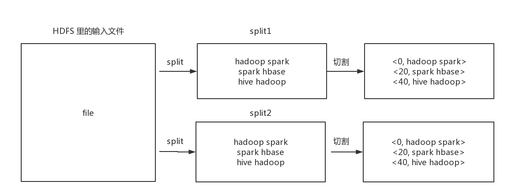

# 7 Hadoop
## 7.1 Hadoop Shell
### 7.1.1 -p

```shell
# -p 保留访问和修改时间，所有权和权限
hdfs dfs -put -p sourceFile desFile
```
### 7.1.2 -f

```shell
# -f 覆盖原文件（如果已存在）
hdfs dfs -put -f sourceFile desFile
```
### 7.1.3 -appendToFile

```shell
# -appendToFile 追加一个文件到原文件的末尾
hdfs dfs -put -appendToFile sourceFile desFile
```
### 7.1.4 -copyFromLocal

```shell
# -copyFromLocal 从本地拷贝一个文件到 HDFS 中去
hdfs dfs -copyFromLocal sourceFile desFile
```
### 7.1.5 -copyToLocal

```shell
# -copyToLocal 从 HDFS 拷贝一个文件到本地
hdfs dfs -copyToLocal sourceFile desFile
```
### 7.1.6 -getMerge

```shell
# -getMerge 合并下载多个文件，将多个文件合并下载为一个文件，比如在 HDFS 的 /test 目录下有 log.1、log.2、log.3、log.4，则使用 hdfs dfs -getMerge /test/log.* /log.sum 就可以将这 4 个 log 文件下载到本地，并且合并为一个 log 文件
hdfs dfs -getMerge /test/log.* /log.sum
```
### 5.4 MapReduce
## 5.4.1 WordCount
### 5.4.1.1 原理


MapReduce 的 WordCount 主要包括以下几个过程 :

**1、对文件进行分片、切割**



首先，Hadoop 会自动将文件进行分片，然后将每一个分片放到对应节点上的 mapper 里面去读，然后再每一台有 mapper 任务的节点上将对应的分片切割成一行一行的键值对，然后传递到 map 方法中，键是每一行在这个分片中的偏移量，值是每一行中的字符串

**2、map**


对每一行中的字符串进行切割，生成健值对的形式，然后写出去

**3、map 中的 shuffle 阶段**


map 中的 shuffle 阶段主要包括 partition、sort、combine，在 partition 阶段主要得到的键值对按照一定的规则分组，比如将 key 中所有首字母为 a 的分到一组，将所有首字母为 b 的分到一组，在 sort 阶段主要对每一个组中的键值对根据键的哈希码排序，在 combine 阶段主要将所有键值相同的键值对合并成一个新的键值对，新的键值对的键是原来的键，键值是所有键的键值之和

**4、reduce 中的 shuffle 阶段**


reduce 中的 shuffle 阶段主要包括从 partition 中拉取数据、merge、sort，hadoop 决定有多少个 reducer 的时候会规定有多少个 partition，每个 reducer 拉取自己要处理的那个分组的全部成员，例如每一个节点要处理所有以 a 开头的数据，那么它将会从所有的 mapper 中将所有首字母为 a 的数据全部拉取过来，在 merge 阶段，每一个 reducer 会将所有键相同的键值对合并成一个新的键值对，键是以前的键，值是以前所有键值的集合，在 sort 阶段，每一个 reducer 会对所有的键值对根据键的哈希码进行排序

**5、reduce**


在 reduce 阶段，会将每一个键值对的所有键值累加起来，然后将结果以健值对的形式将结果写出去

**6、将结果写入 HDFS**


在每一台 reducer 节点上将结果写入，形成一个一个的文件块，但对外表现的形式是一个大文件

### 5.4.1.2 代码

```java
public class WordCount {

    public static class MyMapper extends Mapper<LongWritable, Text, Text, LongWritable> {

        /**
         * 单词计数 map
         * 输入数据格式 : <0, hadoop mapreduce hadoop flume> <20, kafka hbase kafka spark>
         * 输出数据格式 : <hadoop, 1> <mapreduce, 1> <hadoop, 1> <flume, 1> <kafka, 1> <hbase, 1> <kafka, 1> <spark, 1>
         *
         * @param key     map 端输入的 key
         * @param value   map 端输入的 value
         * @param context map 上下文
         * @throws IOException
         * @throws InterruptedException
         */

        @Override
        protected void map(LongWritable key, Text value, Context context) throws IOException, InterruptedException {
            for (String str : value.toString().split("\\t")) {
                context.write(new Text(str), new LongWritable(1));
            }
        }

    }

    public static class MyReducer extends Reducer<Text, LongWritable, Text, LongWritable> {

        /**
         * 单词计数 reduce
         * 输入数据格式 : <hadoop, <1, 1>> <mapreduce, <1>> <flume, <1>> <kafka, <1, 1>> <hbase, <1>> <spark, <1>>
         * 输出数据格式 : <hadoop, 2> <mapreduce, 1> <flume, 1> <kafka, 2> <hbase, 1> <spark, 1>
         *
         * @param key     reduce 端输入的 key
         * @param values  reduce 端输入的 value
         * @param context reduce 上下文
         * @throws IOException
         * @throws InterruptedException
         */

        @Override
        protected void reduce(Text key, Iterable<LongWritable> values, Context context) throws IOException, InterruptedException {
            Iterator<LongWritable> iterator = values.iterator();
            int count = 0;
            while (iterator.hasNext()) {
                long num = iterator.next().get();
                count += num;
            }
            context.write(key, new LongWritable(count));
        }

    }

    public static void main(String[] args) {

        try {

            //  本地数据来源
            String localInput = "I:\\LearningData\\MyDocumentation\\黑马程序员大数据培训\\所做项目\\BigData\\file\\wordcount\\input";
            //  本地数据输出路径
            String localOutput = "I:\\LearningData\\MyDocumentation\\黑马程序员大数据培训\\所做项目\\BigData\\file\\wordcount\\output";

            //  判断任务是否是本地模式运行
            if (JobUtils.isLocal(Constants.HADOOP_JOB_LOCAL)) {
                //  如果任务是本地模式运行，则将 args 中的参数设置为本地数据来源和输出路径
                args = new String[]{localInput, localOutput};
            }


            //  创建任务
            Job job = Job.getInstance();

            //  设置类的来源
            job.setJarByClass(WordCount.class);

            //  设置 mapper 和 reducer 的类
            job.setMapperClass(MyMapper.class);
            job.setReducerClass(MyReducer.class);

            //  设置 map 的输出的 key 和 value 的数据类型
            job.setMapOutputKeyClass(Text.class);
            job.setMapOutputValueClass(LongWritable.class);

            //  设置 reduce 的输出的 key 和 value 的数据类型
            job.setOutputKeyClass(Text.class);
            job.setOutputValueClass(LongWritable.class);

            //  设置数据来源和输出路径
            FileInputFormat.setInputPaths(job, new Path(args[0]));
            FileOutputFormat.setOutputPath(job, new Path(args[1] + "/" + DateUtils.formatDateWithSecondsWithoutSeparator(new Date())));

            //  设置任务等待执行完成
            boolean result = job.waitForCompletion(true);
            System.exit(result ? 0 : 1);

        } catch (Exception e) {
            e.printStackTrace();
        }

    }

}
```
## 5.4.2 自定义排序
### 5.4.2.1 原理

自定义排序时，需要建一个实体类，然后实现 WritableComparable 接口，并实现其中的 compareTo、write、readFiles 方法，其中 compareTo 主要用于定义排序规则，write 方法主要用于类的序列化，readFiles 主要用于类的反序列化

### 5.4.2.2 代码

```java
@Setter
@Getter
@NoArgsConstructor
@AllArgsConstructor
public class Flow implements WritableComparable<Flow> {

    //  手机号
    private String phone;

    //  上行流量
    private Long upFlow;

    //  下行流量
    private Long downFlow;

    @Override
    public String toString() {
        return phone + "\t" + upFlow + "\t" + downFlow + "\t" + (upFlow + downFlow);
    }

    /**
     * 对流量进行排序
     * 排序规则 :
     * 1、如果总流量大小不相同，则按照总流量大小进行正序排序
     * 2、如果总流量大小相同，但上行流量大小不相同，则按照上行流量大小进行正序排序
     * 3、如果总流量大小相同，且上行流量大小相同，则按照手机号正序排序
     * @param o 另一个 Flow 对象
     * @return  第二个 Flow 对象与第一个 Flow 对象的比较结果
     */

    @Override
    public int compareTo(Flow o) {
        long result1 = upFlow + downFlow - o.getUpFlow() - o.getDownFlow();
        if (result1 != 0) {
            return (int) result1;
        } else {
            long result2 = upFlow - o.getUpFlow();
            if (result2 != 0) {
                return (int) result2;
            }
        }
        return phone.compareTo(o.getPhone());
    }

    @Override
    public void write(DataOutput dataOutput) throws IOException {
        dataOutput.writeUTF(phone);
        dataOutput.writeLong(upFlow);
        dataOutput.writeLong(downFlow);
    }

    @Override
    public void readFields(DataInput dataInput) throws IOException {
        phone = dataInput.readUTF();
        upFlow = dataInput.readLong();
        downFlow = dataInput.readLong();
    }
}
```
## 5.4.3 自定义分区
### 5.4.3.1 原理

自定义分区时需要写一个类，然后实现 Partitioner<K, V> 接口，其中 K 是指自定义分区的 key，分区时就是根据 key 来进行分区的，V 是自定义分区的 value，然后实现 getPartition 方法，该方法的返回值就是分区号，在实现自定义分区时，需要在 Job 中设置自定义分区类和分区个数，其中分区的个数就是在自定义分区中所分分区的个数

```java
//  设置自定义分区
job.setPartitionerClass(FlowPartitioner.class);
job.setNumReduceTasks(6);
```

### 5.4.3.2 代码

```java
public class FlowPartitioner extends Partitioner<Flow, NullWritable> {

    /**
     * 流量排序自定义分区
     * @param flow          自定义分区的 key : 流量
     * @param nullWritable  自定义分区对应的 value : NullWritable
     * @param numPartitions 分区的数量
     * @return  对应的分区序号
     */

    @Override
    public int getPartition(Flow flow, NullWritable nullWritable, int numPartitions) {
        String beforePhone3Digit = flow.getPhone().substring(0, 3);
        switch (beforePhone3Digit) {
            case "134":
            case "135":
                return 0;
            case "136":
            case "137":
                return 1;
            case "138":
            case "139":
                return 2;
            case "150":
            case "159":
                return 3;
            case "182":
            case "183":
                return 4;
            default:
                return 5;
        }
    }

}
```
## 5.4.4 自定义 Combiner
### 5.4.4.1 原理

Combiner 可以对 map 阶段的输出先做一次合并，以减少 map 和 reduce 节点之间的数据传输量，提高网络 IO 性能，是  MapReduce 的一种优化手段之一，在使用时，其方法和 reduce 的方法的逻辑相同，所以可以不用写 combiner 的方法，直接在 job 中设置 Combiner 的类即可

```java
//  设置自定义 Combiner
job.setCombinerClass(FlowSortReducer.class);
```
## 5.4.5 MapReduce 中的配置模板

```java
try {

    String localInputPath = "I:\\LearningData\\MyDocumentation\\黑马程序员大数据培训\\所做项目\\BigData\\file\\partitioner\\input";
    String localOutputPath = "I:\\LearningData\\MyDocumentation\\黑马程序员大数据培训\\所做项目\\BigData\\file\\partitioner\\output";

    if (JobUtils.isLocal(Constants.HADOOP_JOB_LOCAL)) {
        args = new String[]{localInputPath, localOutputPath};
    }


    //  创建任务实例
    Job job = Job.getInstance();

    //  设置自定义分区
    job.setPartitionerClass(FlowPartitioner.class);
    job.setNumReduceTasks(6);

    //  设置自定义 Combiner
    job.setCombinerClass(FlowSortReducer.class);

    //  设置类的依赖
    job.setJarByClass(FlowSort.class);

    //  设置 Mapper 和 Reducer 类的依赖
    job.setMapperClass(FlowSortMapper.class);
    job.setReducerClass(FlowSortReducer.class);

    //  设置 map 和 reduce 的输入数据和输出数据格式
    job.setMapOutputKeyClass(Flow.class);
    job.setMapOutputValueClass(NullWritable.class);
    job.setOutputKeyClass(Flow.class);
    job.setOutputValueClass(NullWritable.class);

    //  设置数据来源和数据输出路径
    FileInputFormat.setInputPaths(job, new Path(args[0]));
    FileOutputFormat.setOutputPath(job, new Path(args[1] + "/" + DateUtils.formatDateWithSecondsWithoutSeparator(new Date())));

    //  等待任务运行完成
    boolean result = job.waitForCompletion(true);
    System.exit(result ? 0 : 1);

} catch (Exception e) {
    e.printStackTrace();
}
```