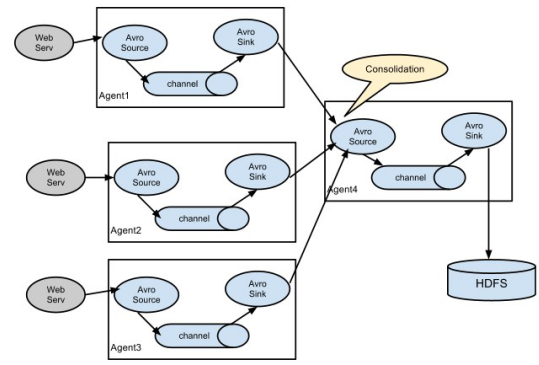

# 8 Flume
## 8.1 原理


Flume 主要分为三个组件，分别为 source、channel、sink，source 收集到的数据，会被 Flume 框架封装成 event 对象，然后就以 event 对象为单位，传输到 channel 组件中，channel 主要用于缓存从 source 中传来的数据，sink 组件在从 channel 中读取数据时，也是以 event 对象为单位

## 8.2 采集系统结构图
### 8.2.1 单个 agent 采集数据


### 8.2.2 多级 agent 之间串联



## 8.3 采集方案
### 8.3.1 采集目录到 HDFS
#### 8.3.1.1 配置文件

```conf
# Name the components on this agent
a1.sources=r1
a1.sinks=k1
a1.channels=c1

#Describe/configure the source
# 注意：不能往监控目中重复丢同名文件
a1.sources.r1.type=spooldir
a1.sources.r1.spoolDir=/root/logs
a1.sources.r1.fileHeader=true

# Describe the sink
a1.sinks.k1.type=hdfs
a1.sinks.k1.hdfs.path=/flume/events/%y-%m-%d/%H%M/
a1.sinks.k1.hdfs.filePrefix=events-
a1.sinks.k1.hdfs.round=true
a1.sinks.k1.hdfs.roundValue=10
a1.sinks.k1.hdfs.roundUnit=minute
a1.sinks.k1.hdfs.rollInterval=3
a1.sinks.k1.hdfs.rollSize=20
a1.sinks.k1.hdfs.rollCount=5
a1.sinks.k1.hdfs.batchSize=1
a1.sinks.k1.hdfs.useLocalTimeStamp=true
# 生成的文件类型，默认是Sequencefile，可用DataStream，则为普通文本
a1.sinks.k1.hdfs.fileType=DataStream

# Usea channel which buffers events in memory
a1.channels.c1.type=memory
# 默认该通道中最大的可以存储的event数量
a1.channels.c1.capacity=1000
a1.channels.c1.transactionCapacity=100

# Bind the source and sink to the channel
a1.sources.r1.channels=c1
a1.sinks.k1.channel=c1
```
### 8.3.2 采集文件到 HDFS
#### 8.3.2.1 配置文件

```conf
# Name the components on this agent
a1.sources=r1
a1.sinks=k1
a1.channels=c1

# Describe/configure the source
a1.sources.r1.type=exec
a1.sources.r1.command=tail -F /root/logs/test.log
a1.sources.r1.channels=c1

# Describe the sink
a1.sinks.k1.type=hdfs
a1.sinks.k1.hdfs.path=/flume/tailout/%y-%m-%d/%H%M/
a1.sinks.k1.hdfs.filePrefix=events-
# 是否启用时间上的“舍弃”，这里的“舍弃”，类似于“四舍五入”。
a1.sinks.k1.hdfs.round=true
# 时间上进行“舍弃”的值；
a1.sinks.k1.hdfs.roundValue=10
# 时间上进行 “舍弃” 的单位，包含：second, minute, hour 示例：
# a1.sinks.k1.hdfs.path=/flume/events/%y-%m-%d/%H%M/%S
a1.sinks.k1.hdfs.round=true
a1.sinks.k1.hdfs.roundValue=10
a1.sinks.k1.hdfs.roundUnit=minute
# 当时间为2015-10-1617:38:59时候，hdfs.path依然会被解析为：
# /flume/events/20151016/17:30/00
# 因为设置的是舍弃10分钟内的时间，因此，该目录每10分钟新生成一个。
a1.sinks.k1.hdfs.roundUnit=minute
# hdfs sink间隔多长将临时文件滚动成最终目标文件，单位：秒；如果设置成0，则表示不根据时间来滚动文件；
# 注：滚动（roll）指的是，hdfssink将临时文件重命名成最终目标文件，并新打开一个临时文件来写入数据；
a1.sinks.k1.hdfs.rollInterval=3
# 当临时文件达到该大小（单位：bytes）时，滚动成目标文件；如果设置成0，则表示不根据临时文件大小来滚动文件；
a1.sinks.k1.hdfs.rollSize=20
# 当events数据达到该数量时候，将临时文件滚动成目标文件；如果设置成0，则表示不根据events数据来滚动文件；
a1.sinks.k1.hdfs.rollCount=5
a1.sinks.k1.hdfs.batchSize=1
a1.sinks.k1.hdfs.useLocalTimeStamp=true
# 生成的文件类型，默认是Sequencefile，可用DataStream，则为普通文本
a1.sinks.k1.hdfs.fileType=DataStream

# Use a channel which buffers events in memory
a1.channels.c1.type=memory
a1.channels.c1.capacity=1000
a1.channels.c1.transactionCapacity=100

# Bind the source and sink to the channel
a1.sources.r1.channels=c1
a1.sinks.k1.channel=c1
```
### 8.3.3 load-balance
#### 8.3.3.1 原理


负载均衡主要是用于解决一台机器无法处理所有请求而产生的一种算法，Flume 的 load-balance 结构图如上图所示，Agent1 是一个路由节点，负责将 channel 中暂存的 Event 采用轮询的方式平均分配到每个 sink，每个 sink 分别连接到一个独立的 Agent 上

#### 8.3.3.2 配置文件

```conf
a1.sinkgroups=g1
a1.sinkgroups.g1.sinks=k1 k2 k3
a1.sinkgroups.g1.processor.type=load_balance
# 如果开启，则将失败的sink放入黑名单
a1.sinkgroups.g1.processor.backoff=true
a1.sinkgroups.g1.processor.selector=round_robin
# 在黑名单放置的超时时间，超时结束时，若仍然无法接收，则超时时间呈指数增长
a1.sinkgroups.g1.processor.selector.maxTimeOut=10000
```
### 8.3.4 failover
#### 8.3.4.1 原理

faliover 的流程和 load-balance 相似，但内部处理机制却完全不同，故障转移机制是将失败的 sink 降级到一个池，在这些池中他们被分配一个冷却时间，随着故障的连续，在重试之前冷却时间增加，一旦 sink 成功发送一个事件，它将恢复到活动池，sink 具有与之相关的优先级，数量越大，优先级越高，Agent 中的 sink 在发送数据时，会将数据一直发送到当前优先级最高的 sink，如果优先级最高的 sink 发生故障，将会把数据发送到下一个优先级最高的 sink，一旦优先级最高的 sink 恢复成活动状态，则又会把数据一直发送到优先级最高的 sink

#### 8.3.4.2 配置文件

```conf
a1.sinkgroups=g1a1.sinkgroups.g1.sinks=k1 k2 k3
a1.sinkgroups.g1.processor.type=failover
# 优先级值,绝对值越大表示优先级越高
a1.sinkgroups.g1.processor.priority.k1=5
a1.sinkgroups.g1.processor.priority.k2=7
a1.sinkgroups.g1.processor.priority.k3=6
# 失败的Sink的最大回退期（millis）
a1.sinkgroups.g1.processor.maxpenalty=20000
```
### 8.3.5 日志采集汇总
#### 8.3.5.1 原理


服务器 A 和 B 中产生的主要日志数据包括 access.log、nginx.log、web.log，这些日志数据首先需要在服务器 C 中进行汇总，然后通过服务器 C 上传到 HDFS 中，HDFS 中目录的格式为

```txt
/source/logs/access/20160101/** 
/source/logs/nginx/20160101/** 
/source/logs/web/20160101/** 
```
#### 8.3.5.2 配置文件

**服务器 A 和服务器 B 配置文件 :**

```conf
# Name the components on this agent
a1.sources = r1 r2 r3
a1.sinks = k1
a1.channels = c1
 
# Describe/configure the source
a1.sources.r1.type = exec
a1.sources.r1.command = tail -F /root/data/access.log
a1.sources.r1.interceptors = i1
a1.sources.r1.interceptors.i1.type = static
# static 拦截器的功能就是往采集到的数据的 header 中插入自己定义的 key-value 对
a1.sources.r1.interceptors.i1.key = type
a1.sources.r1.interceptors.i1.value = access
 
a1.sources.r2.type = exec
a1.sources.r2.command = tail -F /root/data/nginx.log a1.sources.r2.interceptors = i2
a1.sources.r2.interceptors.i2.type = static
a1.sources.r2.interceptors.i2.key = type
a1.sources.r2.interceptors.i2.value = nginx
 
a1.sources.r3.type = exec
a1.sources.r3.command = tail -F /root/data/web.log
a1.sources.r3.interceptors = i3
a1.sources.r3.interceptors.i3.type = static a1.sources.r3.interceptors.i3.key = type
a1.sources.r3.interceptors.i3.value = web
 
# Describe the sink
a1.sinks.k1.type = avro
a1.sinks.k1.hostname = 192.168.200.101
a1.sinks.k1.port = 41414
 
# Use a channel which buffers events in memory
a1.channels.c1.type = memory
a1.channels.c1.capacity = 20000
a1.channels.c1.transactionCapacity = 10000
 
# Bind the source and sink to the channel
a1.sources.r1.channels = c1
a1.sources.r2.channels = c1
a1.sources.r3.channels = c1
a1.sinks.k1.channel = c1
```
**服务器 C 配置文件 :**

```conf
# 定义 agent 名， source、channel、sink 的名称
a1.sources = r1
a1.sinks = k1
a1.channels = c1
 
# 定义 source
a1.sources.r1.type = avro
a1.sources.r1.bind = mini2
a1.sources.r1.port =41414
 
# 添加时间拦截器 
a1.sources.r1.interceptors = i1
a1.sources.r1.interceptors.i1.type = org.apache.flume.interceptor.TimestampInterceptor$Builder
 
# 定义 channels
a1.channels.c1.type = memory
a1.channels.c1.capacity = 20000
a1.channels.c1.transactionCapacity = 10000
 
# 定义 sink
a1.sinks.k1.type = hdfs
a1.sinks.k1.hdfs.path=hdfs://192.168.200.101:9000/source/logs/%{ty pe}/%Y%m%d
a1.sinks.k1.hdfs.filePrefix =events
a1.sinks.k1.hdfs.fileType = DataStream
a1.sinks.k1.hdfs.writeFormat = Text
# 时间类型
a1.sinks.k1.hdfs.useLocalTimeStamp = true
# 生成的文件不按条数生成
a1.sinks.k1.hdfs.rollCount = 0
# 生成的文件按时间生成
a1.sinks.k1.hdfs.rollInterval = 30
# 生成的文件按大小生成
a1.sinks.k1.hdfs.rollSize  = 10485760
# 批量写入 hdfs 的个数
a1.sinks.k1.hdfs.batchSize = 10000
# flume 操作 hdfs 的线程数（包括新建，写入等）
a1.sinks.k1.hdfs.threadsPoolSize=10
# 操作 hdfs 超时时间
a1.sinks.k1.hdfs.callTimeout=30000
 
# 组装 source、channel、sink
a1.sources.r1.channels = c1
a1.sinks.k1.channel = c1
```
## 8.4 命令
### 8.4.1 启动 Flume

```shell
bin/flume-ng agent -c conf -f conf/avro_source_hdfs_sink.conf -name a1 Dflume.root.logger=DEBUG,console
```