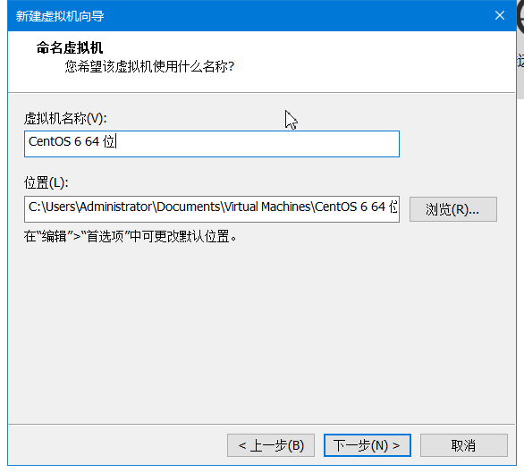
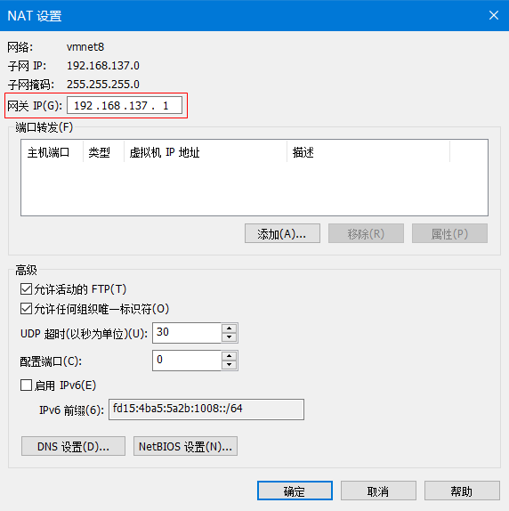
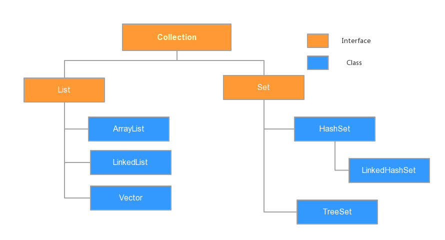
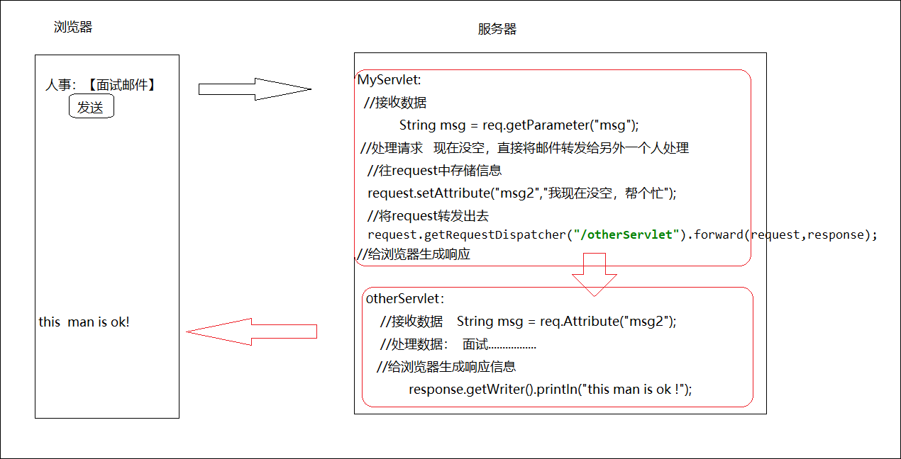
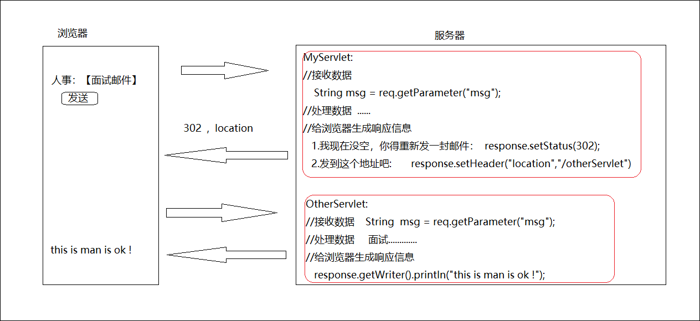
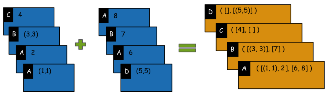
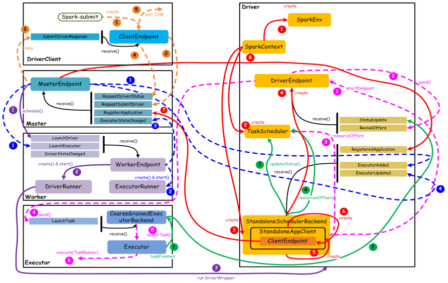
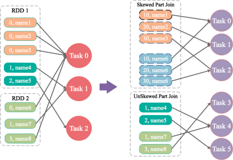
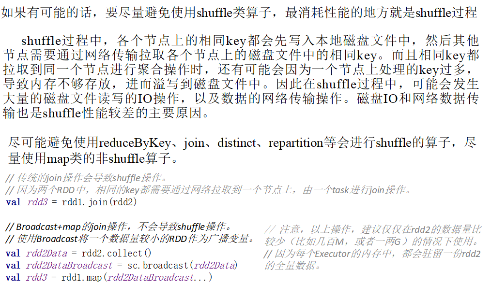

# 学习笔记

## 1 Linux

### 1.1 Linux 命令

**1. tail :** 

~~~txt
tail -f filename 说明：监视filename文件的尾部内容（默认10行，相当于增加参数 -n 10），刷新显示在屏幕上。退出，按下CTRL+C。
tail -n 20 filename 说明：显示filename最后20行。
tail -r -n 10 filename 说明：逆序显示filename最后10行
~~~
```shell
```

**2. awk :**

~~~txt
awk 的基本选项：
-F 指定分隔符，-F后面加指定的分隔符
-f 指定脚本，-f后面加脚本文件，从该脚本中读取awk命令，代替输入

输出a,b,c，$1 $2 $3 分别对应输出的a，b，c
echo a b c | awk'{print $1,$2,$3}'

指定分隔符是" : ",  输出passwd文本的第一列，即系统的用户名
awk -F ":" '{print $1}' /etc/passwd

用-f 选项调用一个awk脚本来对sample.txt做操作，awk脚本是test.sh
awk -f test.sh sample.txt
~~~

 **3.java :** 

~~~txt
在 linux 上运行打包成 jar 的 java 程序，其中 mainClassReference 是主类的引用名，包括包名和类名，agrs 是主方法中通过 args 接收的参数
java -cp jarName.jar mainClassReference args
~~~

 **4.dirname :**

~~~txt
获取文件的路径，其中 file 为文件名
dirname file
~~~

**5. 截取字符串**

~~~txt
1. # 截取，删除左边字符，保留右边字符
${str#*reg}

2. % 截取，删除右边字符，保留左边字符
${str%reg*}
~~~

**6. tar**

```txt
//    压缩文件
tar -zcvf 打包压缩后的文件名 要打包的文件

//    解压文件
tar -zxvf 压缩文件 -C 指定解压的位置
```
**7. 网卡操作**

```txt
//    查看网卡信息
ip addr

//    关闭网卡
ifdown 网卡名

//    启动网卡
ifup 网卡名
```
**8. mount**

```shell
# 把 iso9660 类型的移动设备 /dev/cdrom 以只读的方式挂载到 /mnt/cdrom 目录，注意，/mnt/cdrom 目录需要提前创建好
mount -t iso9660  -o ro  /dev/cdrom   /mnt/cdrom

# 卸载设备
umount /dev/cdrom
```
**9. crontab**

```shell
# 安装 crontab
yum -y install crontabs

# 启动服务
service crond start

# 停止服务
service crond stop

# 重启服务
service crond restart

# 用指定的文件替代目前的 crontab, -u user 表示用来设定某个用户的 crontab 服务
crontab file [-u user]

# 列出用户目前的 crontab 服务
crontab -l [-u user]

# 编辑用户目前的 crontab 服务
crontab -e [-u user]

# 分时日月周、命令
# 分 : 1 - 59, 每分钟用 * 或 */1 表示
# 时 : 0 - 23
# 日 : 1 - 31
# 月 : 1 - 12
# 周 : 0 - 6, 0 表示星期日
*   *    *   *   *   command

# 每月 1、10、22 日的 4 : 45 重启 apache
45 4 1,10,22 * * service httpd restart

# 每天 18 : 00 至 23 : 00 之间每隔 30 分钟重启 apache
0,30 18-23 * * * service httpd restart

# 晚上 11 : 00 到早上 7 : 00 每隔 1 小时重启 apache
0 23-7/1 * * * service httpd restart
```

### 1.2 Shell 脚本

1. **远程运行其它机器上的脚本 :**

~~~txt
其中 host 是远程机器的主机名，command 是要在远程机器上运行的脚本（包括完整路径）
ssh root@host command
~~~

2. **读取文件内容 :**

~~~txt
其中 file 为文件名
cat file while read line
do
echo $line
done
~~~

 

### 1.3 Java 程序打包成 jar 包在 Linux 上运行的方法

**本地运行**

```txt
//    其中 java -jar 运行的是已指定主类的 jar 包，java -cp 运行的是未指定主类的 jar 包，jar1、jar2 是 Java 程序打包成的 jar 包以及引用的依赖包，main-class 是 Java 程序打包成 jar 包的主类的全类名（包括包名和类名），args 是要传递的参数
java -cp jar1:jar2 main-class args
```
**yarn 上运行**

```txt
//    其中 jar1 是 Java 程序打包成的 jar 包，main-class 是 Java 程序打包成 jar 包的主类的全类名（包括包名和类名），args 是要传递的参数，jar2、jar3 是 Java 程序打包成的 jar 包引用的依赖包
yarn jar jar1 main-class args -libjars jar2:jar3
```
### 1.4 VMware WorkStation 安装 Centos 6.5 及网卡配置

1. 点击创建新的虚拟机


2. 选择自定义，点击下一步


3. 点击下一步


4. 选择稍后安装操作系统，点击下一步


5. 选择操作系统为 Linux，然后选择版本为 Centos 64 位，点击下一步


6. 修改虚拟机的名称，选择虚拟机保存的位置（注：当修改虚拟机的位置时，尽量在相应目录下创建一个和虚拟机名称相同的文件夹），点击下一步



7. 选择虚拟机处理器的数量和内核数（根据自己电脑的配置进行选择），点击下一步


8. 设置虚拟机的内存（根据自己电脑的配置进行选择），点击下一步


9. 选择使用网络地址转换（NAT），点击下一步


10. 点击下一步


11. 点击下一步


12. 点击下一步


13. 设置虚拟机物理磁盘大小为 40G，点击下一步


14. 点击下一步


15. 点击完成


16. 点击编辑虚拟机位置


17. 选择使用 CD/DVD(IDE)，点击使用 ISO 镜像文件


18. 点击浏览，找到 Centos 6.5 镜像文件


19. 点击打开


20. 点击确定


21. 点击开启此虚拟机


22. 选择第一个，点击回车


23. 按下 -> 键，选择 skip，点击回车


24. 点击 Next


25. 选择简体中文，点击 Next


26. 点击下一步


27. 点击下一步


28. 选择是，忽略所有数据，点击下一步


29. 设置主机名，点击配置网络


30. 选中 System eth0，点击编辑


31. 选中自动连接，点击应用，点击关闭


32. 点击下一步


33. 点击下一步


34. 设置 root 用户的密码，点击下一步


35. 点击下一步


36. 点击将修改写入磁盘


37. 选择 Basic Server，点击下一步


38. 开始安装，等待安装过程完成


39. 安装完成后点击重新引导，然后虚拟机会重启，重启后 login : 输入为 root，密码为安装过程中所设置的 root 用户对应的密码（输入密码的时候，密码会隐藏，直接输入对应的密码，然后回车即可）


40. 在屏幕右下方的网络点击右键，选择打开网络和 Internet 设置


41. 选择 WLAN（根据你的网络类型选择）


42. 点击右侧更改适配器选项


43. 选中 WLAN，点击右键，选择属性


44. 选择共享


45. 将两个框都选中，在家庭网络连接下拉框中选中 VMware Network Adapter CMnet8， 点击确定


46. 在弹出的对话框中选择是


47. 使用 Windows + R 快捷键打开运行窗口，输入 cmd，点击回车，在命令行中输入 ipconfig


48. 点击 VMware 中的编辑，选中虚拟网络编辑


49. 选中 VMnet8，修改其对应的子网 IP 和子网掩码

```txt

//    以太网适配器 VMware Network Adapter VMnet8 的配置

IPv4 地址 . . . . . . . . . . . . : 192.168.137.1
子网掩码  . . . . . . . . . . . . : 255.255.255.0
默认网关. . . . . . . . . . . . . : 192.168.43.1

//    VMnet8 的配置为

子网 IP : 192.168.137.0
子网掩码 : 255.255.255.0
```


50. 点击 NAT 设置，设置网关（注：虚拟机中 VMnet8 的子网 IP、子网掩码、网关需要和宿主机中的 VMware Network Adapter VMnet8 的值相对应），点击确定



51. 点击确定


52. 在 Centos 命令窗口输入 `cd etc/sysconfig/network-scripts/`，点击回车


53. 输入 `vim ifcfg-eth0`，然后将内容修改如下，然后按下 ESC ，然后按 :，输入 wq，按下回车保存文件内容并退出

```shell
E=eth0
HWADDR=00:0C:29:35:E7:41
TYPE=Ethernet
ONBOOT=yes
NM_CONTROLLED=yes
BOOTPROTO=static
IPADDR=192.168.137.101
NETMASK=255.255.255.0
GATEWAY=192.168.137.1
DNS1=101.198.198.198
DNS2=114.114.114.114
```


54. 在命令行输入 `service network restart` ，点击回车，重启网卡


55. 在命令行输入 `ping 192.168.43.74`，看虚拟机是否可以与宿主机连通（其中 ip 为宿主机的 ip 地址，如果出现以下情况，则说明虚拟机可以与宿主机连通）


56. 在命令行输入 `ping www.baidu.com`，看虚拟机是否可以连上外网（如果出现以下情况，则说明虚拟机可以连上外网）


### 1.5 VMware WorkStation 克隆虚拟机后需要修改的地方

1、重新生成 Mac 地址


2、删除 70-persistent-net.rules

```shell
rm -rf /etc/udev/rules.d/70-persistent-net.rules
```
3、修改 ifcfg-eth0

```shell
DEVICE=eth0
TYPE=Ethernet
ONBOOT=yes
NM_CONTROLLED=yes
BOOTPROTO=static
IPADDR=192.168.137.21
NETMASK=255.255.255.0
GATEWAY=192.168.137.1
DNS1=101.198.198.198
DNS2=114.114.114.114
```
4、修改主机名

```shell
vi /etc/sysconfig/network
```
```shell
NETWORKING=yes
HOSTNAME=hadoop21
```
5、修改 ip 与主机名的映射

```shell
vi /etc/hosts
```
```shell
127.0.0.1   localhost localhost.localdomain localhost4 localhost4.localdomain4
::1         localhost localhost.localdomain localhost6 localhost6.localdomain6
192.168.137.21 hadoop21
192.168.137.22 hadoop22
192.168.137.23 hadoop23
```
6、重启虚拟机

```shell
reboot
```
### 1.6 配置 SSH 免密登录

假设 hadoop21 是服务器，hadoop22 和 hadoop23 是客户端

1、在 hadoop21 上生成秘钥

```shell
ssh-keygen -t rsa
```
然后来四次回车

2、将 hadoop21、hadoop22、hadoop23 上的公钥复制给 hadoop21

```shell
ssh-copy-id hadoop21
```
3、从 hadoop21 上依次通过 ssh 远程连接 hadoop21、hadoop22、hadoop23

```shell
ssh hadoop21
exit
```
```shell
ssh hadoop22
exit
```
```shell
ssh hadoop23
exit
```
## 2 Hadoop

### 2.1 Hadoop包含的模块

a. **Hadoop Common：**支持其他模块的工具模块

b.**Hadoop Distributed File System (HDFS)：**分布式文件系统，提供了对应用程序数据的高吞吐量访问

​	进程包括：

​	NameNode				名称节点

​	DataNode				数据节点

​	SecondaryNamenode		辅助名称节点

c.**Hadoop YARN (Yet Another Resource Negotiate)：**作业调度与集群资源管理的框架

​	进程包括：

​	ResourceManager		资源管理器

​	NodeManager			节点管理器

### 2.2 配置Hadoop有哪几种模式

a.**Standalone/Local**	独立/本地模式，使用的本地文件系统

b.**Pseudodistributed mode**	伪分布模式

c.**Fully distributed mode**	完全分布式

### 2.3 HDFS中namenode和datanode的功能分别是什么

**namenode：**接受用户请求，维护文件系统中的目录结构，管理文件与block之间的关系、block与datanode之间的关系，namenode支持对hdfs中的目录、文件和块的修改上传.

**datanode：**存储文件，根据namenode和client的指令进行存储或检索block，并周期性的向namenode发送报告（心跳机制）.

### 2.4 HDFS中块的副本的放置策略

**第一个副本：**如果client在集群中的某台机器上，那么第一个副本就放在这一台机器上，如果client不在集群中，那么第一个副本就随机放置.

**第二个副本：**会放置在与第一个副本不同机架上的node节点上，随机性.

**第三个副本：**会放置在与第二个副本不同机架上的node节点上，随机性.

### 2.5 HDFS中fsimage和edits文件的作用是什么

**fsimgae：**记录某一永久检查点时整个hdfs的元数据信息.

**edits：**所有对hdfs的写操作都会记录在此文件中.

### 2.6 HDFS的优点和缺点

**优点：**

1. 上传的数据自动保存多个副本，通过增加副本的数量，来增加它的容错性
2. 如果hdfs某一个副本丢失，hdfs会复制其他机器上的副本，拷贝到自己的磁盘当中
3. 处理超大的数据文件
4. 运行在廉价的计算机集群上
5. 流式的访问数据

**缺点：**

1. 无法存储大量的小文件
2. 不适合低延迟的数据访问
3. 不支持多用户写入及任意的修改文件，一个文件只能一个线程写，不能多个线程同时写，仅支持文件的追加（append），不支持文件的随意修改

### 2.7 YARN 服务组件的功能

**ResourceManager :** 全局的资源管理器，整个集群上只有一个，负责集群资源的统一调度分配. 负责对各个 NodeManager 上的资源进行统一管理和调度. 

**ApplicationMaster :** 用户提交的每个应用程序都包含一个 AM , 主要功能包括：与 RM 协商调度获取资源（用 Container ）；与 NM 通信启动和停止任务；监控所有任务运行状态，并在任务运行失败的时候重新申请资源用于重启任务.

**NodeManager :** NM 是每个节点上的资源和任务管理器，一方面，它会定时向RM汇报本节点上的资源使用情况和各个节点上的 Container 的运行状态，另一方面，它会接受并处理来自 AM 的 Container 启动和停止请求.

**Container :** 是 yarn 中抽象概念，它封装 CPU、内存、多个节点上的多维度资源，当 AM 向 RM 申请资源，RM 返回给 AM 的资源便是 Container，yarn 会为每个任务分配一个 Container，且该任务只能使用该 Container 中描述的资源

### 2.8 MapReduce on Yarn 工作流程



**Client :** 客户

**ResourceManager :** 董事长

**Applications Manager :** 人事部

**Resource Scheduler :** 财务部

**Node Manager :** 项目经理

**Map Task & Reduce Task :**程序员

**特点：**

1. 分布式并行计算.
2. 主要核心功能：排序，默认的排序方式是按照 key 进行排序.

**概念定义：**

1. MapReduce 执行流程涉及到 Client、ResourceManager、NodeManager、 ApplicationMaster、Container、Task.
2. 其中 Client 是提交 MapReduce 的机器.
3. ApplicationMaster 是负责该 Job 调度的进程，一个 Job，一个 ApplicationMaster.
4. Container 是资源表示形式.
5. Task 是运行在 NodeManager 上的进程，使用到的资源就是 Container.
6. ResourceManager 是管理整个集群的资源.
7. NodeManager 是单个节点的资源管理.

**提交流程：**

1. Client 向 RM 申请资源，RM 上有所有 NM 的节点资源信息，RM 将资源信息（ NM 的 hostname、以及分配的内存和 CPU 大小）发送给 Client.
2. Client 根据请求到资源信息发送到对应的 NM，NM 中产生 Container 对象，然后在 Container 对象中调用相关代码，启动 AM.
3. AM 开始获取 Job 相关设置信息，获得 Map Task 数量（由 InputFormat 的 getSplits 方法决定）和 Reduce Task 数量（由 MapReduce.Job.Reduces 影响）
4. 然后 AM 向 RM 申请 Map Task 运行的资源（一个 Task 就需要一个 Container），RM 将分配的资源发送给 AM，AM 远程调用 NM 的相关方法启动对应的 Container，并在 Container 中启动对应的 Map Task.
5. 当一个 Map Task 执行完成后，会通知 AM 进程，当前 Map Task 执行完成；当总 Map Task 中有 5% 执行完成，AM 向 RM 申请 Reduce Task 运行资源（一个 Task 需要一个 Container）.
6. RM 将资源发送给 AM，AM 在对应的 NM 节点启动对应的 Container，并在 Container 中运行对应的 Reduce Task 任务
7. 当 Reduce Task 任务执行完成后，会告诉给 AM 进程；当所有的 Reduce Task 执行完成，AM 通知 Client 表示任务执行完成.

### 2.9 Map Task 在哪儿运行，是由谁来决定的

Map Task 是由 RM 返回给 AM 资源的时候决定的. RM 上会有全部 CPU 和内存，已使用 CPU 和内存，RM 会根据底层写好的算法，返回 NM 的信息. 所以说如果一个 NM 上只有一个 Map Task 任务，一个 Map Task 默认使用1核 CPU，使用 1G 内存，那这个 Map Task 任务只处理该 Task 本身的数据，也就是说该任务处理的数据可以是当前节点的，也可以是其它节点上的数据. RM 在分配资源的时候，会尽可能的将 Map Task 所运行的资源 ( Container 所在机器的 NM 的 hostname 等) 放到数据节点上，这样的话 AM 在启动 RM 的时候就会在数据节点上启动处理该数据的 Task 任务，该机制叫做 MapReduce 的数据本地化机制. 但是如果资源不够，就会选择其他机器，所以主要还是使用资源来做选择哪台机器执行 Task 的判断.

### 2.10 怎么设定 map和 reduce的数量

MapReduce 有两套API，org.apache.hadoop.mapred ( 旧 API ) 和 org.apache.hadoop.mapreduce ( 新API )，开发时基本用新的API.
map 和 reduce 的数量受两个操作的影响，split 和 partition，一个 split 就是对应一个 Map Task，一个 partition 对应一个 reduce 数据输入.
**控制 map数量：**
新版本 MapReduce 的 textInputFormat 使用参数：mapreduce.input.fileinputformat.split.maxsize 和mapreduce.input.fileinputformat.split.minsize 来控制 split 也就是 map 的数量
公式：split_size = max(minsize,min(maxsize,blocksize))
	默认 maxsize 为Long. MaxValue, minsize 为0，所以默认 Map 大小等于 blocksize，也就是128M
	如果要增多 map数量，就将 maxsize 的值设置比 blocksize 小
	如果要减少 map数量，就将 minsize 的值设置比 blocksize 大
	提交job：

```java
hadoop jar XXXX.jar wordcont -Dmapreduce.input.fileinputformat.split.maxsize=xxx -Dmapreduce.input.fileinputformat.split.minsize=xxx
```

​	或者通过api设置

```java
FileInputFormat.setMaxInputSplitSize(job, 20971520l);
FileInputFormat.setMinInputSplitSize(job, 1000);

```

### 2.11 MapReduce 流程


1. 输入（ HDFS、HBase、MySQL ... ).
2. map （数据的切片和清洗）.
3. shuffle.
4. reduce.
5. 输出（ HDFS、HBase、Hive、MySQL ... ）.

### 2.12 MapReduce Shuffle 阶段的主要过程

Shuffle 阶段主要包括 map 阶段的 sort、partition、combine、group 以及 reduce 阶段的合并排序. map 阶段通过 shuffle 后会将输出数据按照 reduce 的分区分文件保存，文件内容是按照定义的 sort 进行排序好的. map 阶段完成后会通知 ApplicationMaster，然后 ApplicationMaster 会通知 reduce 进行数据的拉取，在拉取过程中进行 reduce 端的 shuffle 过程.

**sort :** 用于将 map 输出的 <key, value> 进行 key 排序.

**partitioner:** partitioner 是用于确定 map 输出的 <key, value> 对应的处理 reduce 是哪个节点. 默认MapReduce 任务 reduce 个数为 1 个，此时 partitioner 其实没有什么效果，但是当我们将 reduce 个数修改为多个的时候，partitioner 就会决定 key 所对应 reduce 节点序号（从 0 开始）.

**combiner :** combiner 可以减少 map 阶段的中间输出结果数，降低网络开销. 默认情况下是没有 combiner 的.

**group:** group 用于将 map 输出的 <key, value> 进行分组组合.

**reduce 阶段的 shuffle :** 在 reduce 端拉取 map 的输出数据的时候，会进行 shuffle（合并排序）.

### 2.13 combiner 和 reduce 的区别

combiner 对象是对于单个 map 来说的，只是处理单台机器生成的数据.

reduce 对象是对于多个 map 来说的，所以如果有聚合，reduce 阶段是不可避免的.

### 2.14 NameNode HA


**原理：**

1. 只能有一个 namenode 对外提供服务. ( active, standby )
2. 多个 namenode 元数据信息必须保持一致. ( journalnode 替代了 secondary namenode )
3. 必须有一个代理，让客户端知道是哪一台 namenode 对外提供服务. (必须在某一个地方，记录现在是谁 active, zookeeper)

**自动切换的流程：**

1. 状态为 active 和 standby 的 namenode 上的 zkfc 中的 Monitor 分别监控本身的健康状态.
2. 当状态为 active 的 namenode 出现了异常，触发切换流程，zkfc 将失效的 namenode 信息传到 zookeeper，zookeeper 收到信息后将其发送给状态为 standby 的 namenode 的 zkfc.
3. 在选举之前进行隔离，将原来 active 的 namenode 隔离在集群之外.
4. zkfc 进行选举，通知状态为 standby 的 namenode 进行切换.
5. 新的处于 active 状态的 namenode 选举成功，接管集群响应外部的请求.

### 2.15 大数据平台架构


**接入层：**Canal、Sqoop、Flume

**存储层：**HDFS、HBase、Kafka

**调度层：**Yarn、Kubernetes

**计算层：**MapReduce、Hive、Storm、Spark、Kylin、Tensorflow

### 2.16 大数据平台系统数据流动


### 2.17 Hadoop 生态体系


**Data Storage : **HDFS ( Distributed File System ) 、HBase (Column DB Storage )

**Data Processing : **MapReduce ( Cluster Management ) 、Yarn ( Cluster & Resource Management )

**Data Access : **Hive ( SQL ) 、Pig ( Data Flow ) 、Mahout (Machine Learning ) 、Avro (RPC Serialization ) 、Sqoop ( RDBMS Connector )

**Data Management : **Ozie ( Workflow Monitoring ) 、Chukwa ( Monitoring ) 、Flume ( Monitoring ) 、Zookeeper ( Management )

### 2.18 Hive 体系结构


Hive 使用 HDFS 进行存储，使用 MapReduce 进行计算.

### 2.19 Hive 的四大表类型


1. **外部表 :** 

   工作需求：当一个日志需要多个小组一起分析，分析完了之后创建的表就可以删除了，但是普通的表在删除的同时也会把数据删除，这样就会影响到其他小组的分析，而且日志数据也不能随便删除.

   特点 : 删除外部表，数据不会有任何改变，只是 MySQL 中的元数据被修改.

2. **内部表 :** 

   特点 : 在删除表的同时，内部表的元数据和数据会被一起删除.

3. **分区表 :**

   特点 : 分区的字段是逻辑性的，体现在 HDFS 上形成一个文件夹存在，并不在数据中，必须不能是数据中已包含的字段.

   ~~~mysql
   创建分区表：根据时间字段分区
   create table yhd_part(
   id string,
   url string,
   guid string
   )partitioned by (date string ,hour string)
   row format delimited fields terminated by "\t"; 
   
   插入数据到分区表中：
   insert into table yhd_part partition (date='20150828',hour='18')
   select id,url,guid from yhd_qingxi where date='20150828' and hour='18' ;
   ~~~

4. **桶表 :** 

   特点 : 获得更高的查询处理效率、join、抽样数据. 当数据有严重的数据倾斜，分布不均匀，可以使用桶表，因为相对来说每个桶中的数据会比较均匀，桶与桶之间做 join 查询的时候，会有优化.

   **内部表和外部表的区别 :** 

   创建表时 : 创建内部表时，会将数据移到数据仓库指定的路径；若创建外部表，仅记录数据存在的路径，不对数据的位置做任何改变.

   **普通的表与分区表的区别 :** 

   `select * from logs where date='20171209'`

   普通的表执行流程为 : 对全表的数据执行查询，然后才过滤操作.

   分区表的执行流程为 : 直接加载对应文件路径下的数据.

### 2.20 Hive 常用语句

1. 根据某一符号分割列元素 : `row format delimited fields terminated by'\t';`
2. 加载数据，local 表示加载文件在本地，不加表示在 hdfs，如果从 hdfs 上加载，应该是剪切操作，如果是本地，那就是复制 : `load data local inpath '/opt/datas/student.txt' into table student;`
3. 查看数据库的信息 : `desc database hadoop18;`
4. 显示表格式化信息 : `desc formatted hadoop18.student;`
5. 查看表分区 : `show partitions 表名;`
6. 删除表分区 : `alter table 表名 drop partition (分区名 = 分区值);`
7. 修改表的名称 : `alter table table_name rename to new_table_name`
8. 替换指定字符串为新的字符串 : `regexp_replace(string,expression,new_expression)`
9. 修改表中字段的类型 : `alter table 表名 change column at 字段名 字段类型`
10. 执行 SQL 脚本 : `hive -f fileName`
11. 将数据导出到 HDFS : `insert overwrite directory HDFS 上的路径 row format delimited fields terminated by ',' select * from 表名`
12. 将数据导出到本地 : `insert overwrite local directory 本地路径 row format delimited fields terminated by ',' select * from 表名`
### 2.21 Hiveserver2 的优点


**优点 :** 

1. 进行权限验证，更加安全.
2. 减少客户端连接 HDFS、MySQL 的次数，降低服务器的压力.

### 2.22 Sqoop 的导入和导出

在大数据离线处理过程中，一般需要将数据从关系型数据库如 MySQL 导入到 HDFS、Hive 中，在进行处理之后，将处理后的数据再导出到关系型数据库中，然后在相应的网页上进行展示.

1. **--direct :** 快速模式.
2. **--check-column :** 指定确定要导入行时要检查的列，一般都是拿主键作为检测列.
3. **--incremental :** 增量模式，一般有两种方式，一种方式为`append`，另一种方式为`lastmodified`.
4. **--last-value :** 指定上次导入列检查字段的最大值，也就是最后一个值.

将数据从 MySQL 导入到 HDFS 示例 : 

~~~java
//	普通模式
sqoop import \
--connect jdbc:mysql://hadoop1:3306/sqoop \
--username root \
--password weipeng185261 \
--direct \
--table tohdfs \
--delete-target-dir \
--target-dir /file/sqoop \
-m 1 \
--fields-terminated-by '\t'
~~~

~~~java
//	增量导入（从原有数据上进行追加数据）
sqoop import \
--connect jdbc:mysql://hadoop1:3306/sqoop \
--username root \
--password weipeng185261 \
--direct \
--table tohdfs \
--target-dir /file/sqoop \
-m 1 \
--fields-terminated-by '\t' \
--check-column id \
--incremental append \
--last-value 5
~~~

将数据导入到 Hive 示例 : 

~~~java
sqoop import \
--connect jdbc:mysql://hadoop1:3306/sqoop \
--username root \
--password weipeng185261 \
--direct \
--table tohdfs \
--hive-import \
--hive-database student \
--hive-table stu_info2 \
-m 1 \
--fields-terminated-by '\t'
~~~

将 HDFS 数据导出到 MySQL : 

~~~java
sqoop export \
--connect jdbc:mysql://hadoop1:3306/sqoop \
--username root \
--password weipeng185261 \
--direct \
--table tomysql \
--export-dir /file/sqoop \
-m 1 \
--input-fields-terminated-by '\t'
~~~

将 Hive 数据导出到 MySQL : 

~~~java
sqoop export \
--connect jdbc:mysql://hadoop1:3306/sqoop \
--username root \
--password weipeng185261 \
--table save \
--export-dir /user/hive/warehouse/track_log.db/result \
-m 1 \
--input-fields-terminated-by '\001'
~~~


### 2.23 Hive 中常用的函数

1. **split ( str, regex) :** 分割字符串，regex 为字符串匹配的参数，所以遇到特殊字符的时候需要做特殊的处理 ，当split包含在 "" 之中时 需要加4个\ ，不然得到的值是null 

~~~sql
split ('a,b,c,d', ',');
得到的结果为 : ["a", "b", "c", "d"]

split ('a,b,c,d', ',')[0];
得到的结果为 : a

split ('192.168.0.1', '\\.');
得到的结果为 : ["192", "168", "0", "1"]
~~~

### 2.24 HBase 与 Hadoop (HDFS) 之间的区别

1. HDFS 是分布式存储系统，存储大量数据，HBase 是数据库，构建于 HDFS 之上.
2. HDFS 不支持单个记录的快速查找，HBase 支持大表的快速查找.
3. HDFS 提供了高延迟的批处理，HBase 提供了单行记录低延迟随机访问.
4. HDFS 只提供了数据按序进行访问，HBase 内部是提供 Hash 表随机访问，在 HDFS 上存放索引文件，用来快速查找.

### 2.25 HBase 特点

1. **数据量大 :**  一个表可以有上亿行，上百万列，查询快，可以直接接入在线业务.
2. **面向列 :** 面向列的存储和权限控制.
3. **稀疏 :** 对于空的列，并不占用存储空间，因此表的设计可以非常稀疏.
4. **多版本 :** 每个 cell 中的数据可以有多个版本，默认情况下版本号自动分配，是单元格插入的时间戳.
5. **无类型 :** HBase 中的数据都是字符串，没有类型.
6. **无模式 :** 每行都有一个可排序的主键和任意多的列，列可以根据需要自动增加，同一张表中不同的行可以有截然不同的列.

### 2.26 HBase 的数据模型


1. **行键 (Row Key) :** 类似主键的概念，唯一标识一行数据.
2. **列簇 (Column Family) :** 包含了不同的列，是 HBase 表的一个属性.
3. **列 (Column) :** 在列簇里的字段，不是固定的，可以随机增加或减少.
4. **版本号 (Version) :** 同一个字段的值可以有多个版本，版本的区分通过时间戳，默认显示最新的版本.
5. **单元格 (Cell) :** 行键 + 列簇 + 时间戳唯一确定一个单元格的值.

**用户视图 : **


**物理视图 :** 

~~~txt
1001 basic01_info：name,value=张三,timestamp=23123123123
1001 basic01_info：age,value=18,timestamp=23123123123
1001 basic01_info：sex,value=男,timestamp=23123123123
1001 basic02_info：addr,value=上海,timestamp=23123123123
1001 basic02_info：phone,value=110,timestamp=23123123123
~~~

### 2.27 HBase 架构


1. table 中所有的行都是按照字典序进行排列，可以在行的方向分割为多个 region.
2. region 可以理解为分区的概念，用来存储数据，存储 rowkey.
3. 一张表默认情况下只有一个 region.
4. region 有范围的，有一个 startkey 和 endkey，根据 rowkey 进行区分.
5. region 是 HBase 中分布式存储和负载均衡的最小单元，存储的最小单元是 cell.
6. 原来的一个 region 当数据量非常大达到一定条件后会进行等分操作，划分为两个新的 region，比如 region01 数据达到阈值，进行分裂 : 

~~~txt
//	region01
startkey	endkkey
1000		3000

region01-1	1000 - 2000
region01-2	2000 - 3000
~~~

7. region 由一个或多个 store 组成，每个 store 保存一个列簇.
8. store 又由一个 memstore和 0 至多个 storefile 组成，memstore 是内存中划分的空间，存储在内存中，storefile 指的是存储在底层上的文件（存储在 HDFS 上的文件），又叫 hfile.
9. HBase 对应的 HDFS 目录结构 : 

~~~txt
/hbase/data/nstest/student/86ad8bcce944a691868684916456eb8b/info/2c9baee3f6464a0c9f8b79bf2a8ef3c7
/hbase/data : rootdir 属性设置
/nstest : namespace
/student : table
/86ad8bcce944a691868684916456eb8b : region
/info : column family
/2c9baee3f6464a0c9f8b79bf2a8ef3c7 : storefile
~~~

### 2.28 HBase 的预写日志 WAL

1. 用户每次写入 memstore 同时，也会写一份数据到 Hlog 文件中，写入成功后，才会通知客户端写入成功.
2. 每个 regionserver 只有一个 Hlog 文件.
3. Hlog 文件定期的刷新，删除旧的文件.
4. 避免内存中丢失数据，可以在日志文件中恢复.

### 2.29 HBase 内部存储机制 Flush & Compact & Split



### 2.30 HBase 常用语句

1. **namespace :** 

~~~sql
-- 创建 namespace
create_namespace 'ns1'

-- 展示 namespace
list_namespace

-- 描述 namespace
descripe_namespace 'ns1'

-- 删除 namespace
drop_namespace 'ns1'
~~~

2. **table :** 

~~~sql
-- 展示用户所有表
list

-- 创建表
create 'ns1:t1', {NAME => 'f1', VERSIONS => '5'}, {NAME => 'f2', VERSIONS => '5'}
create 'nstest:student', 'info'

-- 描述一张表
desc 'nstest:student'

-- 修改表
-- 修改某个列簇下的某个属性时，如果列簇存在，则修改相应的属性，如果列簇不存在，则创建相应的列簇
alter 'nstest:t1', NAME => 'f1', VERSIONS => 7
alter 'nstest:t1', NAME => 'f4', VERSIONS => 5
--	删除某个列簇
alter 'nstest:t1', NAME => 'f1', METHOD => 'delete'
alter 'nstest:t1', 'delete' => 'f2'

-- 删除表
-- 删除表之前，首先要禁用该表
disable 't1'
drop 't1'

-- 插入数据
put 'nstest:student', '1001', 'info:name', 'Jack'

-- 查询数据
-- get (条件查询，快速，不支持全表查询)
-- 查询某个 rowkey 的数据
get 'nstest:student', '1001'
-- 查询某个列簇的数据
get 'nstest:student', '1001', 'info'
-- 查询某个列的数据
get 'nstest:student', '1001', 'info:name'
-- scan (支持全表查询)
-- 查询整个表
scan 'nstest:student'
-- 从指定的 rowkey 开始查，包含了指定 rowkey 的数据
scan 'nstest:student', {STARTROW => '1002'}
-- 从指定的 rowkey 开始查，查到指定的 rowkey，数据包头不包尾
scan 'nstest:student', {STARTROW => '1002', STOPROW => '1003'}

-- 删除数据
-- 删除某一列的数据
delete 'nstest:student', '1001', 'info:name'
-- 删除某 rowkey 的数据
deleteall 'nstest:student', '1001'

-- 清空数据
-- 只是清空数据，但是对 region 的数量不会改变
truncate_preserve 'nstest:student'
-- 清空数据的同时对 region 的数量重置
truncate 'nstest:student'
~~~

### 2.31 Kafka 架构



**Kafka 消息队列模型 :** 数据的消费状态，由消费者客户端自己维护 (维护在 zookeeper) ，不管消息消费没消费，都根据指定的阈值，删除消息.

**Kafka 角色 :** 

**broker :** 一个 kafka 服务进程，就是一个 broker 进程.

**客户端 :** 客户端包括生产者、消费者.

生产者在发送数据时，一定要指定主题 topic，可以指定分区 partition，分区可以冗余到不同的 broker 上，只有 leader 分区具有和客户端 client 通信的权限，当 leader 分区挂掉了，其他某一个 follower 分区会升级为 leader，分区内的文件将会定期溢写到 kafka 本地的 log 文件中进行保存. 

同一个消费组内的消费者，不会重复消费消息，在同一个消费组中，同一时间，只有一个消费者可以消费数据，在同一个消费组中，同一个分区，只能绑定一个消费者，一个消费者，可以消费多个主题中的数据，消费数据有两种方案，一种是消费者客户端主动拉取数据，另一种是 kafka 集群主动向消费者客户端推送数据，kafka 只能保证同一个分区的数据是有序的，多个分区的消息不能保证有序性.

**zookeeper :** 主要用来维护消费者消费状态的，保存所有 broker 的状态信息，来负责完成 broker 节点之间的通信，broker 的所有主题的所有分区的元数据信息也会保存到 zookeeper.

### 2.32 为什么需要消息队列


1. 解耦

   允许你独立的扩展或修改两边的处理过程，只要确保它们遵守同样的接口约束.

2. 冗余

   消息队列把数据进行持久化直到它们已经被完全处理，通过这一方式规避了数据丢失风险。许多消息队列所采用的"插入-获取-删除"范式中，在把一个消息从队列中删除之前，需要你的处理系统明确的指出该消息已经被处理完毕，从而确保你的数据被安全的保存直到你使用完毕.

3. 扩展性

   因为消息队列解耦了你的处理过程，所以增大消息入队和处理的频率是很容易的，只要另外增加处理过程即可.

4. 灵活性 & 峰值处理能力

   在访问量剧增的情况下，应用仍然需要继续发挥作用，但是这样的突发流量并不常见。如果为以能处理这类峰值访问为标准来投入资源随时待命无疑是巨大的浪费。使用消息队列能够使关键组件顶住突发的访问压力，而不会因为突发的超负荷的请求而完全崩溃.

5. 可恢复性

   系统的一部分组件失效时，不会影响到整个系统。消息队列降低了进程间的耦合度，所以即使一个处理消息的进程挂掉，加入队列中的消息仍然可以在系统恢复后被处理.

6. 顺序保证

   在大多使用场景下，数据处理的顺序都很重要。大部分消息队列本来就是排序的，并且能保证数据会按照特定的顺序来处理。（Kafka保证一个Partition内的消息的有序性）.

7. 缓冲

   有助于控制和优化数据流经过系统的速度，解决生产消息和消费消息的处理速度不一致的情况.

8. 异步通信

   很多时候，用户不想也不需要立即处理消息。消息队列提供了异步处理机制，允许用户把一个消息放入队列，但并不立即处理它。想向队列中放入多少消息就放多少，然后在需要的时候再去处理它们.
   
## 3 Scala
### 3.1 使用 Scala 逆序遍历数组

```scala
val arr = Array(1, 2, 3, 4)

//  正常顺序
for (i <- 0 until arr.length) {
  println(arr(i))
}

//  逆序
for (i <- (0 until arr.length).reverse) {
  println(arr(i))
}
```
### 3.2 Map 集合的用法

```scala
//    创建空的 Map 集合，这里要用实现类 HashMap，因为 Map 是抽象类，使用时要声明具体实现类
var map = new HashMap[String, Int]();

//    创建 Map 集合
var map = Map("金箍棒" -> 10.0, "装甲" -> 20.0, "机枪" -> 30.0, "飞机" -> 40.0)

//    向 Map 集合中添加元素
map.put("航母", 50)

//    从 Map 集合中删除元素
map.remove("装甲")

//    遍历 Map 集合
map.foreach {
    case (key, value) => println(key, value)
    case _ =>
}

//    判断 Map 集合中是否包含某元素
println(map.contains("航母"))

//    判断 Map 集合是否为空
println(map.isEmpty)

//    只打印 key 或 value
map.keys.foreach(println)
map.values.foreach(println)

//    对 Map 集合进行排序
map.toSeq.sortBy(_._1)    //    排序 key
map.toSeq.sortBy(_._2)    //    排序 value
map.toSeq.sortBy(_._1 > _._1)    //    降序排序 key
map.toSeq.sortBy(_._2 > _._2)    //    降序排序 value
```
### 3.3 Scala 中将 Map 转换为 Java 中的 Map

```scala
var map = Map("金箍棒" -> 10.0, "装甲" -> 20.0, "机枪" -> 30.0, "飞机" -> 40.0)
var javaMap = new java.util.TreeMap[String, Double];
map.foreach{
    case (key, value) => {
        javaMap.put(key, value)
    }
    case =>
}
```
### 3.4 List 集合的用法

```scala
//    创建一个 List 集合
var list = List(1, 2, 3, 4)

//    向集合中添加一个元素
var list2 = 0 :: list

//    将两个 List 合并
var list3 = list ::: list2

//    返回第一个元素
var head = list.head

//    返回除第一个元素的 List 集合
var tailList = list.tail

//    判断 List 是否为空
var isEmpty = list.isEmpty

//    取出 List 中的偶数
var evenList = list.filter(_ % 2 ==0)

//    过滤字符串中的数字
var str = "123 hello scala 168"
var str2 = str.filter(Character.isDigit(_))

//    取出一个字符之前的所有字符
var str3 = str.toList.takeWhile(_ != 's')

//    将每个元素进行转换映射
var str4 = str.map(_.toUpper)

//    取出集合中的偶数，并为每个元素加上 100
var list4 = list.filter(_ % 2 ==0).map(_ + 100)

//    两层 List 集合
var list5 = List(list, List(4, 5, 6))

//    取出 list5 中的所有偶数，第一步 : map 获取每个 list，第二步 : filter 过滤每个 list 中的偶数元素
var list6 = list5.map(_.filter(_ % 2 == 0))

//    将 List 中的结果打平
var list7 = list5.flatMap(_.filter(_ % 2 == 0))

//    reduceLeft 和 reduceRight
var list8 = List(1, 7, 2, 9)
var result = list8.reduceLeft(_ - _)    //    ((1 - 7) -2) - 9 = -17
var result2 = list8.reduceRight(_ - _)    //    1 - (7 - (2 - 9)) = -13

//    foldLeft 和 foldRight 注 : foldLeft 和 foldRight 的简写操作中 : 均位于集合一侧，集合的位置与相应方法的名字相反
var result3 = list8.foldLeft((0)(_ - _))    //    (((0 - 1) - 7) -2) - 9 = -19
var result4 = (0 /: list8)(_ - _)    //    foldLeft 简写操作
var result5 = list8.folderRight((0)(_ - _))    //    1 - (7 - (2 - (9 - 0))) = -13
var result6 = (list8 /: 0)(_ - _)    //    foldRight 简写操作

//    foldLeft 可以用于集合中的元素反转，foldRight 不可以
var list9 = List(1, 2, 4, 3, 5)
var list10 = (List[Int]() /: list9)((x, y) => y :: x)
var list11 = (list9 :\ List[Int]())((x, y) => x :: y)

//    返回列表中的元素以指定的分隔符分割的字符串
var str5 = list.mkString(",")

//    返回列表中移除指定元素后的列表
var list9 = list.remove(_ > 1)

//    返回逆序组成的新列表
var list10 = list.reverse

//    对 List 集合进行排序 (逆序排列)
var list11 = list10.sort((num1, num2) => {
    num1 > num2
})

//    对 List 集合中的元素分组，其中每一组仍然是一个 List 集合
val list12 = List(1, 2, 4, 3, 5, 6, 7, 8)
var list13 = arr.grouped(4).toList    //    4 是指每一组中有 4 个元素，最后一组可能少于 4 个元素
```
### 3.5 Scala 中 :: 、+: 、++ 、::: 的区别

**::**向队列的头部添加数据，创造新的列表，用法为 x :: list，其中 x 为加入到头部的元素
**+:**在头部追加元素，**:+**在尾部追加元素，冒号永远靠近集合类型
**++**连接两个集合，用法为 list1 ++ list2
**:::**只能用于连接两个 List 类型的集合

```scala
var list1 = List("a", "b", "c", "d")
var list2 = List("1", "2", "3", "4")

list1 :: list2 => List(List("a", "b", "c", "d"), "1", "2", "3", "4")
"e" +: list1 => List("e", "a", "b", "c", "d")
list1 :+ "e" => List("a", "b", "c", "d", "e")
list1 ++ list2 => List("a", "b", "c", "d", "1", "2", "3", "4")
list1 ::: list2 => List("a", "b", "c", "d", "1", "2", "3", "4")
```
### 3.6 Scala 中 _ 和 _* 的用法

**_ 的用法 :**
**作为函数的参数 :**当函数中的参数在 => 右侧只出现一次时，可以用 _ 代替这个参数

```scala
def compute(f : (Double) => Double) = {
    f(3)
}

//    传递一个匿名函数作为 compute 的参数
compute((x : Double) => 2 * x)

//    如果参数 x 在 => 右侧只出现一次，可以用 _ 代替这个参数
compute(2 * _)

//    其它常见的使用方式
(1 to 9).filter(_ % 2 == 0)
(1 to 3).map(_ * 3)
```
**作为通配符 :**

```scala
//    在 match 中的 case 语句中使用
def matchTest(num : Int) => {
    num match{
        case 1 => "One"
        case 2 => "Two"
        case _ => "Many"
    }
}

//    可以通过模式匹配获取元组中的元素，当不需要某个值的时候可以使用 _ 代替
var tup = (1, 3.14, "Fred")
var (first, second, _) = tup
```
**_* :**
**变长参数 :**

```scala
//    求和
def sum(nums : Int*) : Int = {
    var sum = 0
    for (num <- nums) {
        sum += num
    }
    sum
}

var sum1 = sum(1, 2, 3, 4, 5)
var sum2 = sum(1 to 5 : _*)    //    _* 将 1 to 5 转化为参数序列
```
**变量声明中的模式 :**

```scala
var arr = Array(1, 2, 3, 4, 5)

var Array(1, 2, _*) = arr
var Array(first, second, _*) = arr
```
### 3.7 Map 和 FlatMap 的区别

Map 是将一个数据按照一个函数进行相应的变换，返回的结果中的元素的类型可能不一致，FlatMap 是将 Map 后的数据进行压平，结果中数据为一个集合，集合中元素的类型都一样.

代码 :

```scala
object collection_t1 {

  def flatMap1(): Unit = {
    val li = List(1,2,3)
    val res = li.flatMap(x => x match {
      case 3 => List('a','b')
      case _ => List(x*2)
    })
    println(res)
  }

  def map1(): Unit = {
    val li = List(1,2,3)
    val res = li.map(x => x match {
      case 3 => List('a','b')
      case _ => x*2
    })
    println(res)
  }

  def main(args: Array[String]): Unit = {
    flatMap1()
    map1()
  }
}
```
结果 :

```txt
List(2, 4, a, b)
List(2, 4, List(a, b))
```
### 3.8 for 和 yield 的用法

for 的用法总结:

```scala
// 1、可以以变量<-表达式的形式提供多个生成器，用分号将它们隔开
for(i <- 1 to 3; j <- 1 to 3) {
    print((10 * i + j) + " ");
  }
 
outputs: 11 12 13 21 22 23 31 32 33

// 2、每个生成器都可以带一个守卫，以if开头的Boolean表达式
for(i <- 1 to 3; j <- 1 to 3 if i != j) {
    print((10 * i + j) + " ");
  }
 
outputs: 12 13 21 23 31 32

// 3、可以使用任意多的定义，引入可以在循环中使用的变量
for(i <- 1 to 3; from = 4 - i; j <- from to 3) {
    print((10 * i + j) + " ");
  }
 
outputs： 13 22 23 31 32 33
```

yield 的用法总结:
1、针对每一次 for 循环的迭代, yield 会产生一个值，被循环记录下来 (内部实现上，像是一个缓冲区).

2、当循环结束后, 会返回所有 yield 的值组成的集合.

3、返回集合的类型与被遍历的集合类型是一致的.

```scala
scala> val a = Array(1, 2, 3, 4, 5)
a: Array[Int] = Array(1, 2, 3, 4, 5)
 
scala> for (e <- a if e > 2) yield e
res1: Array[Int] = Array(3, 4, 5)
```
### 3.9 lazy 的用法

1、在类的初始化的时候可能某个变量初始化比较耗时，那么可以使用lazy，等真正使用到这个变量的时候再初始化

```scala
scala> class Person{
     |   val properties = {
     |     //模拟长时间的某种操作
     |     println("init")
     |     Thread.sleep(2000)
     |   }
     | }
defined class Person

scala> def main() {
     |   println("Start")
     | 
     |   val startTime = System.currentTimeMillis()
     |   val person = new Person
     |   val endTime = System.currentTimeMillis()
     | 
     |   println("End and take " + (endTime - startTime) + "ms")
     | 
     |   person.properties
     | }
main: ()Unit

scala> main
Start
init
End and take 2002ms
```
可以看到new了一个对象，需要大约2000ms，如果改成lazy变量

```scala
scala> class Person{
     |   lazy val properties = {
     |     //模拟长时间的某种操作
     |     println("init")
     |     Thread.sleep(2000)
     |   }
     | }
defined class Person

scala> main
Start
End and take 0ms
init
```
new操作几乎瞬间完成，而且在真正使用变量的时候才初始化的

2、构造顺序问题

```scala
trait Person{
  val name: String
  val nameLen = name.length
}

class Student extends Person{
  override val name: String = "Tom"
}
```
如果这时候在main函数中new一个Student，会报空指针异常
这是因为父类的constructor先与子类执行，那么在执行val nameLen = name.length的时候name还没有被赋值，所以才会导致空指针。
解决办法就是在nameLen前加lazy，延迟初始化

```scala
lazy val nameLen = name.length
```

## 4 Spark
### 4.1 Spark Core
#### 4.1.1 RDD
##### 4.1.1.1 RDD 概念

RDD (Resilient Distributed Dataset) 全称为分布式数据集，是整个Spark的计算基石。是分布式数据的抽象，为用户屏蔽了底层复杂的计算和映射环境，RDD 具有如下特点 :

1、RDD是不可变的，如果需要在一个RDD上进行转换操作，则会生成一个新的RDD

2、RDD是分区的，RDD里面的具体数据是分布在多台机器上的Executor里面的。堆内内存和堆外内存 + 磁盘。

3、RDD是弹性的，RDD 的弹性包括以下几个方面 :

a、存储：Spark会根据用户的配置或者当前Spark的应用运行情况去自动将RDD的数据缓存到内存或者磁盘。他是一个对用户不可见的封装的功能。
  			 
b、容错：当你的RDD数据被删除或者丢失的时候，可以通过血统或者检查点机制恢复数据。这个用户透明的。
  			
c、计算：计算是分层的，有应用->JOb->Stage->TaskSet-Task  每一层都有对应的计算的保障与重复机制。保障你的计算不会由于一些突发因素而终止。
  			
d、分片：你可以根据业务需求或者一些算子来重新调整RDD中的数据分布。
  			 
##### 4.1.1.2 Spark Core 操作 RDD 的过程


RDD的创建--》RDD的转换--》RDD的缓存--》RDD的行动--》RDD的输出。
##### 4.1.1.3 WordCount 解析


##### 4.1.1.4 转换 RDD
###### 4.1.1.4.1 map

```scala
def map[U: ClassTag](f: T => U): RDD[U] : 将函数应用于RDD的每一元素，并返回一个新的RDD
```


```scala
 val mapadd = source.map(_ * 2)
```
###### 2.1.1.4.2 filter

```scala
def filter(f: T => Boolean): RDD[T] : 通过提供的产生boolean条件的表达式来返回符合结果为True新的RDD
```


```scala
 val filter = sourceFilter.filter(_.contains("xiao"))
```
###### 4.1.1.4.3 flatmap

```scala
def flatMap[U: ClassTag](f: T => TraversableOnce[U]): RDD[U] : 将函数应用于RDD中的每一项，对于每一项都产生一个集合，并将集合中的元素压扁成一个集合。
```


```scala
 val flatMap = sourceFlat.flatMap(1 to _)
```
###### 4.1.1.4.4 mapPartitions

```scala
def mapPartitions[U: ClassTag]( f: Iterator[T] => Iterator[U], preservesPartitioning: Boolean = false): RDD[U] : 将函数应用于RDD的每一个分区，每一个分区运行一次，函数需要能够接受Iterator类型，然后返回Iterator。
```


```scala
def partitionsFun(iter : Iterator[(String,String)]) : Iterator[String] = {
  var woman = List[String]()
  while (iter.hasNext){
    val next = iter.next()
    next match {
       case (_,"female") => woman = next._1 :: woman
       case _ =>
    }
  }
  woman.iterator
}
```
```scala
 val result = rdd.mapPartitions(partitionsFun)
```
###### 4.1.1.4.5 mapPartitionsWithIndex

```scala
def mapPartitionsWithIndex[U: ClassTag]( f: (Int, Iterator[T]) => Iterator[U], preservesPartitioning: Boolean = false): RDD[U] : 将函数应用于RDD中的每一个分区，每一个分区运行一次，函数能够接受 一个分区的索引值 和一个代表分区内所有数据的Iterator类型，需要返回Iterator类型。
```


```scala
def partitionsFun(index : Int, iter : Iterator[(String,String)]) : Iterator[String] = {
  var woman = List[String]()
  while (iter.hasNext){
    val next = iter.next()
    next match {
       case (_,"female") => woman = "["+index+"]"+next._1 :: woman
       case _ =>
    }
  }
  woman.iterator
}
```
```scala
val result = rdd.mapPartitionsWithIndex(partitionsFun)
```
###### 4.1.1.4.6 sample

```scala
def sample(withReplacement: Boolean, fraction: Double, seed: Long = Utils.random.nextLong): RDD[T] : 在RDD中以seed为种子返回大致上有fraction比例个数据样本RDD，withReplacement表示是否采用放回式抽样。
```


```scala
 var sample2 = rdd.sample(false,0.2,3)
```
###### 4.1.1.4.7 union

```scala
def union(other: RDD[T]): RDD[T] : 将两个RDD中的元素进行合并，返回一个新的RDD
```


```scala
 val rdd2 = sc.parallelize(5 to 10)
 val rdd3 = rdd1.union(rdd2)
```
###### 4.1.1.4.8 intersaction

```scala
def intersection(other: RDD[T]): RDD[T] : 将两个RDD做交集，返回一个新的RDD
```


```scala
val rdd1 = sc.parallelize(1 to 7)
 val rdd2 = sc.parallelize(5 to 10)
  val rdd3 = rdd1.intersection(rdd2)
```
###### 4.1.1.4.9 distinct

```scala
def distinct(): RDD[T] : 将当前RDD进行去重后，返回一个新的RDD
```


```scala
 val unionRDD = distinctRdd.distinct()
```
###### 4.1.1.4.10 partitionBy

```scala
def partitionBy(partitioner: Partitioner): RDD[(K, V)] : 根据设置的分区器重新将RDD进行分区，返回新的RDD。
```


```scala
 var rdd2 = rdd.partitionBy(new org.apache.spark.HashPartitioner(2))
```
###### 4.1.1.4.11 reduceByKey

```scala
def reduceByKey(func: (V, V) => V): RDD[(K, V)] : 根据Key值将相同Key的元组的值用func进行计算，返回新的RDD
```


```scala
 val reduce = rdd.reduceByKey((x,y) => x+y)
```
###### 4.1.1.4.12 groupByKey

```scala
def groupByKey(): RDD[(K, Iterable[V])] : 将相同Key的值进行聚集，输出一个(K, Iterable[V])类型的RDD
```


```scala
 val group = wordPairsRDD.groupByKey()
```
###### 4.1.1.4.13 combineByKey

```scala
def combineByKey[C](createCombiner: V => C, mergeValue: (C, V) => C, mergeCombiners: (C, C) => C, numPartitions: Int): RDD[(K, C)] : 根据key分别使用CreateCombiner和mergeValue进行相同key的数值聚集，通过mergeCombiners将各个分区最终的结果进行聚集。
```


```scala
 val combine = input.combineByKey(
     |     (v)=>(v,1),
     |     (acc:(Int,Int),v)=>(acc._1+v,acc._2+1),
     |     (acc1:(Int,Int),acc2:(Int,Int))=>(acc1._1+acc2._1,acc1._2+acc2._2))
```
###### 4.1.1.4.14 aggregateByKey

```scala
def aggregateByKey[U: ClassTag](zeroValue: U, partitioner: Partitioner)(seqOp: (U, V) => U,
    combOp: (U, U) => U): RDD[(K, U)] : 通过seqOp函数将每一个分区里面的数据和初始值迭代带入函数返回最终值，comOp将每一个分区返回的最终值根据key进行合并操作。
```


```scala
 val agg = rdd.aggregateByKey(0)(math.max(_,_),_+_)
```
###### 4.1.1.4.15 foldByKey

```scala
def foldByKey(zeroValue: V, partitioner: Partitioner)(func: (V, V) => V): RDD[(K, V)] : aggregateByKey的简化操作，seqop和combop相同
```
```scala
 val agg = rdd.foldByKey(0)(_+_)
```
###### 4.1.1.4.16 sortByKey

```scala
def sortByKey(ascending: Boolean = true, numPartitions: Int = self.partitions.length) : RDD[(K, V)]   在一个(K,V)的RDD上调用，K必须实现Ordered接口，返回一个按照key进行排序的(K,V)的RDD
```
```scala
rdd.sortByKey(true).collect()
```
###### 4.1.1.4.17 sortBy

```scala
def sortBy[K](f: (T) => K, ascending: Boolean = true, numPartitions: Int = this.partitions.length) (implicit ord: Ordering[K], ctag: ClassTag[K]): RDD[T] : 底层实现还是使用sortByKey，只不过使用fun生成的新key进行排序。
```
```scala
 rdd.sortBy(x => x%3).collect()
```
###### 4.1.1.4.18 join

```scala
def join[W](other: RDD[(K, W)], partitioner: Partitioner): RDD[(K, (V, W))] : 在类型为(K,V)和(K,W)的RDD上调用，返回一个相同key对应的所有元素对在一起的(K,(V,W))的RDD，但是需要注意的是，他只会返回key在两个RDD中都存在的情况。
```
```scala
 rdd.join(rdd1).collect()
```
###### 4.1.1.4.19 cogroup

```scala
def cogroup[W](other: RDD[(K, W)], partitioner: Partitioner) : RDD[(K, (Iterable[V], Iterable[W]))] : 在类型为(K,V)和(K,W)的RDD上调用，返回一个(K,(Iterable<V>,Iterable<W>))类型的RDD，注意，如果V和W的类型相同，也不放在一块，还是单独存放。
```


```scala
 rdd.cogroup(rdd2).collect()
```
###### 4.1.1.4.20 cartesian

```scala
def cartesian[U: ClassTag](other: RDD[U]): RDD[(T, U)] : 做两个RDD的笛卡尔积，返回对偶的RDD
```


```scala
 rdd1.cartesian(rdd2).collect()
```
###### 4.1.1.4.21 pipe

```scala
def pipe(command: String): RDD[String] : 对于每个分区，都执行一个perl或者shell脚本，返回输出的RDD，注意，如果你是本地文件系统中，需要将脚本放置到每个节点上。
```
```shell
# Shell脚本
#!/bin/sh
echo "AA"
while read LINE; do
   echo ">>>"${LINE}
done
```
```scala
 rdd.pipe("/home/bigdata/pipe.sh").collect()
```
###### 4.1.1.4.22 coalesce

```scala
def coalesce(numPartitions: Int, shuffle: Boolean = false, partitionCoalescer: Option[PartitionCoalescer] = Option.empty) (implicit ord: Ordering[T] = null) : RDD[T] : 缩减分区数，用于大数据集过滤后，提高小数据集的执行效率。
```
```scala
val coalesceRDD = rdd.coalesce(3)
```
###### 4.1.1.4.23 repartition

```scala
def repartition(numPartitions: Int)(implicit ord: Ordering[T] = null): RDD[T] : 根据你传入的分区数重新通过网络分区所有数据，重型操作。
```
```scala
 val rerdd = rdd.repartition(2)
```
###### 4.1.1.4.24 repartitionsAndSortWithinPartitions

```scala
def repartitionAndSortWithinPartitions(partitioner: Partitioner): RDD[(K, V)] : 性能要比repartition要高。在给定的partitioner内部进行排序
```
###### 4.1.1.4.25 glom

```scala
def glom(): RDD[Array[T]] : 将每一个分区形成一个数组，形成新的RDD类型时RDD[Array[T]]
```


```scala
 rdd.glom().collect()
```
###### 4.1.1.4.26 mapValues

```scala
def mapValues[U](f: V => U): RDD[(K, U)] : 将函数应用于（k，v）结果中的v，返回新的RDD
```


```scala
 rdd3.mapValues(_+"|||").collect()
```
###### 4.1.1.4.27 substract

```scala
def subtract(other: RDD[T]): RDD[T] : 计算差的一种函数去除两个RDD中相同的元素，不同的RDD将保留下来。
```


```scala
rdd.subtract(rdd1).collect()
```
##### 4.1.1.5 行动 RDD
###### 4.1.1.5.1 takeSample

```scala
def takeSample( withReplacement: Boolean, num: Int, seed: Long = Utils.random.nextLong): Array[T] : 抽样但是返回一个scala集合。
```
```scala
 rdd1.takeSample(true, 5, 3)
```
###### 4.1.1.5.2 reduce

```scala
def reduce(f: (T, T) => T): T : 通过func函数聚集RDD中的所有元素
```
```scala
 rdd1.reduce(_+_)
```
###### 4.1.1.5.3 collect

```scala
def collect(): Array[T] : 在驱动程序中，以数组的形式返回数据集的所有元素
```
```scala
rdd1.collect()
```
###### 4.1.1.5.4 count

```scala
def count(): Long : 返回RDD中的元素个数
```
```scala
rdd.count()
```
###### 4.1.1.5.5 first

```scala
def first(): T : 返回RDD中的第一个元素
```
```scala
rdd.first()
```
###### 4.1.1.5.6 take

```scala
def take(num: Int): Array[T] : 返回RDD中的前n个元素
```
```scala
rdd.take(5)
```
###### 4.1.1.5.7 takeOrdered

```scala
def takeOrdered(num: Int)(implicit ord: Ordering[T]) : 返回前几个的排序
```
```scala
rdd1.takeOrdered(2)
```
###### 4.1.1.5.8 aggregate

```scala
def aggregate[U: ClassTag](zeroValue: U)(seqOp: (U, T) => U, combOp: (U, U) => U): U : aggregate函数将每个分区里面的元素通过seqOp和初始值进行聚合，然后用combine函数将每个分区的结果和初始值(zeroValue)进行combine操作。这个函数最终返回的类型不需要和RDD中元素类型一致。
```


```scala
rdd1.aggregate(1)(
| {(x : Int, y: Int) => x * y},
| {(a : Int, b : Int) => a + b}
)
```
###### 4.1.1.5.9 fold

```scala
def fold(zeroValue: T)(op: (T, T) => T): T : 折叠操作，aggregate的简化操作，seqop和combop一样。
```
```scala
 rdd1.fold(1)(_+_)
```
###### 4.1.1.5.10 saveAsTextFile

```scala
def saveAsTextFile(path: String): Unit : 将RDD以文本文件的方式保存到本地或者HDFS中
```
```scala
rdd.saveAsTextFile("hdfs://hadoop1:8020/file/spark")
```
###### 4.1.1.5.11 saveAsSequenceFile

```scala
def saveAsSequenceFile(path: String): Unit : 将RDD中的元素以Hadoop sequencefile的格式保存到指定的目录下，可以是HDFS或者其他Hadoop支持的文件系统。
```
```scala
rdd.saveAsSequenceFile("hdfs://hadoop1:8020/file/spark")
```
###### 4.1.1.5.12 saveAsObjectFile

```scala
def saveAsObjectFile(path: String): Unit : 将RDD中的元素以序列化后对象形式保存到本地或者HDFS中。
```
```scala
rdd.saveAsObjectFile("hdfs://hadoop1:8020/file/spark")
```
###### 4.1.1.5.13 countByKey

```scala
def countByKey(): Map[K, Long] : 针对(K,V)类型的RDD，返回一个(K,Int)的map，表示每一个key对应的元素个数。
```
```scala
rdd.countByKey()
```
###### 4.1.1.5.14 foreach

```scala
def foreach(f: T => Unit): Unit : 在数据集的每一个元素上，运行函数func进行更新。
```
```scala
 var sum = sc.accumulator(0)
 rdd.foreach(sum+=_)
```
##### 4.1.1.6 RDD 需要注意的地方
当你在RDD中使用到了class的方法或者属性的时候，该class需要继承java.io.Serializable接口，或者可以将属性赋值为本地变量来防止整个对象的传输。
##### 4.1.1.7 RDD 的依赖关系


1、RDD的依赖关系分为窄依赖和宽依赖。

2、窄依赖是说父RDD的每一个分区最多被一个子RDD的分区应用，也就是他的出度为1。

3、宽依赖是说父RDD的每一个分区被多个子RDD的分区来应用，也就是他的出度大于等于2.

4、应用在整个过程中，RDD之间形成的产生关系，就叫做血统关系，RDD在没有持久化的时候默认是不保存的，如果需要那么就要根据血统关系来重新计算。

5、应用在执行过程中，是分为多个Stage来进行的，划分Stage的关键就是判断是不是存在宽依赖。从Action往前去推整个Stage的划分。
##### 4.1.1.8 RDD 的持久化
1、RDD的持久化主要通过persist和cache操作来实现。cache操作就相当于StoageLevel为MEMORY_ONLY的persist操作。

2、持久化它的存储等级可以分为：存储的位置（磁盘、内存、非堆内存）、是否序列化、存储的份数（1,2）
##### 4.1.1.9 RDD 的检查点机制
###### 4.1.1.9.1 checkpoint 的使用

```scala
//  1、我需要先创建一个RDD
val data = sc.parallelize(1 to 100 , 5)

//  2、需要设置sparkContext他的checkpoint目录，如果你要用spark-shell,那么就是sc.setCheckpointDir("....")
sc.setCheckpointDir("hdfs://master01:9000/checkpoint")

//  3、在RDD上调用checkpoint方法
data.checkpoint
 
//  4、触发RDD的行动操作，让RDD的数据真实写入checkpoint目录。
ch2.collect
```
注意：整个checkpoint的读取时用户透明
##### 4.1.1.10 RDD 分区
Spark提供了RDD的分区操作，主要针对K-V结构，提供了诸如HashPartitioner和RangePartitioner

###### 4.1.1.10.1 自定义分区器

```scala
//  1、首先需要创建一个新的class继承Partitioner
//  2、复写抽象方法
//  3、通过partitionBy操作应用新的分区器。

class CustomerPartitioner(numParts:Int) extends Partitioner {

  //覆盖分区数
  override def numPartitions: Int = numParts

  //覆盖分区号获取函数
  override def getPartition(key: Any): Int = {
    val ckey: String = key.toString
    ckey.substring(ckey.length-1).toInt%numParts
  }
}

object CustomerPartitioner {
  def main(args: Array[String]) {
    val conf=new SparkConf().setAppName("partitioner")
    val sc=new SparkContext(conf)

    val data=sc.parallelize(List("aa.2","bb.2","cc.3","dd.3","ee.5"))
	
    data.map((_,1)).partitionBy(new CustomerPartitioner(5)).keys.saveAsTextFile("hdfs://master01:9000/partitioner")
  }
}
```
##### 4.1.1.11 RDD 累加器
###### 4.1.1.11.1 累加器的使用

```scala
//  1、首先需要通过sparkcontext去声明一个累加器，方法时accumulator，在声明的过程中需要提供累加器的初始值。
 val blanklines = sc.accumulator(0)
 
//  2、你可以在转换操作或者行动上直接使用累加器， 可以通过 += 操作符增加累加器的值，但是不能够读取累加器。
//  注意： 一般不推荐在转换操作使用累加器。一般推荐在行动操作中去使用。
 val tmp = notice.flatMap(line => {
     |    if (line == "") {
     |       blanklines += 1
     |    }
     |    line.split(" ")
     | })
     
//  3、 Driver可以通过 累加器.value 操作类读取累加器的值并输出。
 blanklines.value
```
###### 4.1.1.11.2 自定义累加器
1、继承AccumulatorV2这个虚拟类，然后提供类型参数 : 增加值类型参数、输出值类型参数。

2、需要创建一个SparkContext

3、需要创建一个自定义累加器实例

4、需要通过SparkContext去注册你的累加器，  sc.register(accum, "logAccum")

5、需要在转换或者行动操作中使用累加器。

6、在Driver中输出累加器的结果。

```scala
//    CustomerAccumulator.scala
class CustomerAccumulator extends AccumulatorV2[String, java.util.Set[String]]{

  //  定义一个累加器的内存结构，用来保存带有字母的字符串
  private val _stringArr = new util.HashSet[String]()

  //  该累加器内部数据是否为空
  override def isZero: Boolean = {
    _stringArr.isEmpty
  }

  //  让 Spark 框架能够调用 copy 函数产生一个新的累加器实例
  override def copy(): AccumulatorV2[String, util.Set[String]] = {
    val customerAccumulator = new CustomerAccumulator
    _stringArr.synchronized{
      customerAccumulator._stringArr.addAll(_stringArr)
    }
    customerAccumulator
  }

  //  重置该累加器数据结构
  override def reset(): Unit = {
    _stringArr.clear()
  }

  //  提供修改累加器的方法
  override def add(v: String): Unit = {
    _stringArr.add(v)
  }

  //  用于合并多个分区的累加器实例
  override def merge(other: AccumulatorV2[String, util.Set[String]]): Unit = {
    other match {
      case o : CustomerAccumulator => _stringArr.addAll(o.value)
    }
  }

  //  通过 value 方法输出累加器最终结果
  override def value: util.Set[String] = {
    java.util.Collections.unmodifiableSet(_stringArr)
  }

}
```
```scala
//    CunstomerAccumulatorTest.scala
object CunstomerAccumulatorTest {

  val config: SparkConf = new SparkConf().setMaster("local[4]").setAppName("CustomerAccumulatorTest")

  val acc: AccumulatorV2[String, java.util.Set[String]] = new CustomerAccumulator

  def main(args: Array[String]): Unit = {

    val sc = new SparkContext(config)

    //  注册自定义累加器
    sc.register(acc, "customerAccumulator")

    val sum = sc.makeRDD(List("1", "2a", "3", "4b", "5", "6", "7cd", "8", "9"), 2).filter(str => {
      val pattern = """^-?(\d+)"""
      //  判断当前字符串是否为纯数字
      val flag = str.matches(pattern)
      if (!flag) {
        //  当前字符串不是纯数字，将其添加到累加器中
        acc.add(str)
      }
      flag
    }).map(_.toInt).reduce(_ + _)

    println(s"sum = ${sum}")
    println(s"acc.value = ${acc.value}")

  }
}
```
##### 4.1.1.12 RDD 广播变量
1、广播变量的出现是为了解决只读大对象分发的问题。

2、如果不是广播变量，那么使用的变量会跟分区进行分发，效率比较低。
###### 4.1.1.12.1 广播变量的使用

```scala
//    1、通过SparkContext.broadcast(对象)  来声明一个广播变量。
 val broadcastVar = sc.broadcast(Array(1, 2, 3))
 
//    2、通过广播变量的变量名的value方法来获取广播变量的值。
 broadcastVar.value
```
##### 4.1.1.13 RDD 中较易混淆的点
###### 4.1.1.13.1 map、flatMap、mapPartitions

```java
/**
 * 方法一 : map
 * map 是将数据中的每一行经过 map 中定义的方法，其方法中参数的类型为每一行数据的类型
 */

JavaRDD<String[]> mapresult=lines.map(new Function<String, String[]>() {

    @Override
    public String[] call(String s) throws Exception {
        return s.split(":");
    }
});

/**
 * 方法二 : flatMap
 * 同 map 一样，将数据中的每一行经过 flatmap 中的方法，不过一般情况下当对数据处理可能出现集合，但结果数据由不需要集合时，可以使用 flatMap
 */
JavaRDD<String> objectJavaRDD = lines.flatMap(new FlatMapFunction<String, String>() {

    @Override
    public Iterable<String> call(String s) throws Exception {
        return Arrays.asList(s.split(" "));
    }
});

/**
 * 方法三 : mapPartitions
 * mapPartitions 是对每个分区中的数据进行处理，其函数中的参数为一个迭代器，返回值同样是一个迭代器，当对分区中的数据处理完之后，再使用 flatMap 将结果压平，最终结果的类型和 flatMap 返回结果的类型相同
 *
 */
lines2.mapPartitions(new FlatMapFunction<Iterator<String>, String>() {
    ArrayList<String> results = new ArrayList<String>();

    @Override
    public Iterable<String> call(Iterator<String> s) throws Exception {
        while (s.hasNext()) {
            results.addAll(Arrays.asList(s.next().split(":")));
        }
        return results;
    }
}).saveAsTextFile("/Users/luoluowushengmimi/Documents/result");
```

### 4.2 Spark SQL
#### 4.2.1 特点
1、和Spark Core的无缝集成，我可以在写整个RDD应用的时候，配置Spark SQL来实现我的逻辑。

2、统一的数据访问方式，Spark SQL提供标准化的SQL查询。

3、Hive的继承，Spark SQL通过内嵌Hive或者连接外部已经部署好的hive实例，实现了对Hive语法的继承和操作。

4、标准化的连接方式，Spark SQL可以通过启动thrift Server来支持JDBC、ODBC的访问，将自己作为一个BI Server使用。
#### 4.2.2 数据抽象
RDD（Spark1.0）-> DataFrame（Spark1.3）-> DataSet（Spark1.6）
##### 4.2.2.1 RDD
1、RDD是一个懒执行的不可变的可以支持Lambda表达式的并行数据集合。

2、RDD的最大好处就是简单，API的人性化程度很高。

3、RDD的劣势是性能限制，它是一个JVM驻内存对象，这也就决定了存在GC的限制和数据增加时Java序列化成本的升高。
##### 4.2.2.2 DataFrame


1、DataFrame是为数据提供了Schema的视图。可以把它当做数据库中的一张表来对待

2、DataFrame也是懒执行的。

3、性能上比RDD要高，主要有两方面原因：

a. 定制化内存管理：数据以二进制的方式存在于非堆内存，节省了大量空间之外，还摆脱了GC的限制。

b. 优化的执行计划：查询计划通过Spark catalyst optimiser进行优化.

4、Dataframe的劣势在于在编译期缺少类型安全检查，导致运行时出错.
##### 4.2.2.3 DataSet
1、是Dataframe API的一个扩展，是Spark最新的数据抽象

2、用户友好的API风格，既具有类型安全检查也具有Dataframe的查询优化特性。

3、Dataset支持编解码器，当需要访问非堆上的数据时可以避免反序列化整个对象，提高了效率。

4、样例类被用来在Dataset中定义数据的结构信息，样例类中每个属性的名称直接映射到DataSet中的字段名称。

5、Dataframe是Dataset的特例，DataFrame=Dataset[Row] ，所以可以通过as方法将Dataframe转换为Dataset。Row是一个类型，跟Car、Person这些的类型一样，所有的表结构信息我都用Row来表示。

6、DataSet是强类型的。比如可以有Dataset[Car]，Dataset[Person].
#### 4.2.3 DataFrame 查询方式
DataFrame支持两种查询方式一种是DSL风格，另外一种是SQL风格
##### 4.2.3.1 DSL 风格
需要引入  import spark.implicit._  这个隐式转换，可以将DataFrame隐式转换成RDD。

```scala
import spark.implicits._
    
val df = spark.read.json("/file/spark/people.json")
    
df.show()
    
df.filter($"age" > 21).show()
```
##### 4.2.3.2 SQL 风格

1、你需要将DataFrame注册成一张表格，如果你通过CreateTempView这种方式来创建，那么该表格Session有效，如果你通过CreateGlobalTempView来创建，那么该表格跨Session有效，但是SQL语句访问该表格的时候需要加上前缀  global_temp

 2、你需要通过sparkSession.sql 方法来运行你的SQL语句。

```scala
val df = spark.read.json("/file/spark/people.json")

df.createOrReplaceTempView("people")

spark.sql("select * from people where age > 21").show()
```
#### 4.2.4 RDD、DataFrame、DataSet 之间的转换


##### 4.2.4.1 RDD、DataFrame 之间的转换
RDD 转换为 DataFrame

```scala
var peopleDF = rdd.map(para=>(para(0).trim(),para(1).trim().toInt)).toDF("name","age")

// 通过反射
b. var peopleDF = rdd.map(para=>Person(para(0).trim(),para(1).trim().toInt)).toDF
// 通过编程设置
import org.apache.spark.sql.types._
var schemaString = “name age”
var fields = schemaString._split(“ ”).map(fieldName = > StructField(fieldName, StringType, nullable = true))
var schema = StructType(fields)
var rowRDD = peopleRDD.map(_.split(“,”)).map(para => Row(para(0).trim(), pra(1).trim()))
val peopleDF = spark.createDataFrame(rowRDD, schema)

DataFrame = RDD + Schema
```
DataFrame 转换为 RDD

```scala
//    注意输出：Array([Michael,29], [Andy,30], [Justin,19])
dataFrame.rdd
```
##### 4.2.4.2 RDD、DataSet 之间的转换
RDD 转换为 DataSet

```scala
//    定义一个 Case 类
case class Person(name : String, age : Int)

rdd.map(para=> Person(para(0).trim(),para(1).trim().toInt)).toDS
```
DataSet 转换为 RDD

```scala
//    注意输出： Array(Person(Michael,29), Person(Andy,30), Person(Justin,19))
dataSet.rdd
```
##### 4.2.4.3 DataFrame、DataSet 之间的转换
DataFrame 转换为 DataSet

```scala
dataFrame.as[Person]
```
DataSet 转换为 DataFrame

```scala
dataSet.toDF
```
#### 4.2.5 用户自定义函数
##### 4.2.5.1 用户自定义 UDF 函数

```scala
// 1、通过spark.udf.register(name,func)来注册一个UDF函数，name是UDF调用时的标识符，func是一个函数，用于处理字段。
spark.udf.register("addName", (x : String) => "Name : " + x)

// 2、你需要将一个DF或者DS注册为一个临时表。
peopleDF.createOrReplaceTempView("people")

// 3、通过spark.sql去运行一个SQL语句，在SQL语句中可以通过 name(列名) 方式来应用UDF函数。
spark.sql("select addName(name) as newName, age from people").show
```
##### 4.2.5.2 用户自定义聚合函数


###### 4.2.5.2.1 弱类型用户自定义聚合函数

1、新建一个Class 继承UserDefinedAggregateFunction  ，然后复写方法：

2、你需要通过spark.udf.resigter去注册你的UDAF函数。

3、需要通过spark.sql去运行你的SQL语句，可以通过 select UDAF(列名) 来应用你的用户自定义聚合函数。

```scala
// MyAverage.scala

object MyAverage extends UserDefinedAggregateFunction{

  //  聚合函数输入参数的数据类型
  override def inputSchema: StructType = StructType(StructField("inputColumn", LongType) :: Nil)

  //  保存聚合函数业务逻辑数据的一个数据结构
  override def bufferSchema: StructType = StructType(StructField("sum", LongType) :: StructField("count", LongType) :: Nil)

  //  返回值的数据类型
  override def dataType: DataType = LongType

  //  对于相同的输入一直有相同的输出
  override def deterministic: Boolean = true

  //  初始化数据结构
  override def initialize(buffer: MutableAggregationBuffer): Unit = {
    //  存工资的总额
    buffer(0) = 0L
    //  存员工的个数
    buffer(1) = 0L
  }

  //  同分区内 Row 对聚合函数的更新操作
  override def update(buffer: MutableAggregationBuffer, input: Row): Unit = {
    //  判断输入的数据是否为空
    if (!input.isNullAt(0)) {
      //  输入的数据不为空，将工资进行累加，将员工人数加 1
      buffer(0) = buffer.getLong(0) + input.getLong(0)
      buffer(1) = buffer.getLong(1) + 1
    }
  }

  //  不同分区对聚合结果的聚合
  override def merge(buffer1: MutableAggregationBuffer, buffer2: Row): Unit = {
    buffer1(0) = buffer1.getLong(0) + buffer2.getLong(0)
    buffer1(1) = buffer1.getLong(1) + buffer2.getLong(1)
  }

  //  计算最终结果
  override def evaluate(buffer: Row): Any = buffer.getLong(0) / buffer.getLong(1)

}
```
```scala
// MyAverageTest.scala

object MyAverageTest {

  def main(args: Array[String]): Unit = {

    //  创建 SparkSession
    val spark: SparkSession = SparkSession.builder().appName("MyAverageTest").master("local[4]").getOrCreate()

    //  注册函数
    spark.udf.register("myAverage", MyAverage)
    //  读取数据
    val df: DataFrame = spark.read.json("hdfs://hadoop1:8020/file/spark/employees.json")
    //  创建临时表
    df.createOrReplaceTempView("employees")
    //  显示数据
    df.show()
    //  查询数据
    val result: DataFrame = spark.sql("select myAverage(salary) as average_salary from employees")
    //  显示数据
    result.show()

  }
}
```
###### 4.2.5.2.2 强类型用户自定义聚合函数

1、新建一个class，继承Aggregator[Employee, Average, Double]，其中Employee是在应用聚合函数的时候传入的对象，Average是聚合函数在运行的时候内部需要的数据结构，Double是聚合函数最终需要输出的类型。这些可以根据自己的业务需求去调整。复写相对应的方法：

2、新建一个UDAF实例，通过DF或者DS的DSL风格语法去应用。

```scala
// MyAverage.scala

case class Employee(name : String, salary : Long)
case class Average(var sum : Long, var count : Long)

object MyAverage2 extends Aggregator[Employee, Average, Double]{

  //  用于定义一个聚合函数内部需要的数据结构
  override def zero: Average = Average(0L, 0L)

  //  针对每个分区内部每一个输入更新数据结构
  override def reduce(b: Average, a: Employee): Average = {
    b.sum += a.salary
    b.count += 1
    b
  }

  //  用于对于不同分区的结构进行聚合
  override def merge(b1: Average, b2: Average): Average = {
    b1.sum += b2.sum
    b1.count += b2.count
    b1
  }

  //  计算输出
  override def finish(reduction: Average): Double = reduction.sum.toDouble / reduction.count

  //  用于数据结构的转换
  override def bufferEncoder: Encoder[Average] = Encoders.product

  //  用于最终结果的转换
  override def outputEncoder: Encoder[Double] = Encoders.scalaDouble

}
```
```scala
object MyAverageTest2 {
// MyAverageTest2.scala

  def main(args: Array[String]): Unit = {

    //  创建 SparkSession 对象
    val spark: SparkSession = SparkSession.builder().appName("MyAverageTest2").master("local[4]").getOrCreate()
    import spark.implicits._
    //  读取数据
    val ds: Dataset[Employee] = spark.read.json("hdfs://hadoop1:8020/file/spark/employees.json").as[Employee]
    //  显示数据
    ds.show()
    //  创建 MyAverage2 对象，并将其转换为列
    val averageSalary: TypedColumn[Employee, Double] = MyAverage2.toColumn.name("average_salary")
    //  查询数据
    val result: Dataset[Double] = ds.select(averageSalary)
    //  显示数据
    result.show()

  }
}
```
#### 4.2.6 输入输出
##### 4.2.6.1 输入

对于Spark SQL的输入需要使用  sparkSession.read方法

1、通用模式   sparkSession.read.format("json").load("path")   支持类型：parquet、json、text、csv、orc、jdbc

2、专业模式   sparkSession.read.json、 csv  直接指定类型。

##### 4.2.6.2 输出

对于Spark SQL的输出需要使用  sparkSession.write方法

1、通用模式   dataFrame.write.format("json").save("path")  支持类型：parquet、json、text、csv、orc

2、专业模式   dataFrame.write.csv("path")  直接指定类型

##### 4.2.6.2 需要注意的地方

1、如果你使用通用模式，spark默认parquet是默认格式，sparkSession.read.load 他加载的默认是parquet格式。dataFrame.write.save也是默认保存成parquet格式。

2、如果需要保存成一个text文件，那么需要dataFrame里面只有一列。

#### 4.2.7 Spark SQL 与第三方工具的集成
##### 4.2.7.1 Spark SQL 与 Hive 的集成
###### 4.2.7.1.1 内置 Hive

1、需要将core-site.xml和hdfs-site.xml 拷贝到spark的conf目录下。如果Spark路径下发现metastore_db，需要删除【仅第一次启动的时候】。

2、在你第一次启动创建metastore的时候，你需要指定spark.sql.warehouse.dir这个参数，比如：bin/spark-shell --conf spark.sql.warehouse.dir=hdfs://master01:9000/spark_warehouse

3、注意，如果你在load数据的时候，需要将数据放到HDFS上。

###### 4.2.7.1.2 外部 Hive

1、需要将hive-site.xml 拷贝到spark的conf目录下。

2、如果hive的metestore使用的是mysql数据库，那么需要将mysql的jdbc驱动包放到spark的jars目录下。

3、可以通过spark-sql或者spark-shell来进行sql的查询。完成和hive的连接。

#### 4.2.8 Spark SQL 操作其它数据库
##### 4.2.8.1 MongoDB
###### 4.2.8.1.1 写入数据

```scala
//  将当前数据写入到 MongoDB
movieDF
   .write
   .option("uri", "mongodb://hadoop4:27017/recommender")
   .option("collection", "Movie")
   .mode("overwrite")
   .format("com.mongodb.spark.sql")
   .save()
```
##### 4.2.8.2 ElasticSearch
###### 4.2.8.2.1 写入数据

```scala
//  新建一个配置
val settings: Settings = Settings.builder().put("cluster.name", "es-cluster").build()

//  新建一个 ES 的客户端
val esClient = new PreBuiltTransportClient(settings)

//  需要将 TransportHosts 添加到 esClient 中
val REGEX_HOST_PORT = "(.+):(\\d+)".r
eSConfig.transportHosts.split(",").foreach {
  case REGEX_HOST_PORT(host: String, port: String) => {
    esClient.addTransportAddress(new InetSocketTransportAddress(InetAddress.getByName(host), port.toInt))
  }
}

//  需要清除掉 ES 中遗留的数据
if (esClient.admin().indices().exists(new IndicesExistsRequest("recommender")).actionGet().isExists) {
  esClient.admin().indices().delete(new DeleteIndexRequest("recommender"))
}
esClient.admin().indices().create(new CreateIndexRequest("recommender"))

//  将数据写入到 ES 中
movieDF
  .write
  .option("es.nodes", "hadoop4:9200")
  .option("es.http.timeout", "100m")
  .option("es.mapping.id", "mid")
  .mode("overwrite")
  .format("com.elasticsearch.spark.sql")
  .save("recommender/Movie")
```

### 4.3 Spark Streaming
#### 4.3.1 原理

1、SPark Streaming是Spark中一个组件，基于Spark Core进行构建，用于对流式进行处理，类似于Storm。

2、Spark Streaming能够和Spark Core、Spark SQL来进行混合编程。

3、Spark Streaming我们主要关注：

a、Spark Streaming 能接受什么数据？ kafka、flume、HDFS、Twitter等。

b、Spark Streaming 能怎么处理数据？ 无状态的转换（前面处理的数据和后面处理的数据没啥关系）、有转换转换（前面处理的数据和后面处理的数据是有关系的，比如叠加关系）

#### 4.3.2 架构


1、Spark Streaming 采用“微批次”架构。

2、对于整个流式计算来说，数据流你可以想象成水流，微批次架构的意思就是将水流按照用户设定的时间间隔分割为多个水流段。一个段的水会在Spark中转换成为一个RDD，所以对水流的操作也就是对这些分割后的RDD进行单独的操作。每一个RDD的操作都可以认为是一个小的批处理（也就是离线处理）。

#### 4.3.3 DStream
##### 4.3.3.1 原理


1、DStream是类似于RDD和DataFrame的针对流式计算的抽象类。在源码中DStream是通过HashMap来保存他所管理的数据流的。K是RDD中数据流的时间，V是包含数据流的RDD。

2、对于DStream的操作也就是对于DStream他所包含的所有以时间序列排序的RDD的操作。

#### 4.3.4 输入 
##### 4.3.4.1 文件数据源

1、Spark Streaming通过streamingContext.fileStream[KeyClass, ValueClass, InputFormatClass](dataDirectory) 这个方法提供了对目录下文件数据源的支持。

2、如果你的文件是比较简单的文本文件，你可以使用 streamingContext.textFileStream(dataDirectory)  来代替。

3、文件数据源目前不支持嵌套目录：

a、 文件需要有相同的数据格式

b、文件进入 dataDirectory的方式需要通过移动或者重命名来实现

c、一旦文件移动进目录，则不能再修改，即便修改了也不会读取新数据。

##### 4.3.4.2 自定义 Receiver

1、你需要新建一个Class去继承Receiver，并给Receiver传入一个类型参数，该类型参数是你需要接收的数据的类型。

2、你需要去复写Receiver的方法： onStart方法（在Receiver启动的时候调用的方法）、onStop方法（在Receiver正常停止的情况下调用的方法）

3、你可以在程序中通过streamingContext.receiverStream( new CustomeReceiver)来调用你定制化的Receiver。

```scala
//  CustomReceiver.scala

//  Receiver 需要提供一个类型参数，该类型参数是 Receiver 接收到的数据的类型
class CustomReceiver(host: String, port : Integer) extends Receiver[String](StorageLevel.MEMORY_AND_DISK){

  //  Receiver 启动的时候需要调用的方法
  override def onStart(): Unit = {
    //  定义一个新的线程去运行 receive 方法
    new Thread("customThread") {
      override def run(): Unit = {receive()}
    }.start()
  }

  //  receive 方法
  def receive() : Unit = {
    //  新建一个 Socket 连接
    val socket: Socket = new Socket(host, port)
    //  获取 Socket 的输入
    val reader: BufferedReader = new BufferedReader(new InputStreamReader(socket.getInputStream, StandardCharsets.UTF_8))
    var lines = ""
    //  如果 Receiver 没有停止并且读取到的数据不为 null
    while (!isStopped() && (lines = reader.readLine()) != null) {
      //  将读取到的 lines 提交给 Spark 框架
      store(lines)
    }
    //  释放资源
    reader.close()
    socket.close()
  }

  //  Receiver 停止的时候需要调用的方法
  override def onStop(): Unit = {
  }

}
```
```scala
// WordCount3.scala

object WordCount3 {

  //  创建 SparkConf 对象
  var conf: SparkConf = new SparkConf().setAppName("WordCount2").setMaster("local[4]")

  def main(args: Array[String]): Unit = {

    //  创建 StreamingContext 对象
    val ssc: StreamingContext = new StreamingContext(conf, Seconds(1))
    //  监控数据变化并处理数据
    val result: DStream[(String, Int)] = ssc.receiverStream(new CustomReceiver("hadoop1", 9999)).flatMap(_.split(" ")).map((_, 1)).reduceByKey(_ + _)
    //  打印结果
    result.print()
    //  启动流式处理程序
    ssc.start()
    //  等待停止信号
    ssc.awaitTermination()

  }
```
##### 4.3.4.3 RDD 数据源

可以通过StreamingContext.queueStream(rddQueue)这个方法来监控一个RDD的队列，所有加入到这个RDD队列中的新的RDD，都会被Streaming去处理。

```scala
object QueueRdd {

  def main(args: Array[String]) {

    val conf = new SparkConf().setMaster("local[2]").setAppName("QueueRdd")
    val ssc = new StreamingContext(conf, Seconds(1))

    // Create the queue through which RDDs can be pushed to
    // a QueueInputDStream
    //创建RDD队列
    val rddQueue = new mutable.SynchronizedQueue[RDD[Int]]()

    // Create the QueueInputDStream and use it do some processing
    // 创建QueueInputDStream
    val inputStream = ssc.queueStream(rddQueue)

    //处理队列中的RDD数据
    val mappedStream = inputStream.map(x => (x % 10, 1))
    val reducedStream = mappedStream.reduceByKey(_ + _)

    //打印结果
    reducedStream.print()

    //启动计算
    ssc.start()

    // Create and push some RDDs into
    for (i <- 1 to 30) {
      rddQueue += ssc.sparkContext.makeRDD(1 to 300, 10)
      Thread.sleep(2000)

      //通过程序停止StreamingContext的运行
      //ssc.stop()
    }
  }
}
```
##### 4.3.4.4 Spark Streaming 和 Kafka 的集成


###### 4.3.4.4.1 BaseKafkaProducerFactory.scala

```scala
class BaseKafkaProducerFactory(brokerList: String,
                                  config: Properties = new Properties,
                                  defaultTopic: Option[String] = None)
  extends KafkaProducerFactory(brokerList, config, defaultTopic) {

  override def newInstance() = new KafkaProducerProxy(brokerList, config, defaultTopic)

}
```
###### 4.3.4.4.2 KafkaProducerFactory.scala

```scala
abstract class KafkaProducerFactory(brokerList: String, config: Properties, topic: Option[String] = None) extends Serializable {
  def newInstance(): KafkaProducerProxy
}
```
###### 4.3.4.4.3 KafkaProducerPool.scala

```scala
//单例对象
object KafkaProducerPool{

  //用于返回真正的对象池GenericObjectPool
  def apply(brokerList: String, topic: String):  GenericObjectPool[KafkaProducerProxy] = {
    val producerFactory = new BaseKafkaProducerFactory(brokerList, defaultTopic = Option(topic))
    val pooledProducerFactory = new PooledKafkaProducerAppFactory(producerFactory)
    //指定了你的kafka对象池的大小
    val poolConfig = {
      val c = new GenericObjectPoolConfig
      val maxNumProducers = 10
      c.setMaxTotal(maxNumProducers)
      c.setMaxIdle(maxNumProducers)
      c
    }
    //返回一个对象池
    new GenericObjectPool[KafkaProducerProxy](pooledProducerFactory, poolConfig)
  }
}
```
###### 4.3.4.4.4 KafkaStreaming.scala

```scala
object KafkaStreaming{

  def main(args: Array[String]) {

    //设置sparkconf
    val conf = new SparkConf().setMaster("local[4]").setAppName("NetworkWordCount")
    //新建了streamingContext
    val ssc = new StreamingContext(conf, Seconds(1))

    //kafka的地址
    val brobrokers = "hadoop1:9092,hadoop2:9092,hadoop3:9092"
    //kafka的队列名称
    val sourcetopic="source";
    //kafka的队列名称
    val targettopic="target";

    //创建消费者组名
    var group="con-consumer-group"

    //kafka消费者配置
    val kafkaParam = Map(
      "bootstrap.servers" -> brobrokers,//用于初始化链接到集群的地址
      "key.deserializer" -> classOf[StringDeserializer],
      "value.deserializer" -> classOf[StringDeserializer],
      //用于标识这个消费者属于哪个消费团体
      "group.id" -> group,
      //如果没有初始化偏移量或者当前的偏移量不存在任何服务器上，可以使用这个配置属性
      //可以使用这个配置，latest自动重置偏移量为最新的偏移量
      "auto.offset.reset" -> "latest",
      //如果是true，则这个消费者的偏移量会在后台自动提交
      "enable.auto.commit" -> (false: java.lang.Boolean)
    );

    //创建DStream，返回接收到的输入数据
    var stream=KafkaUtils.createDirectStream[String,String](ssc, LocationStrategies.PreferConsistent,ConsumerStrategies.Subscribe[String,String](Array(sourcetopic),kafkaParam))

    //每一个stream都是一个ConsumerRecord
    stream.flatMap(_.value().split(" ")).map((_, 1)).reduceByKey(_ + _).foreachRDD(rdd => {
      //对于RDD的每一个分区执行一个操作
      rdd.foreachPartition(partitionOfRecords => {
        // kafka连接池。
        val pool = KafkaProducerPool(brobrokers, targettopic)
        //从连接池里面取出了一个Kafka的连接
        val p = pool.borrowObject()
        //发送当前分区里面每一个数据
        partitionOfRecords.foreach {message => System.out.println(message);p.send(String.valueOf(message),Option(targettopic))}

        // 使用完了需要将kafka还回去
        pool.returnObject(p)

      })
    })

    ssc.start()
    ssc.awaitTermination()

  }
}
```
###### 4.3.4.4.5 PooledKafkaProducerAppFactory.scala

```scala
case class KafkaProducerProxy(brokerList: String,
                            producerConfig: Properties = new Properties,
                            defaultTopic: Option[String] = None,
                            producer: Option[KafkaProducer[String, String]] = None) {

  type Key = String
  type Val = String

  require(brokerList == null || !brokerList.isEmpty, "Must set broker list")

  private val p = producer getOrElse {

    var props:Properties= new Properties();
    props.put("bootstrap.servers", brokerList);
    props.put("key.serializer", "org.apache.kafka.common.serialization.StringSerializer");
    props.put("value.serializer", "org.apache.kafka.common.serialization.StringSerializer");

    new KafkaProducer[String,String](props)
  }


  //把我的消息包装成了ProducerRecord
  private def toMessage(value: Val, key: Option[Key] = None, topic: Option[String] = None): ProducerRecord[Key, Val] = {
    val t = topic.getOrElse(defaultTopic.getOrElse(throw new IllegalArgumentException("Must provide topic or default topic")))
    require(!t.isEmpty, "Topic must not be empty")
    key match {
      case Some(k) => new ProducerRecord(t, k, value)
      case _ => new ProducerRecord(t, value)
    }
  }

  def send(key: Key, value: Val, topic: Option[String] = None) {
    //调用KafkaProducer他的send方法发送消息
    p.send(toMessage(value, Option(key), topic))
  }

  def send(value: Val, topic: Option[String]) {
    send(null, value, topic)
  }

  def send(value: Val, topic: String) {
    send(null, value, Option(topic))
  }

  def send(value: Val) {
    send(null, value, None)
  }

  def shutdown(): Unit = p.close()

}

// 继承一个基础的连接池，需要提供池化的对象类型
class PooledKafkaProducerAppFactory(val factory: KafkaProducerFactory)
  extends BasePooledObjectFactory[KafkaProducerProxy] with Serializable {

  // 用于池来创建对象
  override def create(): KafkaProducerProxy = factory.newInstance()

  // 用于池来包装对象
  override def wrap(obj: KafkaProducerProxy): PooledObject[KafkaProducerProxy] = new DefaultPooledObject(obj)

  // 用于池来销毁对象
  override def destroyObject(p: PooledObject[KafkaProducerProxy]): Unit = {
    p.getObject.shutdown()
    super.destroyObject(p)
  }

}
```
#### 4.3.5 转换
##### 4.3.5.1 方法定义位置

1、DStream的类定义中，主要提供对于值类型的DStream的操作。

2、PairDStreamFunctions的类定义中，主要提供对于K-V形式的DStream的操作。

##### 4.3.5.2 无状态转换
###### 4.3.5.2.1 map

```scala
def map[U: ClassTag](mapFunc: T => U): DStream[U] : 将源DStream中的每个元素通过一个函数func从而得到新的DStreams。
```
###### 4.3.5.2.2 flatMap

```scala
def flatMap[U: ClassTag](flatMapFunc: T => TraversableOnce[U]): DStream[U] : 和map类似，但是每个输入的项可以被映射为0或更多项。
```
###### 4.3.5.2.3 filter

```scala
def filter(filterFunc: T => Boolean): DStream[T] : 选择源DStream中函数func判为true的记录作为新DStream
```
###### 4.3.5.2.4 repartition

```scala
def repartition(numPartitions: Int): DStream[T] : 通过创建更多或者更少的partition来改变此DStream的并行级别。
```
###### 4.3.5.2.5 union

```scala
def union(that: DStream[T]): DStream[T] : 将一个具有相同slideDuration新的DStream和当前DStream进行合并，返回新的DStream
```
###### 4.3.5.2.6 count

```scala
def count(): DStream[Long] : 统计源DStreams中每个RDD所含元素的个数得到单元素RDD的新DStreams。
```
###### 4.3.5.2.7 reduce

```scala
def reduce(reduceFunc: (T, T) => T): DStream[T] : 通过函数func(两个参数一个输出)来整合源DStreams中每个RDD元素得到单元素RDD的DStream。
```
###### 4.3.5.2.8 countByValue

```scala
def countByValue(numPartitions: Int = ssc.sc.defaultParallelism)(implicit ord: Ordering[T] = null) : DStream[(T, Long)] : 对于DStreams中元素类型为K调用此函数，得到包含(K,Long)对的新DStream，其中Long值表明相应的K在源DStream中每个RDD出现的次数。
```
###### 4.3.5.2.9 reduceByKey

```scala
def reduceByKey(reduceFunc: (V, V) => V): DStream[(K, V)] : 对(K,V)对的DStream调用此函数，返回同样（K,V)对的新DStream，但是新DStream中的对应V为使用reduce函数整合而来
```
###### 4.3.5.2.10 join

```scala
def join[W: ClassTag](other: DStream[(K, W)]): DStream[(K, (V, W))] : 两DStream分别为(K,V)和(K,W)对，返回(K,(V,W))对的新DStream。
```
###### 4.3.5.2.11 cogroup

```scala
def cogroup[W: ClassTag](other: DStream[(K, W)]): DStream[(K, (Iterable[V], Iterable[W]))] : 两DStream分别为(K,V)和(K,W)对，返回(K,(Seq[V],Seq[W])对新DStream
```
###### 4.3.5.2.12 transform

```scala
def transform[U: ClassTag](transformFunc: RDD[T] => RDD[U]): DStream[U] : 将RDD到RDD映射的函数func作用于源DStream中每个RDD上得到新DStream。这个可用于在DStream的RDD上做任意操作。注意的是，在这个转换函数里面能够应用所有RDD的转换操作。
```
##### 4.3.5.3 有状态转换
###### 4.3.5.3.1 updateStateByKey


```scala
def updateStateByKey[S: ClassTag]( updateFunc: (Seq[V], Option[S]) => Option[S] ): DStream[(K, S)]
1、S是你需要保存的状态的类型。
2、updateFunc 是定义了每一批次RDD如何来更新的状态值。 Seq[V] 是当前批次相同key的值的集合。 Option[S] 是框架自动提供的，上一次保存的状态的值。
3、updateStateByKey会返回一个新的DStream，该DStream中保存了（Key,State）的序列。
```
```scala
object StateFullWordCount {

  //  创建 SparkConf 对象
  val conf: SparkConf = new SparkConf().setAppName("StateFullWordCount").setMaster("local[4]")

  //  定义一个更新方法，values 是当前批次 RDD 中相同 key 的 value 集合，state 是框架提供的上次 state 的值
  val updateFunc: (Seq[Int], Option[Int]) => Option[Int] = (values : Seq[Int], state : Option[Int]) => {
    //  计算当前批次相同 key 的单词总数
    val currentCount: Int = values.foldLeft(0)(_ + _)
    //  获取上一次保存的单词总数
    val previousCount: Int = state.getOrElse(0)
    //  返回新的单词总数
    Some(currentCount + previousCount)
  }

  def main(args: Array[String]): Unit = {

    //  创建 StreamingContext 对象
    val ssc: StreamingContext = new StreamingContext(conf, Seconds(1))
    //  设置 checkpoint 的目录
    ssc.checkpoint(".")
    //  读取文本数据
    val stream: ReceiverInputDStream[String] = ssc.socketTextStream("hadoop1", 9999)
    //  处理文本数据，是用 updateStateByKey 方法，类型参数是状态的类型，后面传入一个更新方法
    val result: DStream[(String, Int)] = stream.flatMap(_.split(" ")).map((_, 1)).updateStateByKey(updateFunc)
    //  打印数据
    result.print()
    result.saveAsTextFiles("hdfs://hadoop1:8020/output/spark/wordcount/state-full-wordcount/")

    //  启动流式处理程序
    ssc.start()
    //  等待停止信号
    ssc.awaitTermination()

  }
}
```
###### 4.3.5.3.2 window 函数


**window :**

```scala
def window(windowDuration: Duration, slideDuration: Duration): DStream[T] : 基于对源DStream窗化的批次进行计算返回一个新的DStream，windowDuration是窗口大小，slideDuration滑动步长。
```
**countByWindow :**

```scala
def countByWindow( windowDuration: Duration, slideDuration: Duration): DStream[Long] : 注意，返回的是window中记录的条数。
```
**reduceByWindow :**

```scala
def reduceByWindow( reduceFunc: (T, T) => T, windowDuration: Duration, slideDuration: Duration): DStream[T] : 通过使用自定义函数整合滑动区间流元素来创建一个新的单元素流。
```
**reduceByKeyAndWindow :**


```scala
def reduceByKeyAndWindow(reduceFunc: (V, V) => V,windowDuration: Duration， slideDuration: Duration): DStream[(K, V)] : 通过给定的窗口大小以滑动步长来应用reduceFunc函数，返回DStream[(K, V)], K就是DStream中相应的K，V是window应用了reduce之后产生的最终值。

def reduceByKeyAndWindow(reduceFunc: (V, V) => V,invReduceFunc: (V, V) => V,windowDuration: Duration,slideDuration: Duration = self.slideDuration, numPartitions: Int = ssc.sc.defaultParallelism, filterFunc: ((K, V)) => Boolean = null): DStream[(K, V)] : 这个版本是上一个版本的优化版本，计算方式不同，采用增量计算的模式，每次计算只是在上一次计算的基础上减去丢失的值，加上增加的值。
```
```scala
object WindowWordCount {

  //  创建 SparkConf 对象
  val conf: SparkConf = new SparkConf().setAppName("WindowWordCount").setMaster("local[4]")

  def main(args: Array[String]): Unit = {

    //  创建 StreamingContext 对象
    val ssc: StreamingContext = new StreamingContext(conf, Seconds(2))
    //  设置 checkpoint 路径
    ssc.checkpoint(".")
    //  读取文本数据
    val stream: ReceiverInputDStream[String] = ssc.socketTextStream("hadoop1", 9999)
    //  处理数据
    val resultStream: DStream[(String, Int)] = stream.flatMap(_.split(" ")).map((_, 1)).reduceByKeyAndWindow((x : Int, y : Int) => (x + y), Seconds(6), Seconds(4))
    //  显示数据
    resultStream.print()

    //  启动流式处理程序
    ssc.start()
    //  等待停止信号
    ssc.awaitTermination()

  }
}
```
#### 4.3.6 检查点

1、StreamingContext是能够从检查点中恢复数据的，可以通过StreamingContext.getOrCreate(checkPointDir)来创建。

2、Streaming中的累加器和广播变量是不能够从检查点中恢复。

#### 4.3.7 输出
##### 4.3.7.1 print

```scala
print() : 在运行流程序的驱动结点上打印DStream中每一批次数据的最开始10个元素。这用于开发和调试。在Python API中，同样的操作叫pprint()。 
```
##### 4.3.7.2 saveAsTextFiles

```scala
saveAsTextFiles(prefix, [suffix]) : 以text文件形式存储这个DStream的内容。每一批次的存储文件名基于参数中的prefix和suffix。”prefix-Time_IN_MS[.suffix]”. 
```
##### 4.3.7.3 saveAsObjectFiles

```scala
saveAsObjectFiles(prefix, [suffix]) : 以Java对象序列化的方式将Stream中的数据保存为 SequenceFiles . 每一批次的存储文件名基于参数中的为"prefix-TIME_IN_MS[.suffix]". Python中目前不可用。
```
##### 4.3.7.4 saveAsHadoopFiles

```scala
saveAsHadoopFiles(prefix, [suffix]) : 将Stream中的数据保存为 Hadoop files. 每一批次的存储文件名基于参数中的为"prefix-TIME_IN_MS[.suffix]". 
```
##### 4.3.7.5 foreachRDD

```scala
foreachRDD(func) : 这是最通用的输出操作，即将函数func用于产生于stream的每一个RDD。其中参数传入的函数func应该实现将每一个RDD中数据推送到外部系统，如将RDD存入文件或者通过网络将其写入数据库。注意：函数func在运行流应用的驱动中被执行，同时其中一般函数RDD操作从而强制其对于流RDD的运算。
```
### 4.4 内核解析
#### 4.4.1 通信架构


#### 4.4.2 脚本解析


#### 4.4.3 启动流程


#### 4.4.4 应用提交过程



【橙色:应用提交】--》【紫色:启动Driver进程】--》【红色:注册Application】--》【蓝色:启动Executor进程】--》【粉色:启动Task执行】--》【绿色:Tash运行完成】


#### 4.4.5 Shuffle 过程


#### 4.4.6 内存管理与分配


### 4.5 性能调优
#### 4.5.1 数据倾斜的场景及解决方法


##### 4.5.1.1 数据源中的数据分布不均匀，Spark需要频繁交互

1、实现原理：通过在Hive中对倾斜的数据进行预处理，以及在进行kafka数据分发时尽量进行平均分配。这种方案从根源上解决了数据倾斜，彻底避免了在Spark中执行shuffle类算子，那么肯定就不会有数据倾斜的问题了。

2、 方案优点：实现起来简单便捷，效果还非常好，完全规避掉了数据倾斜，Spark作业的性能会大幅度提升。

3、方案缺点：治标不治本，Hive或者Kafka中还是会发生数据倾斜。

4、适用情况：在一些Java系统与Spark结合使用的项目中，会出现Java代码频繁调用Spark作业的场景，而且对Spark作业的执行性能要求很高，就比较适合使用这种方案。将数据倾斜提前到上游的Hive ETL，每天仅执行一次，只有那一次是比较慢的，而之后每次Java调用Spark作业时，执行速度都会很快，能够提供更好的用户体验。

##### 4.5.1.2 数据集中的不同Key由于分区方式，导致数据倾斜


1、实现原理：增加shuffle read task的数量，可以让原本分配给一个task的多个key分配给多个task，从而让每个task处理比原来更少的数据。
方案优点：实现起来比较简单，可以有效缓解和减轻数据倾斜的影响。

2、方案缺点：只是缓解了数据倾斜而已，没有彻底根除问题，根据实践经验来看，其效果有限。

3、实践经验：该方案通常无法彻底解决数据倾斜，因为如果出现一些极端情况，比如某个key对应的数据量有100万，那么无论你的task数量增加到多少，都无法处理。

##### 4.5.1.3 JOIN操作
###### 4.5.1.3.1 一个数据集中的数据分布不均匀，另一个数据集较小


1、方案适用场景：在对RDD使用join类操作，或者是在Spark SQL中使用join语句时，而且join操作中的一个RDD或表的数据量比较小（比如几百M），比较适用此方案。

2、方案实现原理：普通的join是会走shuffle过程的，而一旦shuffle，就相当于会将相同key的数据拉取到一个shuffle read task中再进行join，此时就是reduce join。但是如果一个RDD是比较小的，则可以采用广播小RDD全量数据+map算子来实现与join同样的效果，也就是map join，此时就不会发生shuffle操作，也就不会发生数据倾斜。

3、方案优点：对join操作导致的数据倾斜，效果非常好，因为根本就不会发生shuffle，也就根本不会发生数据倾斜。

4、方案缺点：适用场景较少，因为这个方案只适用于一个大表和一个小表的情况。

###### 4.5.1.3.2 两个数据集都比较大，其中只有几个Key的数据分布不均匀



1、适用场景：两张表都比较大，无法使用Map则Join。其中一个RDD有少数几个Key的数据量过大，另外一个RDD的Key分布较为均匀。

2、解决方案：将有数据倾斜的RDD中倾斜Key对应的数据集单独抽取出来加上随机前缀，另外一个RDD每条数据分别与随机前缀结合形成新的RDD（笛卡尔积，相当于将其数据增到到原来的N倍，N即为随机前缀的总个数），然后将二者Join后去掉前缀。然后将不包含倾斜Key的剩余数据进行Join。最后将两次Join的结果集通过union合并，即可得到全部Join结果。

3、优势：相对于Map侧Join，更能适应大数据集的Join。如果资源充足，倾斜部分数据集与非倾斜部分数据集可并行进行，效率提升明显。且只针对倾斜部分的数据做数据扩展，增加的资源消耗有限。

4、劣势：如果倾斜Key非常多，则另一侧数据膨胀非常大，此方案不适用。而且此时对倾斜Key与非倾斜Key分开处理，需要扫描数据集两遍，增加了开销。

###### 4.5.1.3.3 两个数据集都比较大，有很多Key的数据分布不均匀

1、方案适用场景：如果在进行join操作时，RDD中有大量的key导致数据倾斜，那么进行分拆key也没什么意义。

2、方案实现思路：将该RDD的每条数据都打上一个n以内的随机前缀。同时对另外一个正常的RDD进行扩容，将每条数据都扩容成n条数据，扩容出来的每条数据都依次打上一个0~n的前缀。最后将两个处理后的RDD进行join即可。和上一种方案是尽量只对少数倾斜key对应的数据进行特殊处理，由于处理过程需要扩容RDD，因此上一种方案扩容RDD后对内存的占用并不大；而这一种方案是针对有大量倾斜key的情况，没法将部分key拆分出来进行单独处理，因此只能对整个RDD进行数据扩容，对内存资源要求很高。

3、方案优点：对join类型的数据倾斜基本都可以处理，而且效果也相对比较显著，性能提升效果非常不错。

4、方案缺点：该方案更多的是缓解数据倾斜，而不是彻底避免数据倾斜。而且需要对整个RDD进行扩容，对内存资源要求很高。

5、方案实践经验：曾经开发一个数据需求的时候，发现一个join导致了数据倾斜。优化之前，作业的执行时间大约是60分钟左右；使用该方案优化之后，执行时间缩短到10分钟左右，性能提升了6倍。

##### 4.5.1.4 聚合操作中，数据集中的数据分布不均匀


1、方案适用场景：对RDD执行reduceByKey等聚合类shuffle算子或者在Spark SQL中使用group by语句进行分组聚合时，比较适用这种方案

2、方案实现原理：将原本相同的key通过附加随机前缀的方式，变成多个不同的key，就可以让原本被一个task处理的数据分散到多个task上去做局部聚合，进而解决单个task处理数据量过多的问题。接着去除掉随机前缀，再次进行全局聚合，就可以得到最终的结果。具体原理见下图。

3、方案优点：对于聚合类的shuffle操作导致的数据倾斜，效果是非常不错的。通常都可以解决掉数据倾斜，或者至少是大幅度缓解数据倾斜，将Spark作业的性能提升数倍以上。

4、方案缺点：仅仅适用于聚合类的shuffle操作，适用范围相对较窄。如果是join类的shuffle操作，还得用其他的解决方案

##### 4.5.1.5 数据集中少数几个key数据量很大，不重要，其他数据均匀

1、适用场景：如果发现导致倾斜的key就少数几个，而且对计算本身的影响并不大的话，那么很适合使用这种方案。比如99%的key就对应10条数据，但是只有一个key对应了100万数据，从而导致了数据倾斜。

2、方案优点：实现简单，而且效果也很好，可以完全规避掉数据倾斜。

3、方案缺点：适用场景不多，大多数情况下，导致倾斜的key还是很多的，并不是只有少数几个。

4、实践经验：在项目中我们也采用过这种方案解决数据倾斜。有一次发现某一天Spark作业在运行的时候突然OOM了，追查之后发现，是Hive表中的某一个key在那天数据异常，导致数据量暴增。因此就采取每次执行前先进行采样，计算出样本中数据量最大的几个key之后，直接在程序中将那些key给过滤掉。

#### 4.5.2 资源调优


1、num-executors：应用运行时 executor 的数量，推荐 50 - 100 左右比较合适。

2、executor-memory：应用运行时 executor 的内存，推荐 4-  8 G 比较合适。

3、executor-cores：应用运行时 executor 的 cpu 核数，推荐 2 - 4 个比较合适。

4、driver-memory：应用运行时 driver 的内存量，主要考虑如果用 map side join 或者一些类似于 collect 的操作，那么要相应调大内存量。

5、spark.default.parallelism：每个 stage 默认的 task 数量，推荐参数为 num-executors * executor-cores 的 2 ~ 3 倍较为合适。

6、spark.storage.memoryFraction：每一个 executor 中用于 rdd 缓存的内存比例，如果程序中有大量的数据缓存，可以考虑调大整个比例，默认是 60 %。

7、spark.shuffle.memoryFraction：每一个 executor 中用于 shuffle 操作的内存比例，默认是 20 %，如果程序中有大量的 shuffle 类算子，那么可以考虑调整它的比例。

#### 4.5.3 开发优化
##### 4.5.3.1 避免创建重复的RDD


##### 4.5.3.2 尽可能复用同一个RDD


##### 4.5.3.3 对多次使用的RDD进行持久化


##### 4.5.3.4 尽量避免使用shuffle类算子



##### 4.5.3.5 使用map-side预聚合的shuffle操作


##### 4.5.3.6 使用高性能的算子


##### 4.5.3.7 广播大变量


##### 4.5.3.8 使用Kryo优化序列化性能


##### 4.5.3.9 分区Shuffle优化


##### 4.5.3.10 优化数据结构


#### 4.5.4 Shuffle 过程优化

**1、spark.shuffle.file.buffer：**该参数用于设置shuffle write task的BufferedOutputStream的buffer缓冲大小。将数据写到磁盘文件之前，会先写入buffer缓冲中，待缓冲写满之后，才会溢写到磁盘。如果作业可用的内存资源较为充足的话，可以适当增加这个参数的大小（比如64k），从而减少shuffle write过程中溢写磁盘文件的次数，也就可以减少磁盘IO次数，进而提升性能。

**2、spark.reducer.maxSizeInFlight：**该参数用于设置shuffle read task的buffer缓冲大小，而这个buffer缓冲决定了每次能够拉取多少数据。如果作业可用的内存资源较为充足的话，可以适当增加这个参数的大小（比如96m），从而减少拉取数据的次数，也就可以减少网络传输的次数，进而提升性能

**3、spark.shuffle.io.maxRetries：**shuffle read task从shuffle write task所在节点拉取属于自己的数据时，如果因为网络异常导致拉取失败，是会自动进行重试的。该参数就代表了可以重试的最大次数。如果在指定次数之内拉取还是没有成功，就可能会导致作业执行失败。对于那些包含了特别耗时的shuffle操作的作业，建议增加重试最大次数（比如60次），以避免由于JVM的full gc或者网络不稳定等因素导致的数据拉取失败。在实践中发现，对于针对超大数据量（数十亿~上百亿）的shuffle过程，调节该参数可以大幅度提升稳定性。

**4、spark.shuffle.io.retryWait：**shuffle read task从shuffle write task所在节点拉取属于自己的数据时，如果因为网络异常导致拉取失败，是会自动进行重试的，该参数代表了每次重试拉取数据的等待间隔，默认是5s。建议加大间隔时长（比如60s），以增加shuffle操作的稳定性。

**5、spark.shuffle.memoryFraction：**该参数代表了Executor内存中，分配给shuffle read task进行聚合操作的内存比例，默认是20%。在资源参数调优中讲解过这个参数。如果内存充足，而且很少使用持久化操作，建议调高这个比例，给shuffle read的聚合操作更多内存，以避免由于内存不足导致聚合过程中频繁读写磁盘。在实践中发现，合理调节该参数可以将性能提升10%左右。

**6、spark.shuffle.manager：**该参数用于设置ShuffleManager的类型。Spark 1.5以后，有三个可选项：hash、sort和tungsten-sort。tungsten-sort与sort类似，但是使用了tungsten计划中的堆外内存管理机制，内存使用效率更高。由于SortShuffleManager默认会对数据进行排序，因此如果你的业务逻辑中需要该排序机制的话，则使用默认的SortShuffleManager就可以；而如果你的业务逻辑不需要对数据进行排序，那么建议参考后面的几个参数调优，通过bypass机制或优化的HashShuffleManager来避免排序操作，同时提供较好的磁盘读写性能。

**7、spark.shuffle.sort.bypassMergeThreshold：**当ShuffleManager为SortShuffleManager时，如果shuffle read task的数量小于这个阈值（默认是200），则shuffle write过程中不会进行排序操作，而是直接按照未经优化的HashShuffleManager的方式去写数据，但是最后会将每个task产生的所有临时磁盘文件都合并成一个文件，并会创建单独的索引文件。当你使用SortShuffleManager时，如果的确不需要排序操作，那么建议将这个参数调大一些，大于shuffle read task的数量。那么此时就会自动启用bypass机制，map-side就不会进行排序了，减少了排序的性能开销。但是这种方式下，依然会产生大量的磁盘文件，因此shuffle write性能有待提高。

**8、spark.shuffle.consolidateFiles：**如果使用HashShuffleManager，该参数有效。如果设置为true，那么就会开启consolidate机制，会大幅度合并shuffle write的输出文件，对于shuffle read task数量特别多的情况下，这种方法可以极大地减少磁盘IO开销，提升性能。如果的确不需要SortShuffleManager的排序机制，那么除了使用bypass机制，还可以尝试将spark.shffle.manager参数手动指定为hash，使用HashShuffleManager，同时开启consolidate机制。

## 5 Flume
### 5.1 Flume 的常用操作
#### 5.1.1 启动 Flume

```shell
flume-ng agent --conf conf/ --name a1 --conf-file jobs/china-telecom/china-telecom-service/flume-kafka.conf
```
### 5.2 使用 Flume 时常用的配置文件
#### 5.2.1 flume-kafka.conf

```conf
# define
a1.sources = r1
a1.sinks = k1
a1.channels = c1

# source
a1.sources.r1.type = exec
a1.sources.r1.command = tail -F -c +0 /usr/local/distribute/cdh/file/telecom-customer-service/calllog.csv
a1.sources.r1.shell = /bin/bash -c

# sink
a1.sinks.k1.type = org.apache.flume.sink.kafka.KafkaSink
a1.sinks.k1.brokerList = hadoop1:9092,hadoop2:9092,hadoop3:9092
a1.sinks.k1.topic = calllog
a1.sinks.k1.batchSize = 20
a1.sinks.k1.requiredAcks = 1

# channel
a1.channels.c1.type = memory
a1.channels.c1.capacity = 1000
a1.channels.c1.transactionCapacity = 100

# bind
a1.sources.r1.channels = c1
a1.sinks.k1.channel = c1
```
## 6 Kafka
### 6.1 Kafka 的常用操作
#### 6.1.1 启动 Kafka 集群

```shell
kafka-server-start.sh config/server.properties
```
#### 6.1.2 创建 Kafka 主题

```shell
kafka-topics.sh --zookeeper hadoop1:2181 --topic calllog --create --replication-factor 1 --partitions 3
```
#### 6.1.3 检查主题是否创建成功

```shell
kafka-topics.sh --zookeeper hadoop1:2181 --list
```
#### 6.1.4 启动 Kafka 控制台消费者，等待 Flume 信息的输入

```shell
kafka-console-consumer.sh --zookeeper hadoop1:2181 --topic callog --from-beginning
```
## 7 Hive
### 7.1 UDF
#### 7.1.1 自定义 UDF 函数
1. 在 pm.xml 中添加相应的依赖

```xml
<dependency>
    <groupId>org.apache.hive</groupId>
    <artifactId>hive-jdbc</artifactId>
</dependency>

<dependency>
    <groupId>org.apache.hive</groupId>
    <artifactId>hive-exec</artifactId>
</dependency>
```
2. 创建一个类，让其继承 UDF，然后重写 evaluate 方法

```java
/**
 * @author Grayson
 * @date 2018/8/28 21:11
 */
public class DateStartUDF extends UDF {

    /**
     * 计算某天的起始时刻（毫秒数）
     * @return
     */

    public long evaluate() {
        return evaluate(new Date());
    }

    /**
     * 获取某天的起始时刻（毫秒数）
     * @param date
     * @return
     */

    public long evaluate(Date date) {
        return DateUtil.getStartTimeLong(date);
    }

    /**
     * 获取某天的起始时刻
     * @param dateString
     * @return
     */

    public long evaluate(String dateString) {
        return evaluate(DateUtil.getDateFromString1(dateString));
    }

    /**
     * 获取某天的起始时刻
     * @param dateString
     * @param dateFormatString
     * @return
     */

    public long evaluate(String dateString, String dateFormatString) {
        return evaluate(DateUtil.getDateFromStringDefined(dateString, dateFormatString));
    }

}
```
3. 将项目打包成 jar 包，然后上传至服务器中


4. 将 jar 包添加至 hive 的 classpath

```shell
add jar /usr/local/distribute/hive/udf/app-logs-hive-1.0-SNAPSHOT.jar
```

5. 创建函数
5.1 创建临时函数

```shell
# getstartday 为要创建的方法名称，app.logs.udf.DateStartUDF 为 DateStartUDF 的全限定类名（包括包名和类名）
 create function getstartday as 'app.logs.udf.DateStartUDF'
```
5.2 创建永久函数
5.2.1 因为 hive 仓库在 hdfs 上，所以在创建永久函数时，需要将 jar 包上传到 hdfs 上

```shell
#创建目录
hdfs dfs -mkdir /file/hiveUDF
#将 jar 包上传到指定目录
hdfs dfs -put app-logs-hive-1.0-SNAPSHOT.jar /file/hiveUDF
```
5.2.2 创建永久函数

```shell
create function getstartday as 'app.logs.udf.DateStartUDF' using jar 'hdfs:///file/hiveUDF/app-logs-hive-1.0-SNAPSHOT.jar';
```
6. 使用函数

```shell
select getstartday();
```
结果为 : 

```shell
OK
_c0
1535558400000
Time taken: 3.749 seconds, Fetched: 1 row(s)
```